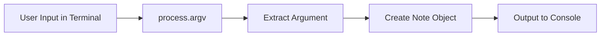

# CLI Notes Application – Study Notes

---

# 1. Introduction to the CLI Logic

## Purpose

The goal is to expand a simple CLI beyond displaying a basic message. The current objective is to:

- Accept input from the terminal
    
- Convert that input into a _note_
    
- Structure notes with a basic data model
    
- Prepare for future actions (save, retrieve, edit)

---

# 2. Understanding CLI Arguments in Node.js

## `process.argv`

- Node provides the array `process.argv` containing arguments passed to the script.
    
- **Structure of `process.argv`:**

|Index|Meaning|
|---|---|
|0|Path to Node executable|
|1|Path to the executed JavaScript file|
|2+|Arguments provided by the user|

## Example

Command:

```Python
node app.js "This is my new note"
```

Interpretation:

- Index 0 → Node
    
- Index 1 → `app.js`
    
- Index 2 → `"This is my new note"`

## Why Use Quotes?

Terminal splits arguments by spaces.  
Without quotes:

```Python
This is my new note
```

becomes **five separate arguments**.  
Quotes enforce it as **one argument**.

---

# 3. Creating a Simple Note Data Model

## Data Model Structure

A note can be represented as an object containing:

- **content** → the text passed by the user
    
- **id** → unique identifier (e.g., using `Date.now()`)

## Example Model (conceptual)

```js
const note = process.argv[2];

const newNote = {
  content: note,
  id: Date.now()
};

console.log(newNote);
```

## Result (example)

```Python
{
  content: "This is my new note",
  id: 1732567890000
}
```

---

# 4. Limitations of the Current Implementation

## Volatile Memory

- The note exists _only while the program runs_.
    
- After execution ends, the note is lost.
    
- Comparable to shutting down a website: memory resets.

## Missing Features

- Storing notes persistently
    
- Editing notes
    
- Adding metadata (tags, categories)
    
- Searching notes
    
- Retrieving all notes

## Why Modules Matter

Handling:

- argument parsing
    
- file manipulation
    
- data persistence

is tedious manually.  
Node.js and third-party modules simplify these tasks.

---

# 5. CLI Input–Output Flow (Initial Concept)



---

# 6. Example Walkthrough

## Terminal Input

```Python
node notes.js "Buy groceries"
```

## Step-by-step

1. User enters a string
    
2. `process.argv[2]` captures `"Buy groceries"`
    
3. A note object is formed
    
4. Note logs to console
    
5. Program ends → data lost (no persistence yet)

---

# 7. Future Enhancements (Preview)

- Use Node’s built-in modules (e.g., `fs`) for file storage
    
- Implement third-party modules for argument parsing (like `yargs`)
    
- Build commands such as:
    
    - `add`
        
    - `list`
        
    - `search`
        
    - `remove`

---

# Key Points Summary

- `process.argv` is essential for reading CLI arguments.
    
- Arguments must be quoted when containing spaces.
    
- A basic note requires at least content and an ID.
    
- Current implementation holds data only in memory.
    
- Persistence and advanced operations require modules and better structure.

---

# MicroTest