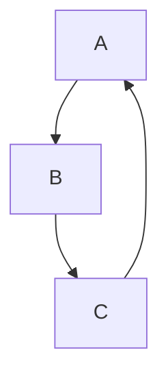

# Study Notes: Node.js Modules, Imports, and CommonJS Vs ES Modules

---

# 1. Importing Core (Internal) Modules in Node.js

## What Are Core Modules?

Core or internal modules are modules that **ship with Node.js** and are available without installation.

Examples:

- `fs` (File System)
    
- `http`
    
- `path"`

## How to Import Core Modules

Core modules do **not** require a path because Node knows where they live.

```js
import fs from "node:fs";
```

## Why `"node:fs"`?

- Newer Node versions allow explicit imports using the `node:` prefix.
    
- Makes it clear that the module is **internal**, not a third-party package.
    
- Prevents name collisions with npm packages with the same name.

Import without prefix (still valid):

```js
import fs from "fs";
```

## Key Distinction: Importing Local Files Vs Built-in Modules

|Import Type|Example|Requires Path?|
|---|---|---|
|Local/user file|`import x from "./utils.js"`|Yes (`./` or `../`)|
|Core module|`import fs from "node:fs"`|No|
|Third-party module|`import _ from "lodash"`|No|

Node uses the **path prefix** (like `./`) to know it's a user file.

---

# 2. Importing Third-Party Modules

Once installed with npm (`npm install lodash`), you import third-party modules exactly like internal modules:

```js
import _ from "lodash";
```

If you want to be explicit:

```js
import _ from "npm:lodash";
```

(Explicit prefixes are optional.)

---

# 3. Dependency Graph and Cyclic Dependencies

As you create more modules, Node builds a dependency graph of how files import each other.

## Cyclic Dependencies

A cycle occurs when:

```Python
A imports B  
B imports C  
C imports A
```

Node resolves this automatically, though it can cause bugs if not managed carefully.

Mermaid diagram:



---

# 4. ES Modules Vs CommonJS

## Why Both Exist?

- **CommonJS** came first. ES Modules (ESM) did not exist when Node was created.
    
- Most older Node codebases still use CommonJS.
    
- Modern apps prefer **ESM** (import/export).

---

# 5. ES Modules (Modern Syntax)

## Importing

```js
import { count } from "./utils.js";   // named import
import helper from "./utils.js";      // default import
```

## Exporting

Named export:

```js
export function count() {}
```

Default export:

```js
export default { count };
```

---

# 6. CommonJS (Legacy Syntax)

## Importing with `require`

```js
const count = require("./utils.js");
```

## Exporting

Old style (rarely used now):

```js
exports.count = function() {};
```

More common:

```js
module.exports = {
  count
};
```

## Comparison Table

|Action|ES Modules|CommonJS|
|---|---|---|
|Import|`import x from`|`require()`|
|Export (object)|`export default {}`|`module.exports = {}`|
|Export (named)|`export function a()`|`exports.a = function()`|
|File extension required?|Yes (`.js`)|No|

---

# 7. Why CommonJS Exists

- Node was created before ECMAScript defined modules.
    
- CommonJS filled the gap.
    
- Now being phased out in favor of ESModule standardization.

## Should You Use Require Today?

Only if:

- You're working on a legacy codebase
    
- You're writing tooling that specifically depends on CommonJS

Otherwise, use ES Modules.

---

# 8. Important Notes About ES Modules in Node

To enable ES Modules, your `package.json` must include:

```json
{
  "type": "module"
}
```

Without this, Node assumes CommonJS.

---

# 9. Summary of Key Points

- Core modules (like `fs`) do not use paths; local files must use `./` or `../`.
    
- `"node:fs"` is an explicit import style for internal modules.
    
- Third-party modules import the same way internal modules do.
    
- ES Modules use `import/export`; CommonJS uses `require/module.exports`.
    
- ES Modules require `"type": "module"` and explicit `.js` extensions.
    
- CommonJS is older and still common in existing Node.js codebases.
    
- Module graphs can include cyclic dependencies which Node resolves automatically.

---

# MicroTest