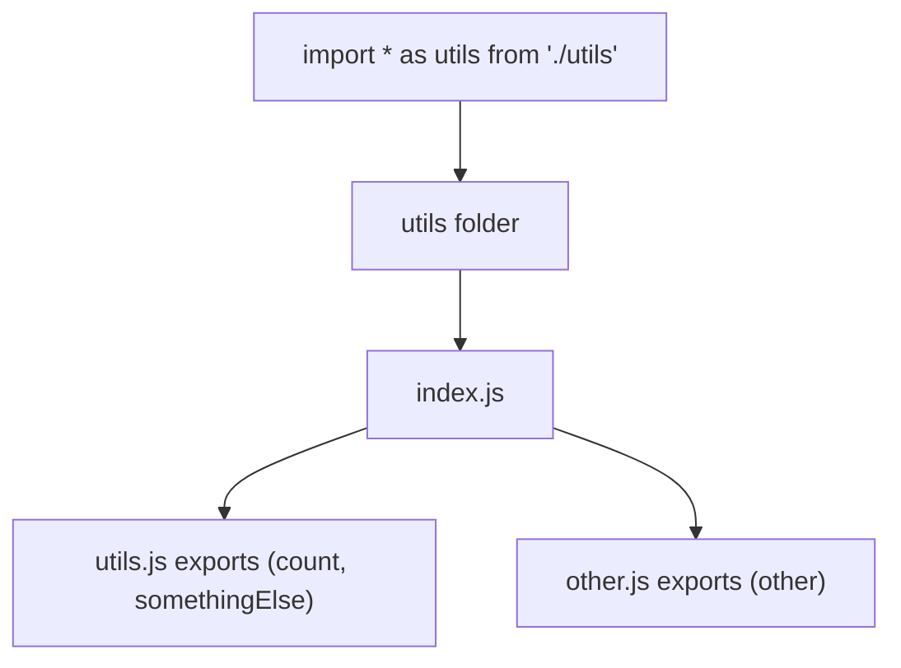

# Study Notes: Thinking in Modules and Module Organization in Node.js

## 1. Introduction to Thinking in Modules

Organizing code into modules is a fundamental practice in software development. It improves maintainability, readability, scalability, and team collaboration.

**Main idea:**  
Break your code into small, logical pieces (modules) that each handle a specific responsibility.

---

## 2. Principles for Structuring Code into Modules

### 2.1 Keep Files Small and Focused

- Each file should contain only what is logically related.
    
- If two pieces of code belong to different concerns, place them in different modules.
    
- Small modules improve clarity and debugging.

### 2.2 Modules Are Cheap

- Creating additional modules does not negatively impact Node.js performance.
    
- Unlike browser JavaScript, Node does not need to download or bundle files.
    
- No need for minimization or async loading in backend environments.

### 2.3 Benefits of Many Small Modules

1. **Easier testing** – small, isolated functions/modules can be unit tested more effectively.
    
2. **Fewer merge conflicts** – teams avoid editing the same large files.
    
3. **Better reusability** – modules can be reused or reorganized easily.

---

## 3. Different Approaches to Organizing Modules

### 3.1 By Logical Functionality

Group files based on what they accomplish:

- Example: authentication logic, database logic, business rules.

### 3.2 By Similarity (Utility Groups)

Some developers group unrelated utility functions together:

- Example: string helpers, number helpers, array operations in a `utils.js` file.

Both patterns are valid; choose based on project needs.

---

## 4. The index.js Pattern (Folder Entry Point)

### 4.1 Purpose of index.js

- Acts as a **router** or **aggregator** for the modules inside a folder.
    
- Gives a single point of entry for importing everything inside a folder.

### 4.2 How It Works

Given a folder structure:

```Python
utils/
  ├── index.js
  ├── utils.js
  └── other.js
```

If `index.js` imports and re-exports everything:

```js
import count from "./utils.js";
import other from "./other.js";

export { count, other };
```

Then in another file:

```js
import * as utils from "./utils";
```

Node will:

- Detect that the path is a folder.
    
- Automatically load `utils/index.js`.
    
- Return everything that `index.js` exports.

### 4.3 Object Structure After Import

```js
utils.count
utils.other
```

### 4.4 Conceptual Diagram



---

## 5. Syntax Choices: Import Vs Require

### 5.1 Recommendation

Use **import/export (ES Modules)** as the modern best practice.

### Reasons

- Frontend development consistently uses ES6 modules.
    
- Maintains consistency across backend and frontend.
    
- CommonJS (`require`, `module.exports`) is legacy.
    
- Node.js already supports ES Modules without experimental flags.
    
- Likely to become the default in future Node releases.

### 5.2 Example Comparison

|Purpose|ES Modules|CommonJS|
|---|---|---|
|Import|`import x from "./file.js"`|`const x = require("./file")`|
|Export|`export default x`|`module.exports = x`|

---

## 6. Enabling ES Modules in Node.js

You need to configure your `package.json`:

```json
{
  "type": "module"
}
```

This enables `import` and `export` in `.js` files.

---

## 7. Additional Notes

- Historically, `import/export` required experimental flags; now only `type: "module"` is needed.
    
- The only reason Node keeps CommonJS is backward compatibility with millions of existing packages.
    
- ES Modules allow better tooling, TypeScript support, and modern bundler alignment.

---

## Summary of Key Points

- Break code into small, focused modules.
    
- Creating many modules in Node.js has no performance cost.
    
- Using modules reduces merge conflicts and simplifies testing.
    
- The `index.js` pattern makes it easy to export everything from a folder.
    
- ES Modules (`import/export`) are the recommended modern standard.
    
- Configure `"type": "module"` in `package.json` to use ES Modules.
    
- Node will automatically load `index.js` when importing a folder.

---

## MicroTest