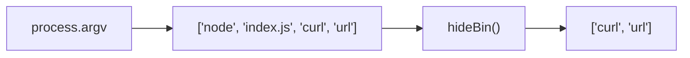
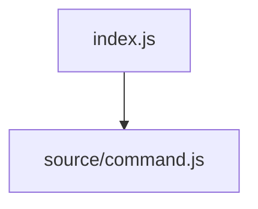

# Study Notes: Building a CLI with Yargs and Module Organization

## Overview

These notes explain how to enhance a Node.js CLI using **Yargs**, how to organize modules for clarity, and how the CLI execution flow works. Concepts include argument parsing, module structure, command registration, and the use of an entry point.

---

# 1. Introduction to Improving a CLI

The transcript discusses improving a basic CLI that currently performs no meaningful actions. Instead of manually implementing features, the solution uses an existing library.

---

# 2. Yargs: Purpose and Advantages

## What is Yargs?

**Yargs** is an NPM package that:

- Helps build **interactive command-line tools**.
    
- **Parses arguments** automatically.
    
- Generates an **elegant user interface**, including help menus.
    
- Converts raw CLI input into a structured **object** (`argv`).

### Why Use It?

- Avoids writing argument parsing from scratch.
    
- Automatically handles:
    
    - Argument formatting
        
    - Help menus (`--help`)
        
    - Type casting of arguments
        
    - Command organization

---

# 3. Installing and Importing Yargs

## Installation

```bash
npm install yargs
```

## Import (ESM)

```js
import yargs from "yargs";
import { hideBin } from "yargs/helpers";
```

---

# 4. Understanding CLI Execution Flow

## How Node Processes CLI Arguments

- `process.argv` contains the full command:
    
    - Index 0 → path to Node
        
    - Index 1 → path to executed file
        
    - Index 2+ → actual CLI arguments

### hideBin()

- Removes the first two elements of `process.argv`.
    
- Example:



---

# 5. Organizing the Project: Entry File and Source Folder

## Goal

Keep `index.js` (the CLI entry point) **small and clean**.

## Structure

```Python
project/
│ index.js  → CLI entry point
│
└── source/
      command.js → where all CLI logic lives
```

## index.js

```js
import "./source/command.js";
```

- No exports required.
    
- Purely executes the command module.
    
- Only the **entry file** needs the `#!` (shebang):

```js
#!/usr/bin/env node
```

## Module Tree Concept

```Python
index.js (entry)
   └── loads command.js
         └── may load other modules
```

The entry file initializes the entire module tree.

---

# 6. Writing the CLI Logic in command.js

## Example Code (Simplified)

```js
import yargs from "yargs";
import { hideBin } from "yargs/helpers";

yargs(hideBin(process.argv))
  .command(
    "curl <url>",
    "Fetch the contents of a URL",
    () => {},
    (argv) => {
      console.log(argv);
    }
  )
  .demandCommand(1)
  .parse();
```

---

# 7. Understanding Commands

## Concept: CLI Vs Command

- **CLI** → main executable (e.g., `npm`, `note`)
    
- **Command** → action after the CLI (e.g., `install`, `curl`)

### Example

```Python
note curl https://example.com
```

- `note` → CLI
    
- `curl` → command
    
- `https://example.com` → argument to command

---

# 8. What demandCommand() Does

```js
.demandCommand(1)
```

- Requires at least **one** command.
    
- Running just `note` results in an error:

    ```Python
    You need at least one command
    ```

---

# 9. Yargs Generates Help Automatically

## Usage

```Python
note --help
```

## Output Includes

- List of available commands
    
- Flags
    
- Command descriptions

This is a standard CLI convention, and Yargs provides it automatically.

---

# 10. Why Argv Looks Different with Yargs

Without Yargs:

```Python
["node", "index.js", "curl", "url"]
```

With Yargs:

```Python
{
  _: ["curl"],
  url: "example.com",
  $0: "note"
}
```

Yargs:

- Converts arguments into an object.
    
- Assigns names to inputs.
    
- Can cast types if configured.

---

# 11. Example Command Execution (Step by Step)

## Running

```Python
note curl https://site.com
```

## Process

1. User enters the command.
    
2. OS runs the `note` executable.
    
3. `index.js` executes.
    
4. `index.js` imports `command.js`.
    
5. Yargs processes the arguments.
    
6. hideBin removes Node paths.
    
7. Yargs sees:
    
    - command: `curl`
        
    - argument: URL
        
8. Command handler runs and logs the parsed object.

---

# 12. Additional Notes for Deeper Understanding

- **Commands are extensible**: You can add more commands easily.
    
- **Yargs handlers** allow async operations (e.g., fetch requests).
    
- **Proper module organization** keeps the CLI scalable as features grow.
    
- Real CLI tools often break commands into **separate files** inside a `/commands` directory.

---

# Summary of Key Points

- Yargs simplifies CLI creation by handling parsing and UI.
    
- Use `hideBin()` to clean `process.argv`.
    
- The entry file should remain minimal.
    
- Use a `/source` folder for CLI logic.
    
- Commands follow the structure: `cli command arguments`.
    
- `demandCommand()` ensures the user provides at least one command.
    
- `--help` is generated automatically.
    
- Yargs returns a structured `argv` object instead of raw arrays.

---

## MicroTest (Leave Empty)

# Study Notes: Building a CLI with Yargs and Module Organization

## 1. Introduction to CLI Improvement

The current CLI is minimal and lacks functionality. Instead of implementing all features manually, the approach relies on using an established library to simplify argument parsing and interface creation.

---

## 2. Yargs: Purpose and Functionality

### Definition

**Yargs** is an NPM library designed to build interactive command-line tools.

### Main Features

- Parses CLI arguments into a readable object.
    
- Automatically generates user interface elements such as help menus.
    
- Supports commands, options, type casting, and input validation.
    
- Reduces manual parsing logic and complexity.

Yargs is valuable because it avoids the need to manually parse `process.argv` and maintain help output.

---

## 3. Installing and Using Yargs (ESM)

**Installation**

```bash
npm install yargs
```

**Importing in ECMAScript Modules**

```js
import yargs from "yargs";
import { hideBin } from "yargs/helpers";
```

---

## 4. CLI Argument Flow and hideBin()

### `process.argv`

An array representing everything typed into the CLI:

- index 0: Node executable path
    
- index 1: script path
    
- index 2+: actual user arguments

### `hideBin()`

Removes the first two elements and passes only user arguments to Yargs.


---

## 5. Organizing Files and Modules

### Goal

Keep the entry point (`index.js`) clean and delegate logic to dedicated modules.

### Structure

```Python
project/
│ index.js   ← Entry file
└── source/
      command.js  ← CLI logic lives here
```

### index.js

```js
#!/usr/bin/env node
import "./source/command.js";
```

Only the entry file requires the shebang.  
This file simply executes the command module.

### Module Tree



The entire CLI flows from the entry file.

---

## 6. Building the CLI in command.js

### Example Code

```js
import yargs from "yargs";
import { hideBin } from "yargs/helpers";

yargs(hideBin(process.argv))
  .command(
    "curl <url>",
    "Fetch the contents of a URL",
    () => {},
    (argv) => {
      console.log(argv);
    }
  )
  .demandCommand(1)
  .parse();
```

---

## 7. Understanding CLI Commands

### Concept

In CLI design:

|Term|Meaning|
|---|---|
|CLI|The main command executed (e.g., `note`, `npm`)|
|Command|Action performed by the CLI (e.g., `curl`, `install`)|

Example input:

```Python
note curl https://example.com
```

- `note` → CLI
    
- `curl` → command
    
- URL → argument to the command

---

## 8. demandCommand()

```js
.demandCommand(1)
```

Requires that the user provide at least one command.  
Running only:

```Python
note
```

Produces an error stating a command is needed.

---

## 9. Automatic Help Generation

Yargs provides a free help menu:

```Python
note --help
```

This automatically lists:

- All commands
    
- Flags
    
- Descriptions

No manual maintenance required.

---

## 10. How Yargs Transforms Argv

Raw `process.argv`:

```Python
["node", "index.js", "curl", "url"]
```

Yargs output:

```Python
{
  _: ["curl"],
  url: "https://site.com",
  $0: "note"
}
```

Advantages:

- Arguments are named and structured.
    
- Types can be cast automatically.
    
- No manual parsing required.

---

## 11. Execution Flow Example (Step by Step)

### When Running

```Python
note curl https://site.com
```

### Flow

1. User types command.
    
2. System executes `note` (the entry script).
    
3. `index.js` runs and imports `command.js`.
    
4. Yargs parses arguments via `hideBin(process.argv)`.
    
5. Yargs identifies:
    
    - command: `curl`
        
    - argument: URL
        
6. Handler runs and logs structured `argv`.

---

## 12. Additional Notes

- Commands can be moved into separate files for large CLIs.
    
- Yargs supports async handlers.
    
- File organization helps scalability and maintainability.
    
- The entry file should remain minimal and declarative.

---

# Summary of Key Points

- Yargs simplifies building CLIs with commands, parsing, and help menus.
    
- `hideBin()` cleans up argument arrays.
    
- The entry file should only import the command logic.
    
- The CLI consists of the main command followed by subcommands.
    
- `demandCommand(1)` enforces at least one command.
    
- Yargs automatically generates `--help`.
    
- Yargs transforms `argv` into a structured, typed object.
    
- Proper project structure keeps the code manageable.

---

## MicroTest