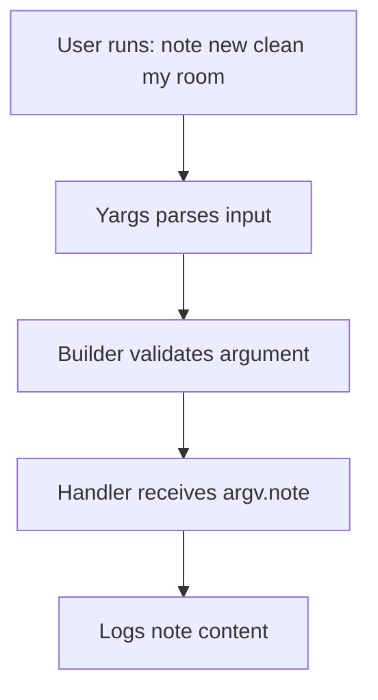
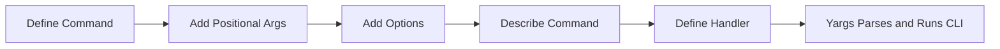

# Study Notes: Building CLI Commands with Yargs

## 1. Overview of CLI Command Setup with Yargs

The transcript explains how to define commands in a Node.js CLI application using **Yargs**, focusing on creating a structured, maintainable interface rather than relying on `if` statements and manual parsing.

Yargs allows you to:

- Define commands with arguments.
    
- Add descriptions for help text.
    
- Configure options (flags).
    
- Access parsed arguments via `argv`.

---

## 2. Defining a Basic Command

### 2.1 Command Structure

A command in Yargs typically uses four parameters:

|Order|Parameter|Description|
|---|---|---|
|1|Command name and arguments|Example: `"new <note>"`|
|2|Description|Shown in help output|
|3|Builder function|Defines arguments/options for this command|
|4|Handler function|Executes when the command is used|

### 2.2 Example: Creating a “new note” Command

This command accepts a required argument called `note`.

**Builder Function Behavior:**

- Receives a _scoped_ Yargs instance.
    
- Defines argument characteristics.

**Example Setup (explained conceptually):**

- Command: `new`
    
- Argument: `<note>`
    
- Description: Creates a new note.
    
- Builder: Defines `note` as a required string.
    
- Handler: Logs `argv.note` (placeholder for future logic).

**Flow Representation:**



---

## 3. Positional Arguments Vs Optional Arguments

### 3.1 Positional Arguments

Defined using `.positional()`, included in the command string using angle brackets:

- `<arg>` = **required**
    
- `[arg]` = **optional**

**Example:**  
`new <note>` — `note` is required.

### 3.2 Optional Arguments (Options / Flags)

Defined using `.option()`:

- Allow you to pass metadata or modifiers.
    
- Can include alias, type, description, defaults.

**Example Concept:** Adding `--tags` to the `new` command.

```text
--tags "work,serious"
```

Alias example:

- `--tags`
    
- `-t`

Both are valid when alias `t` is defined.

---

## 4. Defining Options in Yargs

### 4.1 Example Option: `tags`

Purpose: Attach tags to a note.

Characteristics:

- Alias: `t`
    
- Type: string
    
- Description: note tags for organization

You can run:

```Python
note new "clean room" --tags "work,urgent"
```

Or shorthand:

```Python
note new "clean room" -t "work,urgent"
```

### 4.2 Accessing Options

All options are available in the handler function through:

```Python
argv.tags
```

---

## 5. Additional Commands Mentioned

The transcript references several commands that do not yet have logic but serve as the CLI interface.

|Command|Purpose|
|---|---|
|`new <note>`|Create a new note|
|`all`|Get all notes|
|`find <query>`|Find notes by search criteria|
|`remove <id>`|Remove a note by ID|
|`web [port]`|Launch web UI for notes (port optional)|
|`clear`|Delete all notes|

### 5.1 Optional Parameter Example: `web [port]`

- `[port]` is optional due to square brackets.
    
- A default value is provided.
    
- Yargs manages this automatically.

---

## 6. Using Help to Verify Commands

Running:

```Python
note --help
```

Displays all commands, their arguments, and their descriptions.

This confirms:

- Commands are registered.
    
- Arguments and options are recognized.
    
- Help text is correctly generated.

---

## 7. Summary Table of Bracket Usage

|Symbol|Meaning|Example|
|---|---|---|
|`< >`|Required argument|`<note>`|
|`[ ]`|Optional argument|`[port]`|

---

## 8. Conceptual Diagram of Command Definition



---

# Key Takeaways

- Yargs simplifies CLI creation by providing structure for commands, arguments, and options.
    
- Commands have four core components: name, description, builder, handler.
    
- Positional arguments are defined using `.positional()` and included in the command string.
    
- Options/flags are added using `.option()`, can include alias, type, and description.
    
- `<arg>` = required, `[arg]` = optional.
    
- Help output (`--help`) is automatically generated and useful for validation.
    
- Using Yargs avoids manual parsing and leads to cleaner, maintainable CLI code.

---

## MicroTest