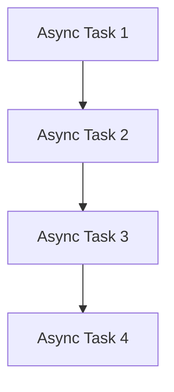

# Study Notes: Implementing Command Functionality and Async Foundations in Node.js

## 1. Overview: Implementing CLI Command Functionality

Before implementing the functionality of our CLI commands, it is essential to decide **how and where the data (notes) will be stored**.

### Persistent Storage Decision

- Instead of using a database, the system will use **files as persistent storage**.
    
- Files act as the simplest form of a database (the “OG database”).
    
- Working with files in Node.js requires understanding **asynchronous behavior**.

---

## 2. Asynchronous JavaScript in Node.js

### 2.1 Why Async Matters

Node.js is:

- Event-loop–driven
    
- Concurrent
    
- Built around non-blocking I/O

Most meaningful operations in Node.js are asynchronous.

### 2.2 What It Means for Code to Be Asynchronous

Async code **does not run in the same order it is written**. Instead, operations can be **scheduled for later**.

Important clarification:  
Async _in Node.js_ does **not** mean multiple things run at the same time (unless you explicitly use threads or workers). Instead, Node schedules tasks and handles them without blocking the main thread.

---

## 3. What Makes Code Asynchronous in Node.js?

As a rule of thumb, **only three categories** make code async:

|Category|Examples|Notes|
|---|---|---|
|Network operations|API calls, fetch, HTTP requests|Always async|
|Timers|setTimeout, setInterval|Schedules a task|
|Storage access|File system, databases|Costly operations → async|

Anything outside these is **almost always synchronous**, even if it uses callbacks.

---

## 4. Callbacks in JavaScript

### 4.1 Definition

A **callback** is a function passed as an argument to be executed after some other task completes.

### 4.2 Not All Callback-Based Functions Are Asynchronous

Example from transcript:

```js
new Array(20000).fill(0).map((_, i) => console.log(i));
```

- Uses a callback (inside `map`)
    
- But it is **100% synchronous**
    
- No interaction with network, timers, or storage

### 4.3 Callback Hell

When chaining many asynchronous operations, you end up with deeply nested callbacks:

```js
readFile('a.txt', () => {
  readFile('b.txt', () => {
    readFile('c.txt', () => {
      // ...
    });
  });
});
```

This is visually messy and hard to maintain.

#### Visual Representation (Mermaid)



This becomes the “pyramid of doom.”

---

## 5. Promises

### 5.1 Purpose

Promises were created to fix callback hell by giving us **flat chaining**:

```js
doTaskA()
  .then(resultA => doTaskB(resultA))
  .then(resultB => doTaskC(resultB));
```

Only **one level** of nesting, regardless of how many operations there are.

### 5.2 Creating a Promise Manually

Turning callback-based code into Promise-based code:

```js
function wait(time) {
  return new Promise(resolve => {
    setTimeout(() => resolve(), time);
  });
}
```

Then:

```js
wait(3000)
  .then(() => wait(2000))
  .then(() => console.log("Done"));
```

### 5.3 Node’s `promisify`

Node provides `util.promisify()` to automate conversion of old callback-based APIs.

---

## 6. Async/Await

### 6.1 Purpose

Async/await brings async code **back to synchronous-looking flow**.

Equivalent transformations:

|Callback|Promise|Async/Await|
|---|---|---|
|Nested callbacks|Flat `.then()` chains|Clean line-by-line code|

### 6.2 Example

Using async/await simplifies:

```js
await wait(3000);
await wait(2000);
console.log("Done");
```

### 6.3 Requirements

- The function used with `await` MUST return a Promise.
    
- Node.js supports **top-level await** in modern versions.

### 6.4 Why Make Async Code Look Synchronous?

Benefits:

- Easier reasoning about code flow
    
- Avoids race conditions
    
- Clear order of operations
    
- Less indentation, less boilerplate
    
- Particularly important in complex workflows (e.g., user registration flow involving DB, external APIs, analytics)

---

## 7. How Async/Await Works Under the Hood

- Uses **JavaScript generators** internally.
    
- Generators were rarely used directly, but async/await made them essential behind the scenes.

---

# 8. Summary of Key Points

- Commands need functionality: reading/storing notes requires async operations.
    
- Only three categories cause async behavior: network, timers, storage.
    
- Callbacks can be sync or async, depending on the operation.
    
- Callback hell → solved by Promises.
    
- Promises → solved by Async/Await for readability and maintainability.
    
- Async/Await makes async logic look synchronous and prevents deeply nested code.
    
- Modern Node.js supports top-level await.

---

## MicroTest