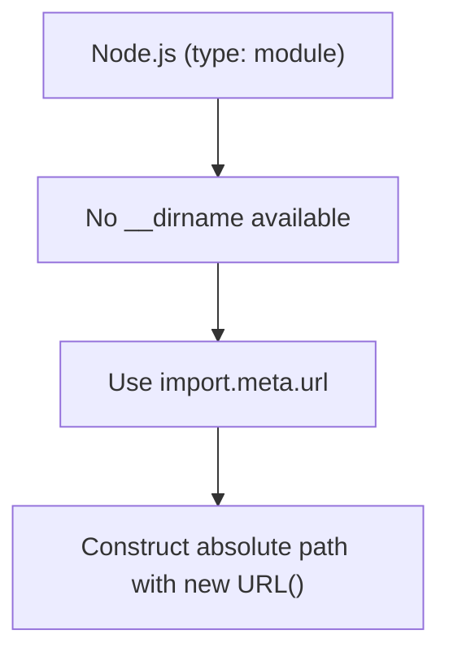

# Study Notes: Node.js **fs Module** and File System Operations

---

# 1. Overview of the `fs` Module

## What is `fs`?

**fs** stands for **File System**.  
It is a **core module** built into Node.js that provides an **API to interact with files and directories** programmatically.

### Key Capabilities

- Create, read, update, and delete files.
    
- Create and read directories.
    
- Retrieve metadata about files.
    
- Automate file-based workflows.
    
- Serve as foundation for building custom storage systems or basic databases.

### Why It's Important

Every application interacts with files at some point—logs, configs, uploads, databases, caching.  
`fs` allows Node.js applications to automate and structure all these operations.

---

# 2. Commonly Used Methods in the `fs` Module

|Method|Description|
|---|---|
|`mkdir` / `mkdirSync`|Create a directory.|
|`readdir` / `readdirSync`|Read the contents of a directory.|
|`stat` / `statSync`|Get file metadata (size, type, timestamps).|
|`unlink`|Delete a file.|
|`rename`|Rename or move a file.|
|`readFile` / `readFileSync`|Read file contents.|
|`writeFile` / `writeFileSync`|Write data to a file.|

---

# 3. Synchronous Vs Asynchronous File Operations

## Synchronous Methods

- Example: `readFileSync`
    
- **Blocking**: stops execution until operation completes.
    
- Should not be used in servers receiving many requests.

## Asynchronous Methods

- Example: `readFile`
    
- Uses **callbacks**, which can become messy (callback hell).

## Promise-based API

Import via:

```js
import fs from 'node:fs/promises'
```

Advantages:

- Cleaner code using `async/await`.
    
- Avoids callback hell.
    
- Safe for high-throughput applications.

---

# 4. Working with Paths in Node.js (ESM modules)

When using `"type": "module"`:

- The old global `__dirname` does **not** exist.
    
- You must construct absolute paths manually.

Example using `new URL()`:

```js
const pjsonPath = new URL('./package.json', import.meta.url);
```

Mermaid diagram summarizing this:



---

# 5. Example: Reading a File

```js
import fs from 'node:fs/promises'

async function readPjson() {
  const pjsonPath = new URL('./package.json', import.meta.url);
  const data = await fs.readFile(pjsonPath);
  console.log(JSON.parse(data));
}
```

## Breakdown

1. Build absolute path using `new URL()`.
    
2. Use `readFile` from the Promise API.
    
3. Parse JSON before logging.

**Node automatically reads files as buffers**, so parsing text requires conversion or passing an encoding option.

---

# 6. Example: Writing a File

```js
async function writeDemo() {
  const newFilePath = new URL('./demo.js', import.meta.url);
  await fs.writeFile(newFilePath, "console.log('yoooo!')");
}
```

## Explanation

- `writeFile` creates the file if it doesn’t exist.
    
- Overwrites by default.
    
- Accepts strings, buffers, or typed arrays.

---

# 7. Executing Multiple Commands Sequentially in the Terminal

Using `&&`:

```sh
node test && node demo.js
```

- Runs `node test` first.
    
- Only after success, runs `node demo.js`.

This mimics “async then await” behavior at the terminal level.

---

# 8. Debugging Callback Hell or Deep Asynchronous Code

## Key Ideas from the Transcript

### 1. Logging is Often the Simplest effective Method

Insert logs to compare **expected vs actual** program behavior.

### 2. Start from the Innermost Operation

Example:

- If the problem originates after a call to `fs.writeFile`,
    
- Start inspecting right after that line,
    
- Then move outward.

### 3. Too Many Abstraction Layers is a Design Smell

Excessive nesting makes debugging harder.

### 4. Frameworks Help Avoid Callback Hell

Frameworks abstract complex async behavior internally.

### 5. Debuggers Help, but You Still Must Locate the Starting point

Even with breakpoints, you must choose where to begin.

---

# 9. Additional Note: Node.js `fs` API Is Extensive

The Node.js docs list dozens of functions:

- `appendFile`
    
- `copyFile`
    
- `realpath`
    
- `rm`
    
- `rmdir`
    
- and many more…

Most use cases center around:

- `readFile`,
    
- `writeFile`,
    
- directory listing,
    
- and metadata inspection.

---

# 10. Third-Party Packages

Some tasks with `fs` are verbose (e.g., recursive directory reading).  
Many npm packages simplify common patterns.

Example:

- Packages that read directories recursively.
    
- Utilities for file transforms.
    
- Build tools that wrap `fs` operations behind simple APIs.

---

## MicroTest

---

# Summary of Key Points

- `fs` is a core Node.js module for file and directory manipulation.
    
- Prefer the **Promise-based API** via `node:fs/promises`.
    
- Avoid synchronous functions in production servers.
    
- Use `new URL()` to resolve paths when using ES modules.
    
- Reading a file returns a buffer; parse or convert as needed.
    
- Writing files is simple with `writeFile` and supports strings or buffers.
    
- Debugging deep async code relies more on clear process than on special tools.
    
- The `fs` API is large; most tasks rely on a few core methods.

---