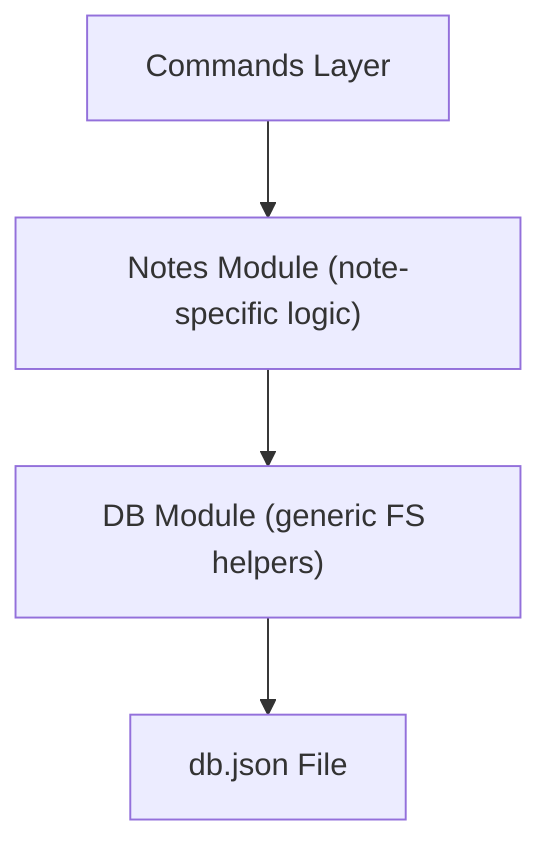

# Study Notes: Using the File System as a Database in Node.js

## 1. Introduction: File System as a Database

In this part of the lesson, the file system (FS) is used as a simple database for a note-taking application.  
Instead of a traditional database, a JSON file (`db.json`) is used to store structured data. This is suitable for small applications or learning purposes.

### Definition: File-System-Based Database

A database that stores information directly in files (often JSON).  
It is simple, persistent, human-readable, and easy to manipulate with Node.js.

---

## 2. Setting Up the Database File

### Creating `db.json`

Placed at the **root** of the project (not inside `/src`).

```json
{
  "notes": []
}
```

This is the "database" — an object containing a “notes” array.

### Reasoning

- Using JSON keeps the structure simple.
    
- The array will store objects representing individual notes.

---

## 3. Creating a Database Module (`db.js`)

The module provides **utility functions** that abstract file interaction.  
This creates a simple version of an **ORM**.

### Definition: ORM

An _Object-Relational Mapping_ tool.  
It acts like an SDK for the database, allowing higher-level functions instead of raw queries.

### Purpose of the Module

- Encapsulate file-system logic
    
- Reuse logic across commands
    
- Prevent repetitive FS code in the app
    
- Allow future extensibility

---

## 4. Importing FS with Promises

```js
import fs from "node:fs/promises";
```

### Why Promises?

The callback API is verbose and leads to “callback hell.”  
The Promises API works cleanly with `async/await`.

---

## 5. Resolving the Database Path

```js
const DB_PATH = new URL("../db.json", import.meta.url).pathname;
```

### Key Concept: `import.meta.url`

In ES modules, `__dirname` is not available.  
`import.meta.url` is used to resolve file paths reliably.

---

## 6. Function: `getDB()`

### Purpose

Read the entire JSON file from disk and return it as a JavaScript object.

### Implementation Summary

1. Read file with UTF-8 encoding.
    
2. Convert JSON string → JavaScript object using `JSON.parse`.

```js
export const getDB = async () => {
  const db = await fs.readFile(DB_PATH, "utf-8");
  return JSON.parse(db);
};
```

### Related Concept: Encoding

- **UTF-8** represents characters (letters, symbols) in a standardized format.
    
- Needed so that the returned value is human-readable text, not raw bytes.

---

## 7. Function: `saveDB(db)`

### Purpose

Override the entire database file with the new JSON data.

### Implementation Summary

1. Convert object → JSON string with indentation (formatting).
    
2. Write it to the file.

```js
export const saveDB = async (db) => {
  await fs.writeFile(DB_PATH, JSON.stringify(db, null, 2));
  return db;
};
```

### Why Format the JSON?

- Indentation (`2` spaces) improves readability.
    
- Without formatting, JSON becomes one long line.

---

## 8. Function: `insertDB(note)`

### Purpose

Insert a new note into the notes array.

### Why We Don't Use `fs.appendFile`

`appendFile()` blindly adds content to the end of the file, without understanding JSON structure.  
Instead, we:

1. Read the entire DB
    
2. Push the new note into the array
    
3. Save the modified DB

### Implementation Summary

```js
export const insertDB = async (note) => {
  const db = await getDB();
  db.notes.push(note);
  await saveDB(db);
  return note;
};
```

---

## 9. How FS Handles File Reads

**Question:** Does `readFile()` load everything and then close the handle?  
**Answer:** Yes.  
The file is opened, fully read, and closed automatically.  
It is _non-streaming_, which:

- Keeps code simple
    
- Is non-blocking
    
- Avoids the overhead of opening/closing manual file handles

---

## 10. Why Create These Utility Functions?

### Repetitive Operations Needed

- Create a note → must update the file
    
- Get notes → must read the file
    
- Find notes → must read and filter the file
    
- Remove note → read, filter, save
    
- Clear all notes → save an empty array

### Benefits of Abstraction

- Avoid duplicating the same FS logic
    
- Isolate data concerns in one place
    
- Keep command logic clean and focused on behavior

---

## 11. Further Abstraction: Note-Specific Module

The current functions are **generic**, meaning:

- They work on the DB file
    
- But do not contain logic specific to "notes"

To keep separation of concerns:

- Another module will be created with note-specific logic
    
- It will use the generic DB functions internally

### Mermaid Diagram: Architectural Layers



---

## 12. Table: Summary of Utility Functions

|Function|Input|Output|Description|
|---|---|---|---|
|`getDB()`|none|JS object|Reads and parses the entire database file|
|`saveDB(db)`|db object|db object|Saves database to disk with JSON formatting|
|`insertDB(n)`|note|note|Appends a new note to the database|

---

## Key Takeaways

- The FS module can serve as a simple database for small apps.
    
- JSON files are an easy way to store structured data.
    
- Use `node:fs/promises` when working with async/await.
    
- Abstracting file operations avoids duplicated logic.
    
- `readFile()` reads and closes the file automatically.
    
- Avoid `appendFile()` for structured formats like JSON.
    
- Additional modules can create cleaner architecture (generic vs. domain-specific logic).

---
