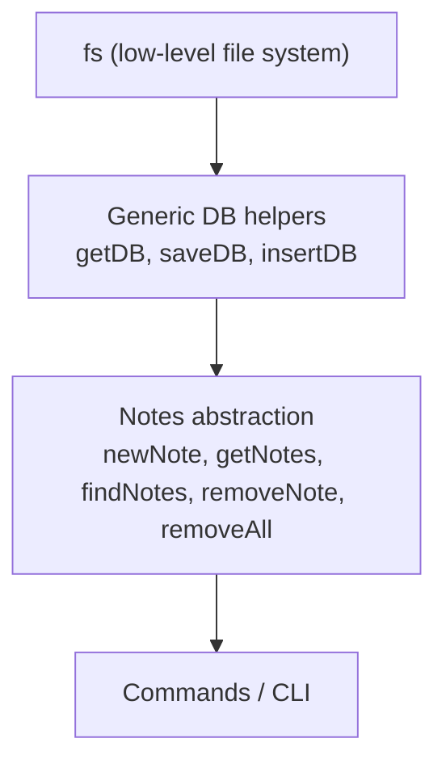

# Notes: CRUD Abstractions for Notes in a File-Based Database

## Overview

This transcript focuses on creating an additional abstraction layer designed specifically for **notes**, built on top of previously created generic database helpers. The goal is to implement CRUD functionality (Create, Read, Update, Delete) for a notes application that uses a JSON file as its database.

---

# 1. Understanding CRUD and Abstraction Layers

## What is CRUD?

CRUD stands for:

|Letter|Meaning|Description|
|---|---|---|
|C|Create|Add new data into the database|
|R|Read|Retrieve existing data|
|U|Update|Modify existing data|
|D|Delete|Remove existing data|

**Relevance:**  
Most applications are CRUD-based because they rely on creating, retrieving, updating, and deleting data. Even apps like Twitter follow CRUD patterns (tweets are created, retrieved, updated, deleted).

---

## Why We Need an Additional Abstraction Layer

We already created generic database functions (`getDB`, `saveDB`, `insertDB`) that interact with the file system. However:

- They are **too generic** for operations specific to notes.
    
- We want to avoid "polluting" these generic DB helpers with note-specific logic.
    
- If the DB file later stores other entities (e.g., users), we don't want note-specific logic to affect them.

Thus, we create **notes.js**, an abstraction layer specifically for note operations.

---

## Abstraction Layers Diagram



---

# 2. Notes Module (notes.js)

## Importing Required Functions

We no longer interact directly with `fs`. Instead we import the DB helpers:

- `getDB()`
    
- `saveDB()`
    
- `insertDB()`

These act like the “SQL layer,” and the notes abstractions sit above them.

---

# 3. Implementing CRUD for Notes

We implement five functions:

1. `newNote`
    
2. `getNotes`
    
3. `findNotes`
    
4. `removeNote`
    
5. `removeAllNotes`

The transcript focuses mainly on the first two and on destructuring.

---

## 3.1 Creating a New Note (`newNote`)

### Purpose

Creates a new note with:

- content (string)
    
- tags (array)
    
- id generated using `Date.now()`

### Steps

1. Receive content and tags.
    
2. Build a new note object.
    
3. Use `insertDB()` to append the note to the file-based DB.
    
4. Return the newly created note.

### Example (explained)

```js
export const newNote = async (content, tags) => {
    const newNote = {
        content,
        id: Date.now(),
        tags
    };

    await insertDB(newNote);

    return newNote;
};
```

**Explanation:**

- `Date.now()` creates a numeric timestamp to act as a unique identifier.
    
- `insertDB()` handles:
    
    - reading the DB
        
    - pushing the new note into `db.notes`
        
    - saving the DB back to the file

This avoids overwriting the entire DB (which would happen using `saveDB()` directly).

---

## 3.2 Getting All Notes (`getNotes`)

### Purpose

Retrieve the entire list of notes from `db.json`.

### Implementation

```js
export const getNotes = async () => {
    const { notes } = await getDB();
    return notes;
};
```

### Explanation of Destructuring Used Here

`getDB()` returns an object like:

```json
{
  "notes": [...],
  "users": [...]
}
```

Using destructuring:

```js
const { notes } = await getDB();
```

is equivalent to:

```js
const db = await getDB();
const notes = db.notes;
```

---

# 4. Destructuring Explained (Expanded)

The transcript includes a detailed explanation of destructuring. Key points:

## Object Destructuring Example

```js
const data = { shooting: 99, dribbling: 20, jumping: 10 };

const { shooting, jumping } = data;
```

Equivalent to:

```js
const shooting = data.shooting;
const jumping = data.jumping;
```

### Purpose

Extracts needed fields without repeatedly writing `data.property`.

---

## Array Destructuring Example

```js
const nums = [10, 20, 30, 40];

const [first] = nums;
```

Extracts only the first element.

---

## Function Parameter Destructuring Example

```js
function action({ speed, power, accuracy, ...rest }) {
    // use speed, power, accuracy
}
```

- Extracts some properties
    
- Packs the remaining ones into `rest`

---

# 5. Concurrency Considerations (Not Needed Here)

A student asked about:

- What happens if someone reads the file while another writes?

Answer:

- This app is single-user.
    
- No concurrency, locking, or multi-tenant considerations needed.
    
- In real apps, this would require:
    
    - file locking
        
    - transactions
        
    - database engines with concurrency control

---

# 6. Summary of Key Points

- CRUD = Create, Read, Update, Delete.
    
- Notes require their own abstraction layer separate from generic DB utilities.
    
- `insertDB()` should be used for adding notes, not `saveDB()`, to avoid overwriting.
    
- Destructuring is used to simplify access to object and array properties.
    
- File-based DB operations are always asynchronous; thus all note functions are `async`.
    
- Concurrency is not a concern for this single-user notes app.

---

## MicroTest