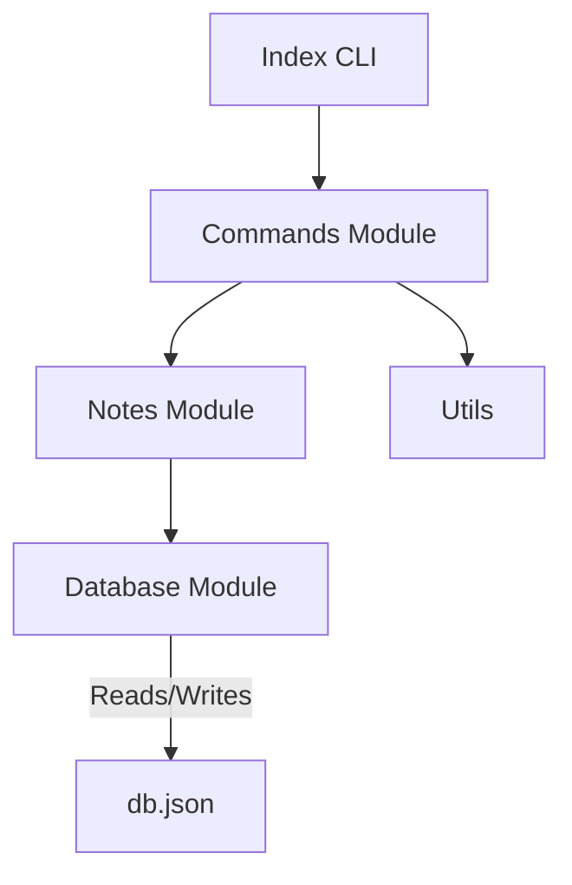

# **Study Notes: Updating CLI Commands and Integrating Modules**

## **1. Overview of Command Updates**

The transcript focuses on integrating previously created logic (note handling, database operations, utilities) into command definitions for a CLI application. The goal is to connect command inputs with the underlying module functionality.

---

## **2. Modular Structure in the Application**

### **2.1 Purpose of Modules**

Modules separate responsibilities across files, improving readability and maintainability.  
Typical modules used:

- **Database module:** Handles reading and writing to the JSON database.
    
- **Notes module:** Manages note creation, filtering, removal.
    
- **Commands module:** Connects CLI commands with the underlying logic.
    
- **Utility functions:** Help format or present data.

### **2.2 Why Modules Matter**

Without modules, a single file would contain command definitions, database logic, note creation logic, and UI printing. This becomes unmanageable.  
Modules help group logic by theme.

---

## **3. Creating a New Note Command**

### **3.1 Converting Tags to an Array**

CLI receives tags as a single string.  
Example:

```Python
tags="work,serious,inner"
```

To convert into an array:

```js
const tags = argv.tags ? argv.tags.split(",") : [];
```

### **3.2 Creating the Note**

The command calls:

```js
const note = await newNote(argv.note, tags);
console.log(note);
```

### **3.3 Behavior**

- The note is created.
    
- ID autogenerated.
    
- Tags stored as array.
    
- Saved to the JSON file via `saveDB`.

### **3.4 JSON Storage Formatting**

The application uses:

```js
JSON.stringify(db, null, 2)
```

to make the file readable.

---

## **4. Listing All Notes**

A helper function formats notes:

### **4.1 Utility Function**

```js
function listNotes(notes) {
    notes.forEach(({id, tags, content}) => {
        console.log(`id: ${id}`);
        console.log(`tags: ${tags}`);
        console.log(`content: ${content}\n`);
    });
}
```

### **4.2 Why Use It?**

- Avoid repeating log formatting.
    
- Keeps command logic clean.

---

## **5. Filtering Notes**

### **5.1 Using the findNotes Function**

It performs a simple substring search using `.includes()`.

### **5.2 Case Normalization**

Both note content and filter are converted to lowercase:

```js
note.content.toLowerCase().includes(filter.toLowerCase())
```

### **5.3 Example**

Notes:

- "clean my room"
    
- "walk my dog"
    
- "eat more food"

Filtering with `"dog"` returns only the second note.

---

## **6. Removing a Specific Note**

### **6.1 The removeNote(id) Function**

Steps:

1. Get all notes.
    
2. Check if note exists (`find`).
    
3. Create a new array excluding that note (`filter`).
    
4. Save new array to database.
    
5. Return the removed ID or `undefined`.

### **6.2 Immutability**

Instead of modifying the array directly, a new array is created:

```js
const newNotes = notes.filter(note => note.id !== id);
```

**Why?**  
Avoids side effects, easier debugging, aligns with functional programming patterns.

---

## **7. Removing All Notes**

### **7.1 One-Liner Command**

```js
return saveDB({ notes: [] });
```

### **7.2 When to Use Await**

Since no code runs after the call, awaiting is optional.

---

## **8. Database JSON Handling**

- Do **not** manually edit the DB file.
    
- Treat it like a production database.
    
- JSON formatting ensures readability.
    
- `undefined` values do **not** survive `JSON.stringify`.

---

## **9. Testing the Commands (Manual CLI Testing)**

### **Creating Notes**

```Python
notes new "clean my room" --tags "work,serious"
```

### **Listing Notes**

```Python
notes all
```

### **Filtering Notes**

```Python
notes find dog
```

### **Removing By ID**

1. Get ID from listing.
    
2. Run:

```Python
notes remove <id>
```

### **Resetting All Notes**

```Python
notes clean
```

---

## **10. MermaidJS Diagram: Flow Between Modules**



---

## **11. Common CLI Command Behaviors Table**

|Command|Function Called|Input Needed|Output|
|---|---|---|---|
|`notes new`|`newNote()`|content, tags|full note object|
|`notes all`|`getAllNotes()`|none|printed list of notes|
|`notes find`|`findNotes(filter)`|filter string|matching notes|
|`notes remove`|`removeNote(id)`|id|removed id or undefined|
|`notes clean`|`removeAllNotes()`|none|DB reset message|

---

## **12. Additional Notes**

- Tag parsing can be customized (comma-splitting is a design choice).
    
- Undefined tags are avoided through default values.
    
- Filtering is basic; no regex or partial-word matching.
    
- Immutability is chosen for safety, not performance.

---

# **Key Summary**

- Commands now call module functions to manipulate notes.
    
- Tags from CLI must be converted into arrays.
    
- Utility functions help simplify repeated output formatting.
    
- Filtering is simple substring matching, case-insensitive.
    
- Notes are removed using immutability via `.filter()`.
    
- Removing all notes resets the JSON storage.
    
- Never manually edit the database file.
    
- Modules keep code organized and maintainable.

---

## **MicroTest**