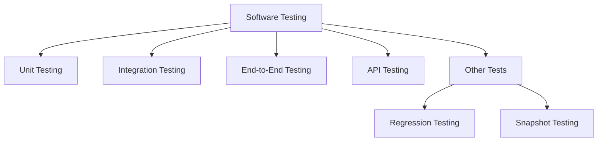

# Study Notes: Software Testing Concepts

## Overview# Study Notes: Software Testing Concepts

## Overview

These notes cover key testing methodologies in software development, focusing on unit, integration, end-to-end, API, and other testing types. They also provide context on practical usage, tools, and the role of testing in real-world development workflows.

---

## 1. Purpose of Testing in Software Development

Testing ensures that individual pieces of software and entire application flows behave correctly. Although often disliked or postponed, testing is essential for reliability, maintainability, and preventing regressions.

---

## 2. Types of Tests

### 2.1 Unit Testing

**Definition:**  
Testing a single, isolated “unit” of code—typically a function or module.

**Objective:**  
Verify that for a given input, the unit returns the expected output, independent of the rest of the system.

**Key Characteristics:**

- Fast to run.
    
- Highly isolated.
    
- Focused on small, deterministic behaviors.

**Example:**  
Testing a function `add(a, b)`:

- Input: `add(2, 3)`
    
- Expected output: `5`

---

### 2.2 Integration Testing

**Definition:**  
Testing how multiple units work together within a system.

**Objective:**  
Validate that interactions between functions, modules, or services behave correctly.

**Typical Scenario:**  
Testing a signup flow:

- User submits a form.
    
- Backend validates input.
    
- System creates user.
    
- Email service sends confirmation.

Even if each function individually works (unit tests), integration tests ensure the sequence and interactions are correct.

---

### 2.3 End-to-End (E2E) Testing

**Definition:**  
Testing an application from the user’s perspective, simulating real interactions from start to finish.

**Objective:**  
Ensure the entire system—from user interface to database—operates correctly as a whole.

**Characteristics:**

- Begins with user-driven actions (clicks, scrolls, inputs).
    
- Involves full system stack: UI → API → server → database → response.

**Tools:**  
Uses a real or simulated browser.

**Headless Browsers:**

- A browser without a graphical interface.
    
- Executes browser code but is faster and requires fewer resources.
    
- Suitable for automation and CI environments.

---

### 2.4 API Testing

**Definition:**  
Testing API endpoints directly, ensuring they return correct responses, headers, status codes, and error handling.

**Difference from Integration Testing:**

- Integration tests focus on internal logic flow.
    
- API tests focus on request-response correctness.

**Common Checks:**

- Correct status codes.
    
- Proper headers.
    
- Valid response bodies.
    
- Accurate error handling.

---

### 2.5 Other Testing Types

|Test Type|Description|
|---|---|
|Regression Testing|Ensures new changes do not break existing functionality.|
|Snapshot Testing|Stores expected output (often UI) and compares future outputs to detect unintended changes.|
|Manual Testing|Performed by humans, exploratory in nature.|
|Automated Testing|Scripted, repeatable tests executed by tools.|

---

## 3. Tools and Ecosystem

### 3.1 Testing Tools Mentioned

|Tool / Course|Purpose|
|---|---|
|Cypress|Popular framework for E2E browser-based testing.|
|Kent C. Dodds – JS Testing Practices|Course focused on testing fundamentals and best practices.|
|Enterprise UI Development Course|Covers a broader testing approach within large-scale systems.|

---

## 4. Visual Overview of Testing Hierarchy

---

## 5. Additional Notes

- Testing culture varies by company; some prioritize extensive test coverage, others focus only on critical paths.
    
- Setting up a testing system can feel difficult, but once in place, it greatly improves confidence and stability.
    
- E2E tests often use recording tools or browser automation scripts to simulate user flows.

---

## Summary of Key Points

- **Unit tests** verify isolated components.
    
- **Integration tests** ensure multiple components work together.
    
- **End-to-end tests** simulate real user flows across the entire system.
    
- **API tests** ensure endpoints behave correctly at the response level.
    
- Testing improves software reliability but can be time-consuming to set up.
    
- Headless browsers enable fast and automated E2E testing.
    
- Real-world development typically uses a combination of several testing types.

---

## MicroTest

## H2

These notes cover key testing methodologies in software development, focusing on unit, integration, end-to-end, API, and other testing types. They also provide context on practical usage, tools, and the role of testing in real-world development workflows.

---

## 1. Purpose of Testing in Software Development

Testing ensures that individual pieces of software and entire application flows behave correctly. Although often disliked or postponed, testing is essential for reliability, maintainability, and preventing regressions.

---

## 2. Types of Tests

### 2.1 Unit Testing

**Definition:**  
Testing a single, isolated “unit” of code—typically a function or module.

**Objective:**  
Verify that for a given input, the unit returns the expected output, independent of the rest of the system.

**Key Characteristics:**

- Fast to run.
    
- Highly isolated.
    
- Focused on small, deterministic behaviors.

**Example:**  
Testing a function `add(a, b)`:

- Input: `add(2, 3)`
    
- Expected output: `5`

---

### 2.2 Integration Testing

**Definition:**  
Testing how multiple units work together within a system.

**Objective:**  
Validate that interactions between functions, modules, or services behave correctly.

**Typical Scenario:**  
Testing a signup flow:

- User submits a form.
    
- Backend validates input.
    
- System creates user.
    
- Email service sends confirmation.

Even if each function individually works (unit tests), integration tests ensure the sequence and interactions are correct.

---

### 2.3 End-to-End (E2E) Testing

**Definition:**  
Testing an application from the user’s perspective, simulating real interactions from start to finish.

**Objective:**  
Ensure the entire system—from user interface to database—operates correctly as a whole.

**Characteristics:**

- Begins with user-driven actions (clicks, scrolls, inputs).
    
- Involves full system stack: UI → API → server → database → response.

**Tools:**  
Uses a real or simulated browser.

**Headless Browsers:**

- A browser without a graphical interface.
    
- Executes browser code but is faster and requires fewer resources.
    
- Suitable for automation and CI environments.

---

### 2.4 API Testing

**Definition:**  
Testing API endpoints directly, ensuring they return correct responses, headers, status codes, and error handling.

**Difference from Integration Testing:**

- Integration tests focus on internal logic flow.
    
- API tests focus on request-response correctness.

**Common Checks:**

- Correct status codes.
    
- Proper headers.
    
- Valid response bodies.
    
- Accurate error handling.

---

### 2.5 Other Testing Types

|Test Type|Description|
|---|---|
|Regression Testing|Ensures new changes do not break existing functionality.|
|Snapshot Testing|Stores expected output (often UI) and compares future outputs to detect unintended changes.|
|Manual Testing|Performed by humans, exploratory in nature.|
|Automated Testing|Scripted, repeatable tests executed by tools.|

---

## 3. Tools and Ecosystem

### 3.1 Testing Tools Mentioned

|Tool / Course|Purpose|
|---|---|
|Cypress|Popular framework for E2E browser-based testing.|
|Kent C. Dodds – JS Testing Practices|Course focused on testing fundamentals and best practices.|
|Enterprise UI Development Course|Covers a broader testing approach within large-scale systems.|

---

## 4. Visual Overview of Testing Hierarchy

---

## 5. Additional Notes

- Testing culture varies by company; some prioritize extensive test coverage, others focus only on critical paths.
    
- Setting up a testing system can feel difficult, but once in place, it greatly improves confidence and stability.
    
- E2E tests often use recording tools or browser automation scripts to simulate user flows.

---

## Summary of Key Points

- **Unit tests** verify isolated components.
    
- **Integration tests** ensure multiple components work together.
    
- **End-to-end tests** simulate real user flows across the entire system.
    
- **API tests** ensure endpoints behave correctly at the response level.
    
- Testing improves software reliability but can be time-consuming to set up.
    
- Headless browsers enable fast and automated E2E testing.
    
- Real-world development typically uses a combination of several testing types.
