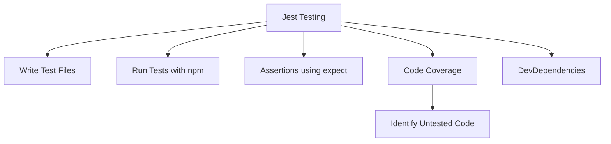

# Study Notes: Unit Testing with Jest

## 1. Introduction to Unit Testing with Jest

Unit testing involves verifying small, isolated pieces of code. For this purpose, Jest is used as the testing framework due to its simplicity, popularity, and wide adoption in JavaScript ecosystems.

### What is Jest?

- A testing framework created by Facebook.
    
- Inspired by earlier tools such as Mocha and Jasmine.
    
- Provides a complete solution with assertions, mocks, and test runners.
    
- Works for both backend and some frontend code.

---

## 2. Setting Up a Test Environment

### Creating a Test Directory

- Conventionally, create a `tests` directory at the project root.
    
- Test files typically use the `.test.js` suffix (e.g., `notes.test.js`).
    
- Jest automatically searches for files ending in `.test.js`.

### How Jest Finds Test Files

- Jest uses Node’s `fs` module to read directory contents.
    
- It scans for filenames with `.test` or similar patterns.
    
- Jest then imports and executes them within its own environment.

---

## 3. Anatomy of a Jest Test

### Jest’s Test Execution Environment

- Tests run in Node.js but wrapped in Jest’s environment.
    
- Jest provides global functions (e.g., `test`, `expect`).

### Structure of a Basic Test

```javascript
test('add takes two numbers and returns a sum', () => {
  function add(a, b) {
    return a + b;
  }
  const result = add(1, 2);
  expect(result).toBe(3);
});
```

### Concepts Introduced

|Concept|Description|
|---|---|
|`test(description, callback)`|Defines a test case.|
|`expect(value)`|Starts an assertion.|
|`.toBe(expected)`|Checks strict equality.|

---

## 4. Running Tests with Npm

### Package Scripts

- Tests run through the `"test"` script in `package.json`.
    
- `npm test` runs the test script directly (without `run`).

### Example `package.json` Setup

```json
"scripts": {
  "test": "jest"
}
```

### Installing Jest

- Installed as a dev dependency using:

```Python
npm install jest --save-dev
```

---

## 5. Dependencies Vs DevDependencies

### Key Differences

|Type|Purpose|
|---|---|
|**dependencies**|Required to run the application. Installed for all users.|
|**devDependencies**|Required only during development (e.g., Jest). Not installed when publishing packages.|

### Why Keep Jest in devDependencies?

- Tests are not required in production.
    
- Users of your package should not download unnecessary modules.
    
- Reduces package size and installation time.

---

## 6. Understanding Test Results

### Passing Tests

- Jest reports passing tests with green checkmarks.
    
- Example output:  
    `1 passed, 1 total`

### Failing Tests

- Displays expected vs received values.
    
- Helps diagnose whether:
    
    - The test expectation is wrong.
        
    - The implementation is incorrect.

### Example Failure Output

If `.toBe(7)` is used but result is `3`, Jest shows:

- Expected: `7`
    
- Received: `3`

---

## 7. Test-Driven Development (TDD) Notes

### Red–Green–Refactor Cycle

|Step|Purpose|
|---|---|
|**Red**|Write failing tests for unimplemented behavior.|
|**Green**|Write minimal code to make tests pass.|
|**Refactor**|Improve code while keeping tests passing.|

### Adoption in Practice

- Few developers fully follow strict TDD daily.
    
- Some companies enforce test coverage thresholds (e.g., 80%+).
    
- Tools generate coverage reports highlighting untested branches.

---

## 8. Code Coverage

### What Is Code Coverage?

- A metric showing which parts of code are executed during tests.
    
- Helps identify untested paths (often shown as yellow or red).

### Importance

- Encourages comprehensive testing.
    
- Often required in enterprise environments.

---

## 9. Challenges of Testing

- Setting up testing infrastructure can be complex.
    
- Many tools perform similar functions—creating confusion.
    
- Large projects may require extensive configuration and maintenance.

---

## Visual Summary (Mermaid Diagram)



---

## Summary of Key Points

- Jest is a widely adopted unit testing framework for JavaScript.
    
- Tests are stored in `.test.js` files that Jest finds automatically using `fs`.
    
- Basic tests use `test()` and `expect()` with matchers like `.toBe`.
    
- Jest should be installed as a dev dependency.
    
- Running tests occurs through `npm test`.
    
- Code coverage tools help enforce testing completeness.
    
- Companies may enforce test coverage thresholds.
    
- Testing setup can be complex but is essential for robust software.

---
