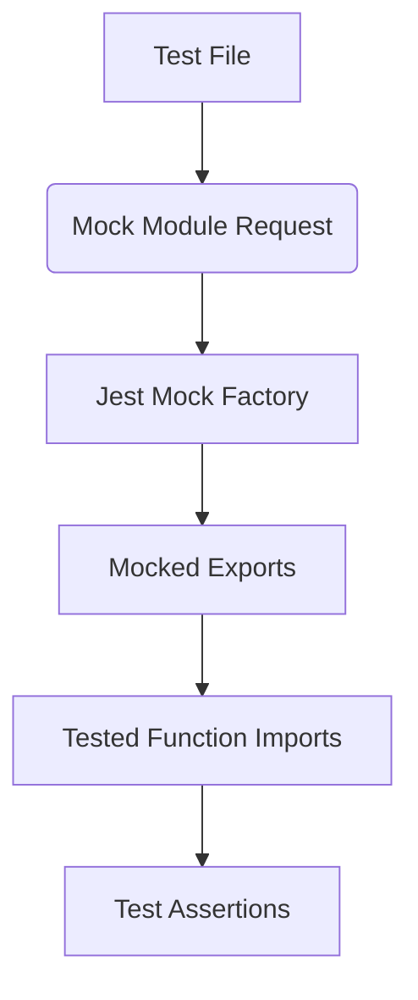

# Testing in Node.js with ESM and Jest

## Overview

This transcript covers how to write unit tests in Node.js using **ESM (ECMAScript Modules)** and **Jest**, focusing on mocking dependencies, dynamic imports, and writing proper isolated tests.

---

# 1. ESM Modules and Their Impact on Testing

## ESM is Not Just Syntactic Sugar

**Definition:** ESM (`"type": "module"`) changes how modules work in Node.js.  
**Relevance:** Tools like Jest must adapt to this different module system, making mocking more complex.

---

# 2. Mocking in Unit Testing

## What is Mocking?

**Mocking** replaces a real dependency with a fake version (stub or spy).  
**Purpose:**

- Test one unit in isolation
    
- Avoid side effects (e.g., writing to a database)
    
- Avoid slow or stateful operations

## Why Mock Database Functions?

Real database calls:

- Slow
    
- Stateful
    
- Unnecessary to unit test (database correctness is not your responsibility)

Mocked database functions:

- Do nothing
    
- Return fake data
    
- Allow you to control behavior and test logic only

## Spy Functions

A **spy** tracks:

- How many times it was called
    
- With what arguments
    
- By what code path

Useful for expectations such as:  
`expect(insertDB).toHaveBeenCalledTimes(3)`

---

# 3. Mocking with Jest in ESM

## Unstable Mock API

Because Jest + ESM is new, you must import Jest globals and use:

```Python
jest.unstable_mockModule(path, mockFactory)
```

## How It Works

- You specify a module path
    
- Jest replaces exported functions with mocked versions (spies)

### Mermaid Diagram – Mocking Flow



---

# 4. Dynamic (Async) Imports

## Why Dynamic Imports Are Required

When using ESM:

- Static imports load before mocks are applied.
    
- Dynamic imports allow mocking **before** the modules are loaded.

## Syntax

```js
const { newNote } = await import('./notes.js');
```

If you use static imports, the real module loads before mocking, breaking the test.

---

# 5. beforeEach and Test Isolation

## Purpose of `beforeEach()`

Runs before every test to ensure fresh state.

Benefits:

- Tests don’t depend on each other
    
- Order of execution doesn't matter
    
- Prevents shared state bugs

Typical use in mocking:

```js
beforeEach(() => {
  jest.clearAllMocks();
});
```

---

# 6. Example: Testing `newNote()`

## Goal

Test that `newNote()`:

- Inserts data via `insertDB`
    
- Returns the expected properties

## Setup Summary

1. Prepare a note object
    
2. Mock `insertDB` so it returns that note
    
3. Call `newNote()`
    
4. Assert values match

## Step-by-Step Example

### Prepare the Input

```js
const note = { content: 'this is my note', id: 1, tags: ['hello'] };
```

### Mock DB return Value

```js
insertDB.mockResolvedValue(note);
```

This simulates:

- Asynchronous behavior
    
- The real DB returning a note object

### Call the Function under Test

```js
const result = await newNote(note.content, note.tags);
```

### Assertions

Because `newNote` generates its own ID internally, you cannot compare full objects.

Instead:

```js
expect(result.content).toEqual(note.content);
expect(result.tags).toEqual(note.tags);
```

## `toEqual` Vs `toBe`

|Matcher|Checks|Example Passes?|
|---|---|---|
|`toBe`|strict equality (`===`)|Only if same object in memory|
|`toEqual`|properties and values|Yes, even if different objects with same shape|

Objects always fail strict comparison:

```js
{} === {} // false
```

---

# 7. Running Jest with ESM

## Why the Test Fails Without This

ESM requires enabling Node’s experimental VM module system.

## Required Script

In `package.json`:

```json
"test": "node --experimental-vm-modules node_modules/jest/bin/jest.js"
```

Without this, Jest doesn’t understand the ESM imports.

---

# 8. Unit Testing Philosophies: TDD Vs BDD

## TDD – Test-Driven Development

- Write tests before code
    
- Focus on units and correctness

## BDD – Behavior-Driven Development

- Focus on behaviors and user expectations
    
- Often used for integration or end-to-end tests

## What to Test?

- **Unit tests** → internal logic, ignore user context
    
- **Integration/E2E tests** → user-facing behavior, flows, edge cases

---

# Resumen De Puntos Clave

- ESM affects how Jest loads and mocks modules.
    
- Mocking isolates the unit under test and avoids side effects.
    
- Jest’s `unstable_mockModule` is required for ESM mocking.
    
- Dynamic `import()` must be used so mocking applies before loading modules.
    
- `beforeEach()` ensures clean, stateless tests.
    
- Use `toEqual` for object comparison; `toBe` only for primitives or references.
    
- When testing functions like `newNote()`, only assert properties you control.
    
- TDD focuses on units, BDD focuses on behavior depending on the test level.