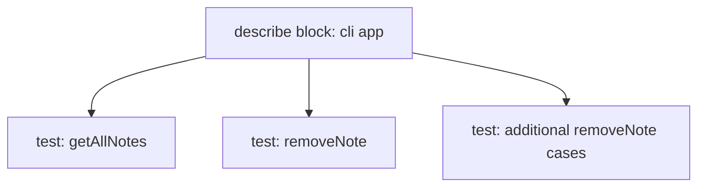

# Testing Additional Functions in Jest (ESM)

## Overview

This transcript continues exploring Jest testing patterns for functions such as **getAllNotes** and **removeNote**, emphasizes grouping tests with **describe**, and introduces the alternative **it()** syntax.

---

# 1. Testing `getAllNotes`

## Purpose of the Test

Validate that `getAllNotes()` returns exactly what the mocked database supplies.

## Key Idea

The test does **not** verify the structure or schema of each note; it only checks that the returned value matches the mocked value exactly.

## Example Behavior

1. Mock database returns a list of notes.
    
2. `getAllNotes()` is called.
    
3. Expectation checks equality:

```js
expect(result).toEqual(mockedNotes);
```

## Why This Is Sufficient

- The goal of the unit test is verifying that the function retrieves what it's supposed to retrieve.
    
- Validation of shape or schema belongs in different kinds of tests (e.g., schema validation or integration tests).

---

# 2. Testing `removeNote`

## Behavior Under Test

The test ensures that attempting to remove a note with a non-existent ID returns `undefined`.

## Example Explanation (Step-by-Step)

1. Mock database contains some notes with IDs (e.g., 1, 2, 3).
    
2. Function is called with ID `4`.
    
3. Since no such note exists, the mocked database API returns `undefined`.
    
4. The test verifies this:

```js
expect(result).toBeUndefined();
```

## Importance

- Confirms correct behavior for missing data.
    
- Demonstrates how to test "negative paths" or edge cases.

---

# 3. Grouping Tests with `describe`

## What `describe` Does

`describe()` groups related tests logically.

## Why Group Tests?

- Large codebases may contain hundreds or thousands of tests.
    
- Grouping allows easier navigation and more readable output.
    
- Structure becomes clearer when multiple tests exercise the same module or feature.

## Example

```js
describe("cli app", () => {
  test("gets all notes", () => { /* ... */ });
  test("removes note", () => { /* ... */ });
});
```

## Mermaid Visualization



---

# 4. Multiple Tests for One Function

## Rationale

A single function may require multiple scenarios to be fully tested, e.g.:

|Scenario|Example Input|Expected Output|
|---|---|---|
|Remove existing note|ID exists|Note is deleted|
|Remove non-existing note|ID not found|undefined|
|Invalid input|null, non-number|Throws or returns error state|
|Multiple deletions|Repeated removals|Consistent behavior|

Testing each scenario ensures reliable, predictable behavior.

---

# 5. Using `it()` vs. `test()`

## Both Are Equivalent

`it()` and `test()` perform the same actions in Jest.

## Differences

|Keyword|Typical Style|Example|
|---|---|---|
|`test`|Direct, functional|`test("removes note", …)`|
|`it`|Behavior-driven|`it("should remove note", …)`|

## Reason for Choice

- Teams choose based on preference or testing philosophy (BDD vs. general testing).
    
- There is no functional difference; both run the same way.

## Example

```js
it("should return undefined when removing a nonexistent note", () => {
  // test logic
});
```

---

# Summary of Key Points

- `getAllNotes` tests simply verify that output equals the mocked database result.
    
- `removeNote` tests should cover both normal and edge cases, such as nonexistent IDs.
    
- `describe()` is used to organize tests into logical groups, improving readability.
    
- Multiple tests per function are common and necessary for complete coverage.
    
- `it()` and `test()` behave identically; the choice depends on style or team conventions.