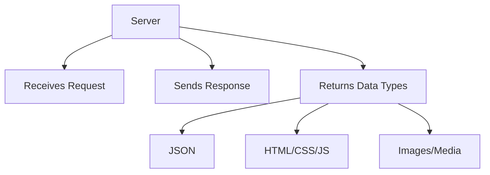

# Introduction to Servers in Node.js

## Transition from Testing to Servers

The transcript shifts from testing concepts toward understanding how servers work in Node.js. Before servers, the course has covered CLI applications, file systems, and asynchronous programming—skills that already allow building many developer tools (e.g., linters, build tools, scaffolding tools).

---

# 1. Understanding What a Server Is

## Definition

A **server** is a program that listens for incoming **network requests** and sends back a **response**.

## What Is a Network Request?

A network request is any action where a client asks for data over the internet (e.g., refreshing a webpage). Browsers allow inspection of these requests in the Network tab.

## Types of Data a Server Can Return

A server can send back any type of data:

- JSON
    
- HTML
    
- CSS / JavaScript files
    
- Images
    
- Audio / Video
    
- Streaming data
    
- Emails
    
- Arbitrary binary content

## Types of Servers

|Type|Description|
|---|---|
|Traditional servers|Always running, always accepting requests.|
|CDNs|Distributed servers that cache and serve content geographically.|
|Serverless|Only run on demand, spin up per request.|
|Real-time servers|Maintain two-way communication (e.g., games, Google Docs).|
|Non-real-time servers|Typical HTTP servers with one-way request → response pattern.|

## Mermaid Diagram: Server Concept Overview



---

# 2. Creating a Basic HTTP Server in Node.js

## Using the Core HTTP Module

Node.js includes a built-in module called **http** used to create servers.

## Example Structure

```js
import http from "node:http";

const server = http.createServer((req, res) => {
    res.statusCode = 200;
    res.setHeader("Content-Type", "text/plain");
    res.end("Hello there");
});

server.listen(4000, () => {
    console.log("Server running on http://localhost:4000");
});
```

## Step-by-Step Breakdown

### 1. Import HTTP Module

```js
import http from "node:http";
```

This loads the internal module for building HTTP servers.

### 2. Create Server

```js
http.createServer((req, res) => { ... })
```

The callback receives:

- **req**: Incoming request data.
    
- **res**: Response object to send data back.

This req/res pattern is extremely common in server frameworks.

### 3. Setting Status Codes

```js
res.statusCode = 200;
```

Status codes indicate the outcome of a request.

|Range|Meaning|
|---|---|
|200–299|Success|
|300–399|Success but cached/redirected|
|400–499|Client made a bad request|
|500–599|Server encountered an error|

Examples:

- **200**: OK
    
- **401**: Unauthorized (bad credentials)
    
- **404**: Resource not found
    
- **500**: Internal server error

Note: Some technologies (e.g., GraphQL) do not rely on HTTP status codes for error semantics.

### 4. Setting Headers

```js
res.setHeader("Content-Type", "text/plain");
```

Defines metadata about the returned content.

#### MIME Types

A **MIME type** describes the format of the returned data—like file extensions on the web.

Examples:

|MIME Type|Meaning|
|---|---|
|`text/plain`|Plain text|
|`text/html`|HTML|
|`application/json`|JSON|
|`image/png`|PNG image|

Browsers use these to properly process and display content.

### 5. Ending the Response

```js
res.end("Hello there");
```

Finalizes and sends the response.

---

# 3. Starting the Server

## Listening on a Port

```js
server.listen(4000, () => { ... });
```

A **port** is a numeric endpoint for communication. Common development ports include:

- 3000
    
- 4000
    
- 5000

If a port is in use, choose another.

Websites also use ports (often implicitly):

- HTTP: 80
    
- HTTPS: 443

Local development uses ports explicitly.

## Important Behavior

- The program **does not exit** after starting the server.
    
- It remains running, waiting for incoming requests.
    
- You must stop it manually (e.g., Ctrl+C).

---

# 4. Debugging Example from the Transcript

The transcript includes a mistake:

```js
res.statusCode()
```

This fails because **statusCode is a property, not a function**.

Correct usage:

```js
res.statusCode = 200;
```

After fixing, the server responds correctly with:

```Python
Hello there
```

---

# Summary of Key Points

- A server listens for requests and sends responses; Node.js makes this easy using the built-in **http** module.
    
- Network requests are everywhere on the web; browsers allow you to inspect them.
    
- Servers can return many types of data (JSON, HTML, media, streaming content).
    
- Status codes communicate request outcomes between systems.
    
- MIME types help browsers understand how to render the returned data.
    
- Creating a server involves: creating the server, handling req/res, setting headers/status, ending the response, and listening on a port.
    
- Node servers run continuously until manually stopped.