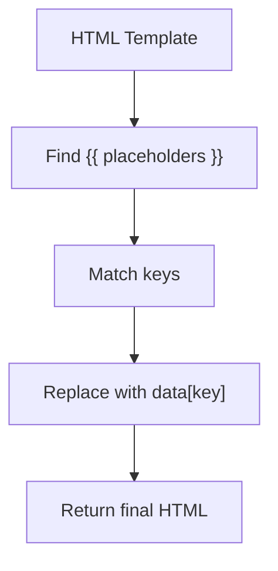

# Notes on Building a Dynamic HTTP Server in Node.js

---

# 1. Overview: Goal of the Server

The purpose of this section is to build a Node.js HTTP server that:

- Fetches notes stored in a JSON “database”.
    
- Injects (interpolates) those notes into an HTML template.
    
- Serves the dynamically generated HTML as a webpage.
    
- Optionally opens the browser automatically using the `open` package.

This allows visualizing notes in the browser instead of only using CLI commands.

---

# 2. Template-Based Rendering

## 2.1 What Is Interpolation?

**Interpolation**:  
The process of inserting values into placeholders inside a string.  
Example in JavaScript:

```js
`My name is ${data.name}`
```

In this project, interpolation replaces placeholders like `{{ notes }}` inside an HTML template with dynamically generated HTML.

---

## 2.2 Creating the HTML Template

The developer creates a file `template.html` containing a placeholder:

```html
<div class="notes">
  {{ notes }}
</div>
```

This placeholder will later be replaced by generated HTML representing the notes.

---

# 3. Installing Tools

## 3.1 Installing `open`

`open` is an npm package that automatically launches the browser to a specified URL.

```Python
npm install open
```

Although optional, it enhances the experience by avoiding manually opening the browser.

---

# 4. Setting Up the Server

## 4.1 Required Imports

```js
import fs from "node:fs";
import http from "node:http";
import open from "open";
```

These modules provide:

|Module|Purpose|
|---|---|
|`fs`|Reading the template file and the notes JSON|
|`http`|Creating the HTTP server|
|`open`|Automatically opening the browser|

---

# 5. Interpolation Function

## 5.1 Purpose

Replaces all `{{ … }}` placeholders in the HTML template with values provided in a data object.

## 5.2 How It Works

The function:

- Scans the HTML string for patterns like `{{ key }}`.
    
- Uses a regex to find all placeholders.
    
- Replaces each placeholder with `data[key]` if it exists.
    
- Falls back to empty string if missing.

### Regex Explanation

Pattern:

```Python
/{{\s*(\w+)\s*}}/g
```

Breakdown:

|Part|Meaning|
|---|---|
|`{{`|match literal `{{`|
|`\s*`|optional spaces|
|`(\w+)`|capture a word (placeholder name)|
|`\s*`|optional spaces|
|`}}`|match literal `}}`|
|`g`|“global” — replace all occurrences|

### Mermaid Diagram: Interpolation Flow



---

# 6. Formatting Notes Into HTML

## 6.1 Goal

Transform an array of notes into HTML `<div>` elements.

Each note should be rendered like:

```html
<div class="note">
  <p>Note content here</p>
  <div class="tags">
    <span class="tag">tag1</span>
    <span class="tag">tag2</span>
  </div>
</div>
```

## 6.2 Implementation

```js
const formatNotes = (notes) => {
  return notes
    .map((note) => {
      return `
        <div class="note">
          <p>${note.content}</p>
          <div class="tags">
            ${note.tags
              .map((tag) => `<span class="tag">${tag}</span>`)
              .join("\n")}
          </div>
        </div>
      `;
    })
    .join("\n");
};
```

### Step-by-step Explanation

1. **Iterate through each note** using `.map()`.
    
2. **Create a `<div>`** for the note.
    
3. **Insert the note content** using interpolation.
    
4. **Create a tags section**, which:
    
    - Maps each tag to a `<span class="tag">`.
        
    - Joins them to avoid an array being inserted.
        
5. **Join all notes into one HTML string**.

---

# 7. How Everything Will Connect

Before sending the page to the client, the server will:

1. Read the notes file (JSON).
    
2. Generate HTML using `formatNotes`.
    
3. Load the template HTML.
    
4. Use `interpolate()` to replace `{{ notes }}`.
    
5. Serve the final HTML through HTTP.

This creates a basic dynamic rendering system similar to templating engines like Handlebars or EJS, but implemented manually.

---

# Summary of Key Concepts

- **Interpolation** allows you to insert dynamic values into templates.
    
- **HTML template file** contains placeholders that will be replaced dynamically.
    
- **Interpolation function** uses regex to replace placeholders with data fields.
    
- **formatNotes** converts each note into a structured HTML block.
    
- The server will later serve this generated HTML to display notes visually.
    
- This approach mimics a basic templating system used in many web frameworks.

These concepts form the basis of dynamic server-side rendering in simple Node.js applications.