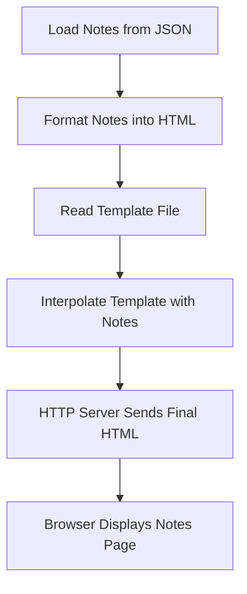

## Notes on Creating a Dynamic HTTP Server with Templating in Node.js

---

# 1. Objective: Server That Renders Notes into an HTML Template

The goal is to build a Node.js server that:

- Reads an HTML template.
    
- Interpolates the template with formatted notes (HTML `<div>` elements).
    
- Sends the generated HTML to the client.
    
- Opens the rendered page automatically in the browser.
    
- Allows dynamic port selection.
    
- Demonstrates foundational server-side rendering (SSR) without a framework.
    

---

# 2. Creating the Server Function

## 2.1 Structure of `createServer(notes)`

A function that returns an HTTP server instance.

### Key steps:

1. Read the HTML template.
    
2. Interpolate the template with formatted notes.
    
3. Send the interpolated HTML to the client.
    

---

# 3. Reading the HTML Template

## 3.1 Determining the Template Path

```js
const HTML_PATH = new URL("./template.html", import.meta.url);
```

Important note:

- On Windows, `pathname` can break file paths. Avoid using `HTML_PATH.pathname`.
    

## 3.2 Reading the File

```js
const template = await fs.readFile(HTML_PATH, "utf-8");
```

---

# 4. Interpolating the Template

## 4.1 Goal

Replace placeholders — such as `{{ notes }}` — with generated HTML from the notes data.

### Code Example:

```js
const html = interpolate(template, {
  notes: formatNotes(notes),
});
```

### Concept Definition: Interpolation

Interpolation replaces placeholder markers within a string with provided data.  
Used here to inject HTML into the template.

---

# 5. Sending the Response

## 5.1 Setting Headers and Sending Content

Use `writeHead` to send status and headers together:

```js
res.writeHead(200, { "Content-Type": "text/html" });
res.end(html);
```

### Why `Content-Type: text/html` matters:

It instructs the browser to interpret the response as HTML, not plain text.

---

# 6. Starting the Server

## 6.1 `start(notes, port)` Function

### Responsibilities:

- Create the HTTP server.
    
- Listen on the provided port.
    
- Log the server address.
    
- Open the browser automatically using `open`.
    
- Export the function for use in other modules.
    

### Implementation Outline:

```js
const server = createServer(notes);
server.listen(port);

const address = `http://localhost:${port}`;
console.log(address);
open(address);
```

---

# 7. Exporting Functions

Only export what is needed externally:

```js
export { start };
```

### Notes on Module Exports:

- Non-exported functions are effectively private.
    
- Private functions **cannot be tested externally**, which may be a disadvantage.
    
- Good practice: export functions you plan to test.
    

---

# 8. Integrating with the CLI Command

### Web Command Workflow:

1. Retrieve all notes:
    
    ```js
    const notes = await getAllNotes();
    ```
    
2. Pass notes and port to `start()`:
    
    ```js
    start(notes, argv.port);
    ```
    

### Default port:

Port is positional with a default value of `5000`.  
If port is busy, user can specify another one when running:

```
notes web 4001
```

---

# 9. Troubleshooting the Example

### Issue: Blank page

Cause: No notes exist in the JSON database.

### Fix:

Create notes using the CLI:

```
notes new "clean my room"
```

Después de agregar notas:

```
notes web 4003
```

The rendered webpage will now display the list of notes.

---

# 10. Understanding What Was Built: Server-Side Rendering (SSR)

You created a **server-rendered HTML page** manually:

- HTML is composed on the server.
    
- Resulting HTML is sent fully formed to the client.
    
- This approach is the foundation of “Server-Side Rendering”.
    

### Relation to Frameworks:

|Concept|How it relates|
|---|---|
|Server-side React|Also renders HTML on the server and sends to the client.|
|Express.js|A popular HTTP framework built on top of `http`. Uses templating or JSX rendering.|

The lesson intentionally avoids Express to demonstrate **foundational HTTP mechanics**.

---

# 11. Mermaid Diagram: Server Rendering Flow



---

# 12. Summary of Key Points

- The server reads an HTML template and injects dynamic content into it.
    
- Interpolation replaces placeholders like `{{ notes }}` with generated HTML.
    
- `writeHead` sets status and headers; `end()` sends the final response.
    
- A `start()` function wraps server creation, listening, logging, and auto-opening the browser.
    
- Notes must exist in the database before they appear on the website.
    
- This approach demonstrates fundamental server-side rendering without frameworks.
    
- Express.js usually replaces manual HTTP servers in real applications, but both rely on underlying Node’s `http` module.
    

These notes summarize the full server creation, integration, and rendering workflow.