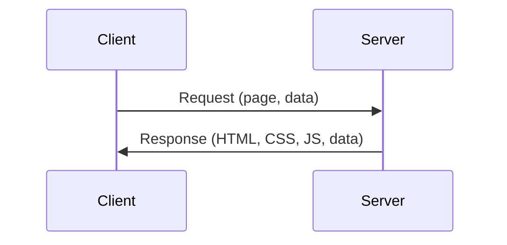
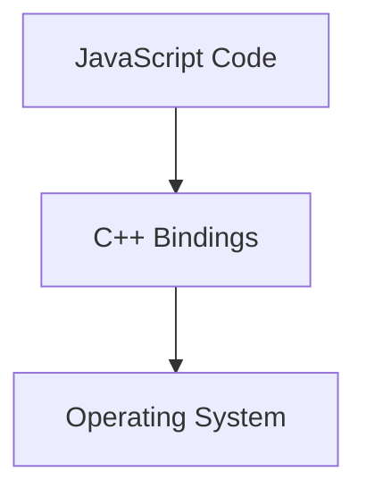

# Opening a Web Application

## Definition

Opening a web application means loading code and data into a web browser so the application can render content and respond to user interactions.

## Context

Different users on different devices (desktop, laptop, phone) can access the same web application through a browser, yet each may request different content or views.

## Example

- A user opens `twitter.com/username` on a Mac.
    
- Another user opens Twitter on Linux and navigates to a topic-specific page.
    
- A third user opens the Twitter homepage on a mobile phone.

All of these are interactions with the same web application.

---

# Core Frontend Technologies

## The Three Required Languages

|Language|Purpose|Role in a Web App|
|---|---|---|
|HTML|Structure|Defines what appears on the page (text, images, links)|
|CSS|Presentation|Styles and positions elements visually|
|JavaScript|Logic & Interaction|Handles user actions, dynamic updates, and data requests|

## Relevance

These three languages run in the browser and are required for any modern web application to function.

---

# Code Vs Data in Web Applications

## Definition

- **Code**: Instructions that tell the browser how to display and behave.
    
- **Data**: Content loaded dynamically, such as tweets, images, and videos.

## Context

Code is responsible for layout and behavior, while data provides the actual content users see.

---

# The Server Concept

## Definition

A **server** is another computer that is:

- Always on
    
- Connected to the internet
    
- Responsible for responding to requests with code and data

## Key Idea

Servers are not special machines by default; they are computers configured to receive and respond to network messages.

---

# Client–Server Model

## Definitions

- **Client**: The user’s browser requesting data and code.
    
- **Server**: The computer that processes requests and sends responses.

## Relationship Diagram

---

# Requests and Responses

## Request

A message sent by the browser asking for:

- A specific page
    
- Associated data
    
- Supporting assets (code, images)

## Response

The server’s reply, containing:

- HTML, CSS, and JavaScript files
    
- Data such as tweets or images

---

# Server-Side Logic

## Definition

Server-side logic is the code that:

- Inspects incoming requests
    
- Determines what content is needed
    
- Sends back the correct response

## Key Action

The developer writes **code** that decides how the server reacts to each request.

---

# Accessing Computer Internals

## Required Capabilities

To act as a server, a program must access:

- Network interfaces (to receive requests)
    
- File system (to read stored files)
    
- Operating system features

## Challenge

Not all programming languages can directly access these low-level features.

---

# Programming Languages and System Access

## Languages Mentioned

- PHP
    
- Ruby
    
- Java
    
- C
    
- C++

## Key Distinction

- **C/C++**: Can directly interact with the operating system.
    
- **JavaScript**: Cannot directly access system internals.

---

# Limitations of JavaScript Alone

## Constraint

JavaScript, by itself, cannot:

- Read files from disk
    
- Listen directly to network ports
    
- Control operating system resources

## Implication

JavaScript alone cannot implement a server.

---

# Node.js: Bridging JavaScript and the System

## Definition

**Node.js** is a runtime that allows JavaScript to:

- Indirectly access system-level features
    
- Use C++ bindings to interact with the operating system

## Core Idea

JavaScript controls C++ components, which in turn control the computer.

---

# Node.js Architecture

---

# Node.js Built-in Modules

## Examples

|Module|Purpose|
|---|---|
|HTTP|Handle network requests and responses|
|FS|Access the file system|

## Relevance

These modules expose JavaScript APIs that internally rely on C++ implementations.

---

# Do You Need to Know C++?

## Answer

- Writing C++ code is not required.
    
- Understanding how JavaScript triggers C++ functionality is essential.

## Mental Model

Developers must understand how JavaScript commands map to underlying system operations.

---

# Learning Focus Going Forward

## Key Goals

- Understand how requests are received
    
- Learn how JavaScript interacts with Node.js internals
    
- Develop a strong mental model of server behavior

---

# Summary of Key Points

- Web applications run using HTML, CSS, and JavaScript in the browser.
    
- Data and code are loaded from a server.
    
- A server is an always-on computer that responds to client requests.
    
- JavaScript cannot directly access system internals.
    
- C++ can access operating system features.
    
- Node.js combines JavaScript with C++ to enable server-side development.
    
- Understanding the interaction between JavaScript and C++ is critical for mastering Node.js.