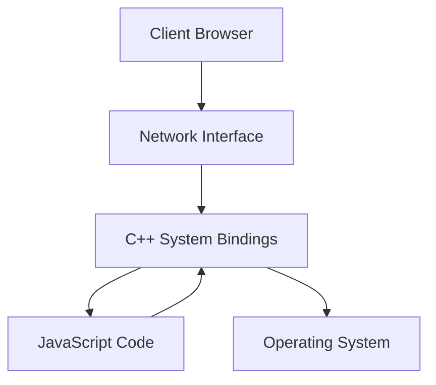
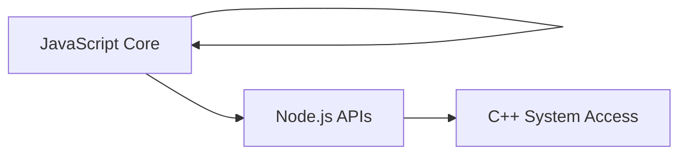

# Request Flow in a Web Application

## Definition

A **request flow** describes how a message sent from a user’s device travels through the network, reaches a server, and is processed to generate a response.

## Context

When a user opens a URL such as `twitter.com/node`, their device sends an internet message requesting specific content.

## Example (Step-by-Step)

1. A user opens a browser on a Mac.
    
2. The browser sends an internet message requesting `/node`.
    
3. The message travels over the network.
    
4. The message arrives at the server’s networking interface.
    
5. The server processes the request and prepares a response.

---

# Where Incoming Requests Arrive

## Definition

Incoming requests do **not** arrive in JavaScript code. They arrive at the computer’s **network interface**, often referred to conceptually as the **network card**.

## Relevance

Understanding where requests physically arrive is essential to understanding why JavaScript alone cannot handle server responsibilities.

---

# Computer Internals

## Definition

**Computer internals** are operating system–level features that include:

- Networking
    
- File system
    
- Process management

## Key Point

These features are managed by the operating system and cannot be accessed directly by JavaScript.

---

# The Role of C++ in Server Operations

## Definition

**C++** is a low-level language capable of interacting directly with operating system abstractions that control networking and file access.

## Clarification

C++ does not interact with hardware directly; instead, it communicates with **operating system abstraction layers** that manage hardware safely.

## Relevance

Server-side programs rely on C++ to:

- Receive network messages
    
- Read files from disk
    
- Manage system resources

---

# JavaScript’s Limitation and Indirect Access

## Definition

JavaScript cannot directly access computer internals such as the network or file system.

## Solution

JavaScript interacts with **C++ features indirectly** through exposed interfaces.

---

# Node.js As a Bridge

## Definition

**Node.js** is a runtime environment where:

- JavaScript code controls
    
- C++-implemented features
    
- Which in turn access operating system internals

## Core Relationship

JavaScript → Node.js APIs → C++ → Operating System

---

# Node.js Architecture

---

# JavaScript “Labels” in Node.js

## Definition

**Labels** are JavaScript-accessible APIs that appear as functions or objects but internally trigger C++ logic.

## Examples

|Label|Purpose|
|---|---|
|Networking APIs|Handle inbound requests|
|File system APIs|Read and write files|
|Other built-ins|Access system-level functionality|

## Relevance

These labels allow developers to write JavaScript while leveraging C++ power.

---

# Why Understanding Node Internals Matters

## Key Insight

Most of Node.js’s heavy lifting occurs in C++, not JavaScript.

## Implication

Developers must understand:

- How JavaScript commands map to C++ behavior
    
- How data flows between layers

---

# JavaScript Execution Model (Independent of Node)

## Overview

JavaScript has a core execution model that operates independently of Node.js internals.

## The Three Core Responsibilities

|Responsibility|Description|
|---|---|
|Saving data|Stores values such as numbers, strings, arrays, objects, and functions|
|Using data|Executes stored functions and operates on stored values|
|Triggering Node features|Calls labels that activate C++-based system operations|

---

# Core JavaScript Responsibilities (Without Node)

## 1. Saving Data

JavaScript stores:

- Primitive values
    
- Data structures
    
- Functions (code to run later)

## 2. Using Data

JavaScript executes previously stored functions and manipulates stored values.

## Importance

These two behaviors form the foundation needed to understand how JavaScript later interacts with Node.js and C++.

---

# Conceptual Separation of Responsibilities

---

# Learning Priority Going Forward

## Key Focus

Before mastering Node.js internals, it is essential to:

- Fully understand JavaScript’s execution model
    
- Understand how JavaScript saves and executes code
    
- Build a strong mental model of how JavaScript interacts with Node.js

---

# Summary of Key Points

- Browser requests arrive at the server’s network interface, not in JavaScript.
    
- Computer internals are controlled by the operating system.
    
- C++ can access operating system abstractions; JavaScript cannot.
    
- Node.js bridges JavaScript and C++.
    
- JavaScript controls C++ features through labeled APIs.
    
- Most of Node.js’s heavy work happens in C++.
    
- JavaScript’s core responsibilities are saving data, using data, and triggering Node.js features.
    
- A deep understanding of JavaScript execution is required to understand Node.js behavior.