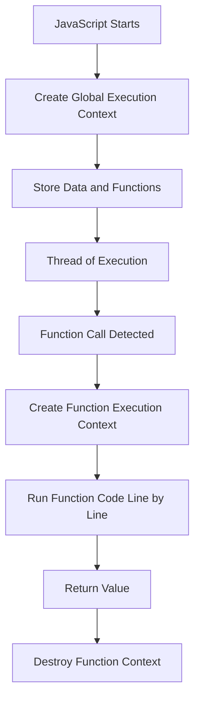

# JavaScript Core Execution Model

## Overview

JavaScript fundamentally performs two tasks:

1. **Saving data and code**
    
2. **Running code on data**

Understanding these two responsibilities explains how JavaScript executes programs, manages memory, and runs functions.

---

# Global Execution Context

## Definition

The **Global Execution Context** is the initial environment created when JavaScript starts running a program.

It consists of:

- **Global Memory (Global Variable Environment)**:  
    A persistent data store where variables and functions declared in the global scope are saved.
    
- **Thread of Execution**:  
    JavaScript’s ability to execute code line by line, in order.

## Key Characteristics

- Data stored here is **available throughout the entire runtime** of the program.
    
- This memory exists as long as the program is running.
    
- Often referred to simply as **memory**.

---

# Saving Data in JavaScript

## Variables

- Declaring a variable creates a **label** in memory.
    
- Assigning a value stores data under that label.

Example:

```js
const num = 3;
```

- Label: `num`
    
- Stored value: `3`

---

# Saving Code in JavaScript (Functions)

## Function Declaration

### What Happens When a Function Is Declared

When JavaScript encounters a function declaration:

- It **stores the function’s label**
    
- It **stores the function’s body (code)**
    
- It **stores the parameters (placeholders for future input)**

This code is **not executed immediately**.  
It is saved for later use.

## Stored Components of a Function

|Component|Description|
|---|---|
|Function name|Label used to reference the code|
|Parameters|Placeholders for future inputs|
|Function body|Code to run later|

---

# Executing Code

## Thread of Execution

### Definition

The **Thread of Execution** is JavaScript’s mechanism for:

- Moving through code line by line
    
- Evaluating and executing instructions sequentially

---

# Running a Function

## How Functions Are Executed

To execute a function:

- Use the function’s label
    
- Add parentheses `()`

Example:

```js
multiplyBy2(3);
```

## Important Distinction

- **Parentheses `()` trigger execution**
    
- **Arguments** are values inserted into parameters during execution

---

# Function Execution Context

## Definition

A **Function Execution Context** is a temporary environment created when a function is executed.

It contains:

- **Local Memory** (temporary data store)
    
- **Its own Thread of Execution**

This context exists **only while the function is running**.

## Lifecycle

1. Function is called
    
2. Execution context is created
    
3. Code runs line by line
    
4. Function returns (or finishes)
    
5. Execution context is destroyed
    
6. Local memory is deleted

---

# Parameters and Arguments

## Definitions

- **Parameters**: Placeholders defined in the function declaration
    
- **Arguments**: Actual values passed into the function during execution

---

# Example: Step-by-Step Function Execution

## Code Example

```js
function multiplyBy2(inputNumber) {
  const result = inputNumber * 2;
  return result;
}

const output = multiplyBy2(3);
```

## Step-by-Step Breakdown

### Global Execution Context

1. Store `multiplyBy2` (function code + parameter)
    
2. Declare `output` (uninitialized)
    
3. Encounter function call `multiplyBy2(3)`

### Function Execution Context

1. Create local memory
    
2. Assign parameter:
    
    - `inputNumber = 3`
        
3. Declare `result`
    
4. Compute:
    
    - `result = 6`
        
5. `return 6`
    
6. Assign returned value to `output`
    
7. Delete local execution context

---

# Memory Behavior

## Global Vs Local Memory

|Memory Type|Scope|Lifetime|
|---|---|---|
|Global Memory|Entire program|Until program ends|
|Local Memory|Inside function|Until function finishes|

---

# Returning from a Function

## Return Keyword

- `return` immediately exits the function
    
- Sends a value back to the caller
    
- If no `return` is used, the function exits at the closing brace

---

# Functions as Deferred Code

## Purpose

Functions allow JavaScript to:

- **Bundle code**
    
- **Delay execution**
    
- **Run code later in response to events**

This concept is foundational for:

- Event-driven programming
    
- Asynchronous behavior
    
- Node.js architecture

---

# High-Level JavaScript Model

## Core Responsibilities

1. **Save data and code**
    
2. **Execute code on data**

## Triggering Execution

- JavaScript does **not** automatically run saved functions
    
- Execution happens only when parentheses `()` are applied

---

# Conceptual Flow (MermaidJS)



---

# Key Takeaways

- JavaScript first **stores data and code**, then **runs code on data**
    
- Functions are stored for later execution
    
- Execution requires parentheses `()`
    
- Each function call creates a temporary execution context
    
- Local memory is deleted after function execution
    
- This execution model underpins Node.js and event-driven systems