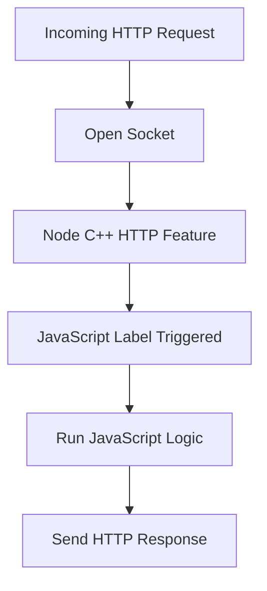

# JavaScript + Node.js: Accessing External Capabilities

## Overview

JavaScript alone cannot directly access system-level features such as networking. **Node.js extends JavaScript** by exposing C++-implemented capabilities through JavaScript-accessible labels, enabling server-side behavior like receiving and responding to web requests.

---

# The Goal: Handling Incoming Internet Messages

## Conceptual Objective

The core goal is to:

- Receive messages from the Internet
    
- Inspect (introspect) their contents
    
- Decide what the message is requesting
    
- Send back an appropriate response

This is the foundation of building web servers and APIs.

---

# Node.js Built-in Features

## Definition

**Node.js built-in features** are system-level capabilities written in C++ and exposed to JavaScript through predefined labels.

These features allow JavaScript to:

- Access the network
    
- Communicate with hardware
    
- Handle asynchronous events

JavaScript triggers these features using labels, similar to calling functions.

---

# Networking in Node.js

## Network Access Requirement

To communicate over the Internet:

- The program must access the computer’s **network card**
    
- It must open a **two-way communication channel**

This is not possible in plain JavaScript and requires Node.js features.

---

# Sockets

## Definition

A **socket** is an open, two-way communication channel between a computer and the Internet.

## Key Properties

- Allows data to be sent and received
    
- Must remain open to listen for incoming messages
    
- Forms the foundation of server communication

---

# HTTP Protocol

## Definition

**HTTP (Hypertext Transfer Protocol)** is a standardized format and rule set for sending messages over the web.

## Meaning of the Name

|Component|Meaning|
|---|---|
|Hypertext|Structured, linked web documents|
|Transfer|Movement of data|
|Protocol|Rules and format of communication|

## Context

- Every time a URL is entered in a browser and ENTER is pressed, an **HTTP request** is sent.
    
- Node.js servers commonly listen specifically for HTTP-formatted messages.

---

# The HTTP Node Feature

## Purpose

The **HTTP module** in Node.js:

- Opens a socket prepared to receive HTTP messages
    
- Allows JavaScript to respond to those messages

## Key Capability

- It connects JavaScript code to the underlying C++ networking system.

---

# Labels as Triggers to C++ Features

## Concept

In Node.js:

- A **label in JavaScript** acts as a trigger
    
- That trigger activates a **C++ feature** in the background

Example conceptually:

- JavaScript label → C++ networking logic → Internet communication

---

# `http.createServer`

## Definition

`http.createServer` is a JavaScript-accessible label that:

- Triggers Node.js to open a network socket
    
- Prepares it to receive HTTP requests
    
- Allows JavaScript code to run when requests arrive

## Important Note

- This label is **not automatically available**
    
- It must be explicitly made accessible (covered later via module loading)

---

# Comparison to Browser APIs

## Similarity to Browser Features

|Environment|Feature|Explanation|
|---|---|---|
|Browser|`setTimeout`|JavaScript label for browser timer|
|Node.js|`http.createServer`|JavaScript label for C++ networking|

Both:

- Are not native to JavaScript itself
    
- Expose external capabilities via labels

---

# Execution Flow Concept

## High-Level Process

1. Node.js exposes a networking feature
    
2. JavaScript uses a label to activate it
    
3. A socket is opened
    
4. Incoming HTTP messages arrive
    
5. JavaScript code runs in response
    
6. A response is sent back over the network

---

# Conceptual Flow (MermaidJS)

---

# Key Principles of the Node.js Model

## Universality of the Model

- This interaction pattern applies to **every Node.js feature**
    
- JavaScript always:
    
    - Uses a label
        
    - Triggers underlying C++ logic
        
    - Responds to events

---

# Key Takeaways

- JavaScript alone cannot access networking
    
- Node.js exposes C++ features via JavaScript labels
    
- HTTP is the standard format for web communication
    
- A socket is a two-way Internet communication channel
    
- `http.createServer` opens an HTTP-ready socket
    
- Incoming messages trigger JavaScript code execution
    
- This model applies to all Node.js features