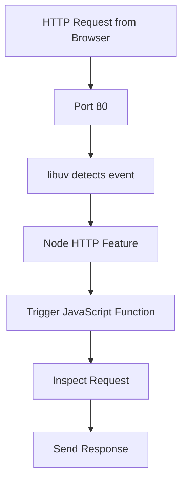

# Opening Network Access with Node.js

## Goal

Enable JavaScript to receive incoming Internet messages by opening a network channel (socket) using Node.js internal features.

---

# Computer Internals and Sockets

## Computer Internals

**Computer internals** refer to operating system–level capabilities such as networking, file systems, and hardware access. JavaScript cannot access these directly.

## Socket

A **socket** is an open, two-way communication channel between a computer and the Internet, allowing messages to be received and sent.

**Relevance:**  
Sockets are required to receive HTTP requests from browsers (e.g., when a user types a URL).

---

# Node.js HTTP Feature

## `http.createServer`

**Definition:**  
`http.createServer` is a JavaScript-accessible label that triggers Node’s underlying C++ networking logic to open an HTTP-ready socket.

**Key Characteristics:**

- Triggers work in Node’s C++ layer, not in JavaScript itself
    
- Uses system-level networking via Node
    
- Prepares the computer to receive HTTP-formatted messages

---

# Role of Libuv

## Libuv

**Definition:**  
**libuv** is a C++ library used by Node.js to interface with operating system internals across platforms (Linux, macOS, Windows).

**Responsibilities:**

- Handles low-level I/O
    
- Ensures cross-platform compatibility
    
- Bridges Node’s C++ code with OS-specific internals

**Relevance:**  
libuv enables Node.js to open sockets and listen for network events regardless of operating system.

---

# Ports and Entry Points

## Ports

**Definition:**  
A **port** is a numbered entry point that identifies where incoming network messages should arrive on a computer.

**Key Facts:**

- Ports range from 1 to ~65,000
    
- They logically distinguish different services on the same machine

## Default HTTP Port

|Protocol|Default Port|
|---|---|
|HTTP|80|

**Context:**  
Browsers send HTTP requests to port 80 by default unless another port is specified.

---

# Two-Step Server Setup Pattern

## Step 1: Create the Server

Calling `http.createServer()`:

- Opens an HTTP-ready socket
    
- Prepares Node to receive incoming messages
    
- Immediately returns an object into JavaScript

## Step 2: Configure the Server

The returned object contains **methods** (functions attached to the object), such as `listen`.

**Purpose:**  
These methods allow modification of the underlying Node HTTP instance.

---

# Returned Server Object

## Server Object

**Definition:**  
The object returned by `http.createServer` represents the specific HTTP server instance created in Node.

**Key Method:**

- `listen(port)` — tells Node which port the socket should listen on

---

# Listening on a Port

## `server.listen(80)`

**What It Does:**

- Triggers Node’s C++ feature to bind the socket to port 80
    
- Opens the “door” for incoming HTTP messages
    
- Does not perform meaningful computation in JavaScript itself

---

# Minimal Server Setup (Conceptual)

|Line|Effect|
|---|---|
|`http.createServer()`|Opens an HTTP socket|
|`server.listen(80)`|Binds socket to port 80|

**Outcome:**  
The computer is now capable of receiving HTTP requests from the Internet.

---

# Incoming Message Flow

## Message Arrival

1. A browser sends an HTTP request (e.g., `twitter.com/node`)
    
2. The request arrives at port 80
    
3. libuv detects the incoming message
    
4. Node receives the message in its internal layer

---

# The Core Problem: When to Run JavaScript Code

## Issue

JavaScript executes sequentially and finishes running:

- It cannot “wait” forever at a line of code
    
- Incoming messages can arrive at any unpredictable time

## Why Polling Fails

Repeatedly checking for messages:

- Is inefficient
    
- Blocks meaningful work
    
- Does not scale

---

# Event-Driven Solution

## Who Knows When Messages Arrive?

**Node.js**, not JavaScript.

## Strategy

- Bundle JavaScript logic into a **function**
    
- Give Node control to run that function automatically
    
- Node triggers the function when an inbound message arrives

---

# Functions as Event Handlers

## Function

**Definition:**  
A **function** is a bundle of code saved to be executed later.

**Relevance in Node.js:**

- Functions are passed to Node
    
- Node invokes them when specific events occur (e.g., incoming requests)

---

# Event-Driven Execution Model

---

# Key Architectural Insight

- JavaScript does not control _when_ incoming messages occur
    
- Node.js listens continuously
    
- Node automatically executes JavaScript functions when events happen
    
- This enables scalable, asynchronous servers

---

# Summary of Key Points

- `http.createServer` opens an HTTP-ready socket via Node’s C++ layer
    
- libuv connects Node to OS-level networking across platforms
    
- Ports identify entry points; HTTP defaults to port 80
    
- Server configuration happens through methods like `listen`
    
- Incoming messages arrive asynchronously
    
- Node, not JavaScript, detects message arrival
    
- Functions are bundled and auto-executed by Node when events occur