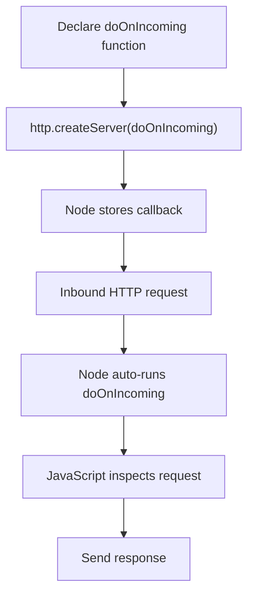

# Event-Driven Execution in Node.js

## Core Idea

Node.js automatically runs JavaScript code when external events occur (such as incoming network requests) by using functions as callbacks.

---

# Requests and Automatic Code Execution

## Request

**Definition:**  
A **request** is an inbound message sent from a client (e.g., a browser) to a server asking for data or an action.

**Context:**  
When a user visits a URL, the browser sends an HTTP request to the server.

---

# Saving Code to Run Later

## Function Declaration

**Definition:**  
Declaring a function stores its code in JavaScript memory so it can be executed later.

**Relevance:**  
In Node.js, functions are used to bundle logic that should run in response to events rather than immediately.

---

# Callback Function

## Callback

**Definition:**  
A **callback function** is a function passed as an argument to another function, to be automatically executed when a specific event occurs.

**Context in Node.js:**  
Callbacks are the primary way Node triggers JavaScript code when background events happen.

---

# `http.createServer` And Callbacks

## Passing the Callback

- `http.createServer` accepts a function as its argument
    
- That function is saved internally by Node
    
- Node automatically executes it when an inbound request arrives

## Key Insight

The function is not executed when passed in—only saved for later execution.

---

# Step-by-Step Flow

## Example Structure (Conceptual)

1. Declare a function (e.g., `doOnIncoming`)
    
2. Call `http.createServer(doOnIncoming)`
    
3. Node stores the function internally
    
4. An HTTP request arrives
    
5. Node automatically runs `doOnIncoming`

---

# Code Execution Flow Diagram

---

# Role of the Server Object

## Server Object

**Definition:**  
The object returned by `http.createServer` represents the active HTTP server instance.

**Purpose:**  
Provides methods to further configure the server (e.g., listening on a port).

---

# Why Node Must Trigger the Function

## Unpredictable Timing

- Requests can arrive at any moment
    
- JavaScript cannot block and wait indefinitely

## Node’s Responsibility

Node continuously listens for events and triggers JavaScript callbacks when needed.

---

# JavaScript Execution Constraints

## Single-Threaded

**Definition:**  
JavaScript can only execute one task at a time.

**Implication:**  
JavaScript cannot wait for long-running tasks like network or database operations.

---

# Offloading Work to Node

## Background Tasks

**Examples:**

- Receiving network messages
    
- Reading files
    
- Querying databases

**Mechanism:**

- Node handles the slow task in the background
    
- A callback function is triggered when:
    
    - Data arrives
        
    - The task completes

---

# General Node.js Pattern

|Step|Responsibility|
|---|---|
|Set up task|JavaScript|
|Perform slow work|Node (C++ layer)|
|Detect completion|Node|
|Run callback|JavaScript|

---

# Summary of Key Points

- Node uses functions as callbacks to handle events
    
- `http.createServer` accepts a function to auto-run on incoming requests
    
- Callback functions are saved, not executed immediately
    
- Node decides _when_ to execute JavaScript code
    
- JavaScript is single-threaded and cannot wait on slow operations
    
- Node offloads slow tasks and triggers callbacks upon completion