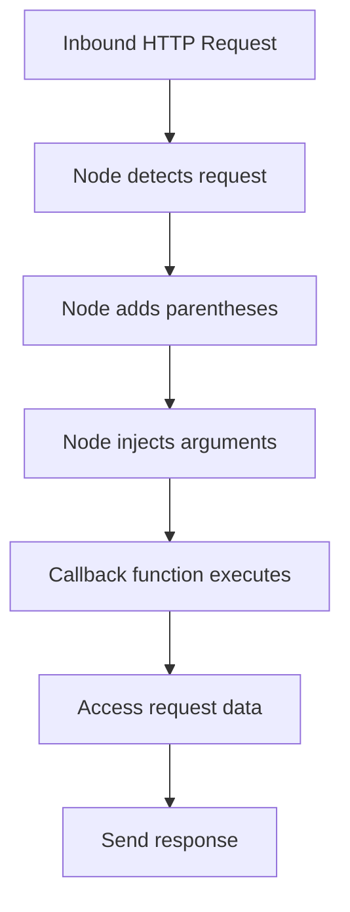

# Automatic Function Invocation in Node.js

## Context

Node.js is responsible for automatically executing JavaScript functions when external events occur, such as incoming HTTP requests, without the developer manually invoking them.

---

# Two Parts of Calling a Function

## Function Execution

**Definition:**  
Executing a function means running the code stored inside it.

**Indicator:**  
Execution is normally triggered by adding **parentheses `()`** after the function name.

---

## Argument Insertion

**Definition:**  
Arguments are the actual values inserted into a function’s parameters when the function runs.

**Relevance:**  
Arguments provide the data that the function operates on.

---

## Summary of Function Invocation

|Component|Purpose|
|---|---|
|Parentheses `()`|Trigger execution of the function code|
|Arguments|Provide input data to the function|

---

# Who Executes the Function in Node.js?

## Node as the Executor

**Key Insight:**  
In an event-driven Node.js application, the developer does **not** manually add parentheses to execute certain functions.

**Responsibility Shift:**

- Node adds the parentheses
    
- Node decides _when_ execution happens

**Trigger Condition:**  
Execution occurs **when an inbound request arrives**.

---

# Automatic Argument Injection

## Node-Provided Arguments

**Definition:**  
Node automatically supplies arguments to the callback function when it runs.

**Primary Argument:**

- Data from the inbound request (e.g., information sent by the client)

**Secondary Argument (Common Pattern):**

- An object containing functions that allow the developer to:
    
    - Send data back to the client
        
    - Interact with Node’s response mechanisms

---

# Callback Function Behavior

## Callback Function

**Definition:**  
A callback is a function whose execution and inputs are fully controlled by Node.

**Key Characteristics:**

- Executed automatically
    
- Receives data without explicit developer insertion
    
- Runs exactly when the relevant event occurs

---

# Event-Driven Function Invocation Flow

---

# Comparison: Manual Vs Node-Controlled Execution

|Aspect|Manual JavaScript|Node.js Callback|
|---|---|---|
|Adds parentheses|Developer|Node|
|Supplies arguments|Developer|Node|
|Execution timing|Immediate|Event-based|
|Control over inputs|Explicit|Automatic|

---

# Why This Matters

## Asynchronous Reality

- Requests may arrive:
    
    - Immediately
        
    - Minutes later
        
    - Days or weeks later
        
- JavaScript cannot pause indefinitely

## Node’s Role

Node:

- Waits for events
    
- Executes functions at the correct moment
    
- Supplies all relevant data automatically

---

# Summary of Key Points

- Calling a function involves execution and argument insertion
    
- In Node.js, both steps are handled by Node for event-driven callbacks
    
- Node automatically:
    
    - Adds parentheses
        
    - Injects request-related data as arguments
        
- Callback functions run exactly when events occur
    
- This mechanism enables scalable, asynchronous server behavior