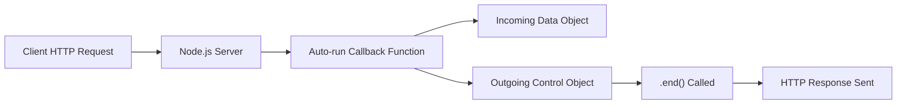

# Automatic Function Execution in Node.js

## Event-Driven Execution

- **Inbound HTTP Message**: A request sent from a client (e.g., a browser) to a Node.js server.
    
- **Event Trigger**: When an inbound message arrives, Node.js automatically triggers a predefined callback function (e.g., `doOnIncoming`).

**Key Idea**: Developers do not manually execute this function; Node.js does it automatically at the exact moment the message arrives.

---

# What It Means to “Run” a Function

## Two Parts of Function Execution

|Part|Description|Who Handles It|
|---|---|---|
|Code execution|Running the function body|Node.js|
|Input insertion|Providing arguments (data) to the function|Node.js|

- **Parentheses `()`**: Symbol that executes a function.
    
- **Automatic Invocation**: Node.js inserts the parentheses and arguments behind the scenes.

---

# Automatic Arguments Inserted by Node.js

## Overview

When Node.js auto-runs the callback function, it automatically inserts **two arguments**:

1. **Incoming data object** (request)
    
2. **Outgoing control object** (response)

These objects are created by Node.js and passed into the function as arguments.

---

# The Incoming Data Object (Request)

## Definition

- A JavaScript object automatically created by Node.js.
    
- Contains parsed, structured information from the inbound HTTP message.

## Purpose

- Makes HTTP data easy to work with in JavaScript.
    
- Avoids manual parsing of raw text-based HTTP messages.

## Common Properties

|Property|Description|
|---|---|
|`url`|Path portion of the request (e.g., `/node`)|
|`headers`|Metadata about the request|
|`body`|Request payload (handled later in more detail)|

## Access Pattern

- The object has no predefined name.
    
- The developer assigns a **parameter name** in the function definition.

```js
function doOnIncoming(incomingData) {
  console.log(incomingData.url);
}
```

---

# The Outgoing Control Object (Response)

## Definition

- A JavaScript object automatically created by Node.js.
    
- Does **not** directly store response data.
    
- Contains **methods** (functions) that control how the response is sent.

## Key Characteristic

- Instead of modifying properties, developers **call methods** to affect the outgoing message.

## Important Method

|Method|Purpose|
|---|---|
|`end()`|Finalizes the response and sends data back to the client|

---

# Fundamental Difference Between the Two Objects

|Aspect|Incoming Data Object|Outgoing Control Object|
|---|---|---|
|Contains data|Yes|No|
|Contains functions|No|Yes|
|Used to read|Request details|—|
|Used to write|—|Response output|

---

# Step-by-Step Example Flow

1. A client sends an HTTP request asking for Node-related data.
    
2. Node.js receives the message.
    
3. Node.js automatically:
    
    - Executes the callback function.
        
    - Inserts two arguments into the function.
        
4. Inside the function:
    
    - The first argument is used to inspect request details (e.g., URL).
        
    - The second argument’s methods are used to send a response.

```js
function doOnIncoming(incomingData, functionsToSetOutgoingData) {
  functionsToSetOutgoingData.end("Welcome to Twitter");
}
```

1. The `.end()` method:
    
    - Adds `"Welcome to Twitter"` to the response message.
        
    - Sends the HTTP response back to the client.

---

# Node.js Execution Flow (Mermaid Diagram)



---

# Key Concepts Recap

## Parsing

- **Parsing**: Converting raw text into structured data.
    
- Node.js parses HTTP messages into JavaScript objects to simplify access.

## Parameters Vs Arguments

- **Parameters**: Placeholder names in function definitions.
    
- **Arguments**: Actual values inserted when the function runs.
    
- Node.js supplies the arguments automatically.

---

# Summary of Key Points

- Node.js automatically executes callback functions on incoming events.
    
- Running a function involves executing code and inserting arguments.
    
- Node.js inserts two crucial objects: one for request data and one for response control.
    
- The request object stores readable data; the response object exposes methods.
    
- Calling `.end()` sends data back to the client and completes the response cycle.