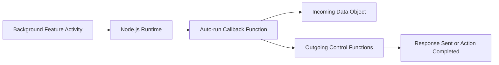

# Building a Server with Node.js

## Minimal Server Construction

- **Key Idea**: A fully functioning server can be built with just a few lines of JavaScript.
    
- **JavaScript vs Node.js Internals**:
    
    - **JavaScript code**: User-written logic (shown as “black” in explanation).
        
    - **Node.js features**: Built-in runtime capabilities (shown as “purple”), implemented internally in C++.

**Relevance**: Demonstrates how Node.js abstracts complex server behavior into a simple JavaScript interface.

---

# Core Execution Model of Node.js

## Automatic Function Handling

Node.js relies on a consistent pattern whenever interacting with background system features.

### What Node.js Automatically Does

1. **Auto-runs a callback function** when an event occurs.
    
2. **Auto-inserts arguments** into that function.
    
3. **Auto-creates those arguments** based on the event context.

This means developers focus on defining _what should happen_, not _when or how it is triggered_.

---

# Callback Functions in Node.js

## Definition

- **Callback Function**: A function provided to Node.js that Node will automatically execute when a specific background event occurs.

## Role

- Acts as the bridge between JavaScript and underlying system features (network, file system, etc.).

---

# Automatically Inserted Arguments

## Two Categories of Inserted Data

When Node.js auto-runs a callback, it inserts data needed to handle the event:

|Argument Type|Purpose|Behavior|
|---|---|---|
|Incoming data|Represents data coming from the background event|Read-only access|
|Outgoing controls|Provides functions to affect the result|Action-based (methods)|

---

# Incoming Data Object

## Definition

- A JavaScript object created by Node.js.
    
- Contains relevant data from the background event (e.g., an HTTP request).

## Examples of Incoming Data

- Request information (URL, headers, payload).
    
- File contents (when reading from the file system).

**Relevance**: Gives the developer structured access to raw system data.

---

# Outgoing Control Object

## Definition

- A JavaScript object created by Node.js.
    
- Contains **functions**, not raw data.

## Purpose

- Allows JavaScript code to send instructions back to Node.js.
    
- Used to modify or finalize an outgoing response.

## Example Function

- **`end()`**: Finalizes the response and sends data back to the client.

---

# Example: Handling an Incoming Request

## Step-by-Step Flow

1. A background event occurs (e.g., an HTTP request arrives).
    
2. Node.js detects the event.
    
3. Node.js auto-runs the provided callback function.
    
4. Node.js inserts:
    
    - An object containing incoming request data.
        
    - An object containing functions for sending a response.
        
5. The callback:
    
    - Reads incoming data if needed.
        
    - Calls a response function (e.g., `.end()`).
        
6. Node.js sends the completed response back to the client.

---

# Node.js Event Pattern (Generalized)

---

# Universal Pattern Across Node.js APIs

## Background Features Using the Same Model

- HTTP networking
    
- File system access
    
- Network sockets
    
- Other operating system features

## Common Structure

1. Use a **built-in Node.js label** to access a background feature.
    
2. Provide a **callback function**.
    
3. Node.js:
    
    - Auto-runs the function on activity.
        
    - Auto-inserts relevant data and control functions.

**Relevance**: This pattern is the foundation of all Node.js development.

---

# Key Concept: Essence of Node.js

- Node.js is fundamentally about **event-driven execution**.
    
- Every interaction follows the same rules:
    
    - Background activity → auto-run function → auto-insert data.
        
- Mastering this model enables effective use of any Node.js API.

---

# Summary of Key Points

- A complete server can be built with minimal JavaScript due to Node.js abstractions.
    
- Node.js automatically runs functions and supplies required data.
    
- Two main auto-inserted objects exist: one for incoming data, one for outgoing control.
    
- The same execution pattern applies to networking, file systems, and other system features.
    
- Understanding this event-driven model is the core of mastering Node.js.