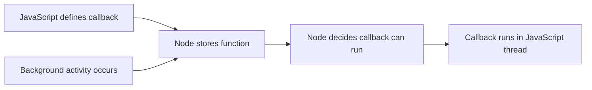

# Semicolons and JavaScript Syntax in Node.js

## Semicolons

- **Definition**: Semicolons (`;`) terminate JavaScript statements.
    
- **Relevance in Node.js**:
    
    - JavaScript supports _Automatic Semicolon Insertion (ASI)_, but relying on it can cause subtle bugs.
        
    - In Node.js, missing semicolons can cause lines to be concatenated incorrectly, leading to hard-to-debug errors.
        
- **Best Practice**: Always include semicolons, especially in server-side Node.js code.

---

# Scope of Code Accessible to Node.js

## Auto-Run Function Scope

- **Key Point**: The only JavaScript code that Node.js can automatically execute is the function passed into `http.createServer`.
    
- Node.js does not have access to arbitrary JavaScript code.
    
- It only knows about:
    
    - The function reference explicitly provided.
        
    - The parameters (arguments) it auto-inserts when that function runs.

**Implication**: All server logic that should respond to incoming requests must be inside (or reachable from) this callback function.

---

# Error Handling and Alternate Triggers

## Request Vs Error Events

- Not every inbound event triggers the same callback.
    
- A successful request may trigger the server callback.
    
- An error (e.g., malformed request) may trigger a **different internal Node.js mechanism**.
    
- Node.js provides more control than a single callback; different events can be handled separately.

**Relevance**: Explains why error-handling patterns exist separately from request-handling logic.

---

# Auto-Created Response Object (Second Argument)

## Characteristics

- Created automatically by Node.js.
    
- Inserted as the second argument to the callback function.
    
- **Anonymous**: Has no built-in name.
    
- The developer assigns a **parameter name** to access it.

## What It Contains

- A collection of methods (functions), not raw data.
    
- One critical method:
    
    - **`end()`**: Signals that response editing is complete and sends the response.

---

# The `end()` Method

## Definition

- A method on the response object that finalizes and sends the HTTP response.

## Typical Usage

- Often called **without arguments** to indicate:
    
    - “I’m done modifying headers/body; send the response.”
        
- Can accept an argument:
    
    - A string or data stream to be sent as the response body (shorthand usage).

## Best Practice

- Usually used after setting headers or writing data with other methods.
    
- Passing data directly to `end()` is acceptable for simple examples, but not common in production.

---

# Method Chaining and Evaluated Language Behavior

## JavaScript as an Evaluated Language

- Every expression resolves to a value.
    
- Example:
    
    - `http.createServer(…)` evaluates to an object.
        
    - That object contains methods like `.listen()`.

## Consequence

- You can write:
    
    - `http.createServer(…).listen(…)`
        
- Or:
    
    - Store the object first, then call methods later.

## Why Store the Server Object?

- Provides long-term access to server controls.
    
- Improves clarity and debuggability.
    
- Pedagogically useful to show what Node.js returns.

---

# Ports and Default Network Behavior

## Default Port

- Browsers default to **port 80** for HTTP requests.
    
- The port does not need to be specified explicitly in most URLs.

## Custom Ports

- Common during development.
    
- Necessary for:
    
    - Running multiple servers.
        
    - Using different protocols (e.g., HTTPS).

## HTTPS Note

- HTTPS uses a different default port (not 80).
    
- Provides encrypted communication.
    
- Protects against “man-in-the-middle” attacks.

---

# Relationship Between JavaScript and Node.js

## Division of Responsibility

- **JavaScript**:
    
    - Provides functions and logic.
        
    - Defines what should happen.
        
- **Node.js**:
    
    - Holds those functions.
        
    - Decides _when_ to run them.
        
    - Interfaces with system-level features (network, filesystem).

## Conceptual Model

> JavaScript says: “Here is the function.”
> 
> Node.js says: “I will run it at the correct time.”

---

# Execution Context and Single-Threading

## Single-Threaded Nature

- JavaScript runs one piece of code at a time.
    
- Multiple callbacks cannot run simultaneously.

## Key Question Introduced

- When multiple Node-triggered callbacks are ready:
    
    - In what order are they allowed back into JavaScript?
        
    - What rules decide _when_ a callback can execute?

**Importance**: This leads directly to understanding the event loop and execution rules.

---

# High-Level Execution Flow

---

# Summary of Key Points

- Semicolons are important in Node.js to avoid subtle errors.
    
- Node.js can only auto-run the function explicitly passed to it.
    
- Node auto-creates and inserts a response object containing methods like `end()`.
    
- JavaScript expressions evaluate to values, enabling method chaining.
    
- Browsers default to port 80; other ports and HTTPS are common variations.
    
- JavaScript defines logic; Node.js controls timing.
    
- Callback execution timing raises critical questions about execution order and rules.