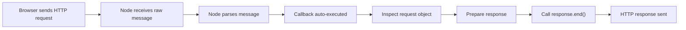

# Building a Minimal Node.js HTTP Server

## Overview

- A fully functional HTTP server can be built in **three lines of JavaScript** using Node.js.
    
- The simplicity comes from Node handling:
    
    - Network setup
        
    - Background processing
        
    - Automatic execution of JavaScript callbacks

---

# `http.createServer`

## Definition

- **`http.createServer`** is a Node.js API that:
    
    - Sets up a low-level network socket inside the computer’s internals.
        
    - Opens a channel to the internet to receive HTTP messages.
        
    - Registers a JavaScript function to be automatically executed when activity occurs.

## Relevance

- This function is the bridge between:
    
    - JavaScript code
        
    - The computer’s networking capabilities (implemented in Node’s C++ layer)

---

# Ports, Sockets, and Browser Defaults

## Key Concepts

- **Socket**: A communication endpoint opened by the operating system.
    
- **Port**: A logical entry point for network traffic.

## Default Browser Behavior

- Browsers send HTTP requests to **port 80** by default.
    
- Servers must explicitly open this entry point to receive requests.

## How Node Enables This

- `http.createServer` returns an object.
    
- That object exposes functions (e.g., `listen`) that:
    
    - Edit the underlying Node HTTP instance.
        
    - Bind it to a specific port.

---

# Returned Server Object

## Definition

- The object returned by `http.createServer` contains **edit functions**.
    
- These functions allow:
    
    - Configuration of the server
        
    - Control over how it listens and responds

## Purpose

- Provides long-term control over the server after creation.
    
- Enables incremental configuration rather than one-time setup.

---

# Automatic Callback Execution

## Core Idea

- JavaScript code does not continuously check for incoming requests.
    
- Instead:
    
    - Node automatically runs a specified JavaScript function when activity occurs.

## What Node Does Automatically

1. Detects inbound network activity.
    
2. Executes the provided callback function.
    
3. Creates a new execution context for that function.

---

# Auto-Inserted Arguments

## Definition

- Node automatically creates and inserts **two JavaScript objects** into the callback function.

## Why This Matters

- Developers do not manually parse raw HTTP text.
    
- Node converts low-level data into structured JavaScript objects.

## The Two Objects

|Object|Purpose|Contents|
|---|---|---|
|Request Object|Represents inbound data|URL, headers, method, body (parsed)|
|Response Object|Controls outbound message|Functions to edit and send response|

---

# Request Object (Inbound Data)

## Characteristics

- Derived from a raw HTTP text message.
    
- HTTP messages are plain strings, not objects.
    
- Node parses and packages important parts into an object.

## Example Properties

- `url`: Path requested (e.g., `/tweets/3`)
    
- `headers`: Metadata about the client
    
- `method`: HTTP verb (GET, POST, etc.)

## Relevance

- Enables inspection of _what the user wants_.
    
- Drives logic for conditional responses.

---

# Response Object (Outbound Control)

## Characteristics

- Does **not** contain data directly.
    
- Contains functions that:
    
    - Communicate back to Node
        
    - Modify the outgoing HTTP message

## Important Methods

- `end()`: Signals that the response is ready to be sent.
    
- Other methods (e.g., `write`) allow incremental content addition.

## Typical Usage Pattern

1. Inspect request data.
    
2. Decide what content to send.
    
3. Add content via response methods.
    
4. Call `end()` to send the message.

---

# The `end()` Function

## Definition

- Finalizes the response and tells Node to send it back to the client.

## Behavior

- Without arguments: sends the prepared response.
    
- With an argument: sends that data as the response body (shorthand).

## Best Practice

- Commonly used as a signal, not as the main method for writing data.
    
- More advanced responses use other methods before calling `end()`.

---

# HTTP Message Structure

## Definition

- HTTP is a **protocol**: a set of rules for browser–server communication.
    
- Messages are plain text formatted in a specific structure.

## Three Parts of an HTTP Request

|Part|Description|Example|
|---|---|---|
|Request Line|Action + path|`GET /tweets/3`|
|Headers|Metadata about the request|Browser type, auth info|
|Body|Payload (optional)|Tweet content (POST)|

---

# Example: Requesting a Specific Resource

## Scenario

- User navigates to: `/tweets/3`
    
- Browser sends an HTTP request:
    
    - Method: GET
        
    - Path: `/tweets/3`
        
    - No body required

## Step-by-Step Flow

1. Browser sends HTTP message.
    
2. Node receives raw text.
    
3. Node parses and creates request object.
    
4. Node auto-runs callback function.
    
5. JavaScript inspects `request.url`.
    
6. Logic determines the requested resource.
    
7. Appropriate data is attached to the response.
    
8. `end()` sends the response back.

---

# Generalized Server Pattern

## Reusable Paradigm

- This same pattern powers:
    
    - Social media feeds
        
    - Video streaming platforms
        
    - Large-scale services

## Key Insight

- Scaling complexity does not change the core model:
    
    - Inspect inbound request
        
    - Decide response
        
    - Send back data

---

# Flow of Control

---

# Summary of Key Points

- A Node.js server can be built with minimal code.
    
- `http.createServer` connects JavaScript to system-level networking.
    
- Browsers default to port 80 for HTTP.
    
- Node auto-executes callbacks when network activity occurs.
    
- Two critical objects are auto-inserted: request data and response controls.
    
- HTTP messages consist of a request line, headers, and optional body.
    
- Inspecting the inbound request determines what data is sent back.
    
- This model underpins both simple demos and large-scale applications.