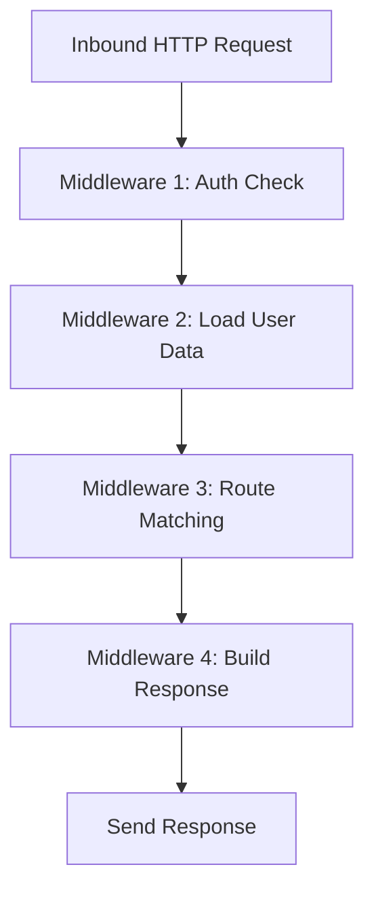

# The Core Node.js Mental Model

## Central Idea

- Node.js repeatedly uses **the same execution pattern**:
    
    1. Receive an inbound message.
        
    2. Auto-run a JavaScript function.
        
    3. Inspect the auto-created request object.
        
    4. Decide what data to send back.
        
    5. Use response functions to send it.

## Learning Goal

- Mastery comes from recognizing that **all Node features follow this same model**.
    
- Once internalized, new Node APIs become predictable and easy to reason about.

---

# Handling Different Routes (Pages)

## The Problem

- Servers must respond differently depending on the requested path:
    
    - `/about` → send About page
        
    - `/help` → send Help page
        
    - `/tweets/3` → send Tweet #3

## Naive Approach

- Write large `if / else` chains:

    ```text
    if path === "/about" → send about page
    else if path === "/help" → send help page
    ...
    ```

## Limitation

- This becomes unmanageable when dealing with:
    
    - Many pages
        
    - Complex logic
        
    - Authentication checks
        
    - Database access

---

# Pre-Written Abstractions (Frameworks)

## Motivation

- Repeated tasks are often abstracted by the community.
    
- Developers rely on **pre-written JavaScript code** to avoid boilerplate.

## Example

- Express.js:
    
    - Encapsulates routing logic.
        
    - Internally uses conditional checks.
        
    - Allows mapping routes to responses in a single line.

## Key Insight

- Frameworks do not change Node’s model.
    
- They **layer convenience on top of the same core mechanism**.

---

# The Middleware Pattern

## Definition

- **Middleware** is a design pattern where:
    
    - The inbound request object is passed through a sequence of functions.
        
    - Each function performs one focused task.
        
    - The object is progressively analyzed, enriched, or modified.

## Purpose

- Avoid a single, monolithic request-handling function.
    
- Improve:
    
    - Modularity
        
    - Readability
        
    - Maintainability

---

# Typical Middleware Tasks

|Step|Responsibility|
|---|---|
|1|Check authentication (cookies, headers)|
|2|Fetch user data from database|
|3|Inspect requested URL|
|4|Validate permissions|
|5|Prepare response data|

Each step:

- Receives the same request-related data.
    
- Performs one concern.
    
- Passes control forward.

---

# Middleware Flow



---

# Middleware as a Generalized Node Pattern

## Key Characteristics

- Operates on the auto-created request object.
    
- Breaks logic into small, reusable functions.
    
- Each function focuses on _one transformation or decision_.

## Benefits

- Easier debugging
    
- Cleaner code structure
    
- Scales with application complexity

---

# Express and Middleware

## Role of Express

- Provides pre-written middleware infrastructure.
    
- Handles:
    
    - Routing
        
    - Request parsing
        
    - Response handling

## What Express Adds

- Developer-friendly syntax
    
- Automatic chaining of middleware
    
- Reduced boilerplate

## What Express Does Not Change

- Node still:
    
    - Auto-runs callbacks
        
    - Inserts request/response objects
        
    - Uses the same underlying execution model

---

# Summary of Key Points

- Node.js repeatedly follows the same request–response model.
    
- Conditional routing logic can become complex at scale.
    
- Middleware solves this by breaking logic into sequential functions.
    
- The request object flows through each middleware step.
    
- Express is a convenience layer built on top of this pattern.
    
- Understanding this model makes all Node features approachable and predictable.