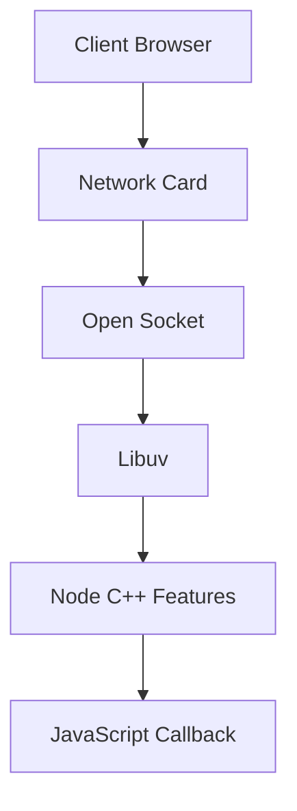
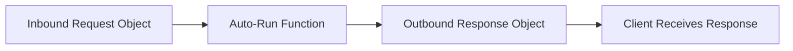

# Receiving and Handling HTTP Requests in Node.js

## Overview

- After server setup, Node waits for inbound network activity.
    
- When a client (browser) sends a request, Node automatically handles message intake and triggers developer-defined logic.
    
- Most of this process occurs **outside visible JavaScript code**, but understanding it is essential.

---

# Client Request Lifecycle

## Client Action

- A user opens a browser and enters a URL.
    
- The browser immediately sends an **HTTP request message**.

## HTTP Request Structure

An HTTP request is composed of multiple parts; two are emphasized here:

|Part|Description|Example|
|---|---|---|
|Request Line|Specifies action and resource|`GET /tweets/3`|
|Headers|Metadata about client and request|Browser, OS, cookies|
|Body|Optional data payload|Not used for GET|

---

# Transport into Node.js

## Network Flow

1. Request reaches the machine’s network card.
    
2. An open socket receives the data.
    
3. **Libuv** assists in transferring the data into Node’s C++ layer.
    
4. Node converts the raw message into structured JavaScript-accessible data.

---

# Auto-Run Callback Execution

## Auto-Run Function

- The developer previously passed a function to `createServer`.
    
- Node **automatically executes** this function when a request arrives.

## Two Parts of Function Execution

1. **Execution Trigger**
    
    - Node adds parentheses `()` to run the function.
        
2. **Argument Insertion**
    
    - Node creates and inserts values as arguments.

---

# Parameters Vs Arguments

|Term|Definition|Role|
|---|---|---|
|Parameter|Placeholder variable in function definition|Receives values|
|Argument|Actual value passed into the function|Represents real data|

- Node auto-creates the arguments and inserts them into parameters.

---

# Auto-Created Inbound Object (Request)

## Request Object

- First argument inserted by Node.
    
- Represents inbound request data.

### Key Properties

|Property|Meaning|Example|
|---|---|---|
|`url`|Requested path|`/tweets/3`|
|`method`|HTTP method|`GET`|

- The `url` contains **only the path**, not the full domain.

---

# Auto-Created Outbound Object (Response)

## Response Object

- Second argument inserted by Node.
    
- Represents the outbound message to the client.

## Characteristics

- Contains functions that allow:
    
    - Writing data
        
    - Ending the response
        
- Running these functions sends data back through Node to the client.

---

# Inbound and Outbound Pairing

- When an inbound request arrives:
    
    - An outbound response object is created **at the same time**.
        
- The developer’s job:
    
    - Read inbound data from the request object.
        
    - Attach output data to the response object.

---

# Code Vs Runtime Behavior

## Important Observation

- After initial setup, **developer code stops running**.
    
- All further activity is triggered externally by client requests.
    
- Node orchestrates execution invisibly until callbacks run.

---

# Conceptual Challenges

## Complexity

- Execution is controlled by Node, not the developer.
    
- Functions run in response to external events.

## Complication

- Multiple auto-created objects.
    
- Many moving parts: sockets, messages, arguments, callbacks.

---

# Summary of Key Points

- Browsers send HTTP requests automatically when URLs are opened.
    
- Requests contain a request line and headers.
    
- Libuv moves network data into Node.
    
- Node auto-runs a callback function on request arrival.
    
- Two arguments are auto-inserted: request and response objects.
    
- Request objects contain URL and method data.
    
- Response objects provide functions to send data back.
    
- This pattern repeats consistently across Node features.