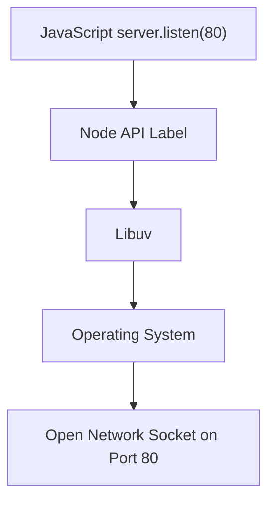

# Node.js Architecture: JavaScript and C++ Integration

## Overview

- Node.js allows JavaScript code to **control computer internals** (networking, file system, etc.).
    
- This is achieved by connecting JavaScript to **C++ features** inside Node.
    
- JavaScript acts as the _controller_, while C++ performs the _low-level system work_.

---

# Node.js Components and Responsibilities

## JavaScript Code

- Used to:
    
    - Declare data
        
    - Define functions
        
    - Call Node-provided labels (APIs)
        
- Does **not** directly access hardware or OS internals.

## Node C++ Features

- Implement access to:
    
    - Networking
        
    - File system
        
    - Timers
        
- Exposed to JavaScript via Node APIs.

## Libuv

- **Definition**: A C++ library used by Node to handle asynchronous I/O.
    
- **Role**:
    
    - Manages event loop
        
    - Handles sockets, networking, file system operations
        
- JavaScript never interacts with Libuv directly.

---

# Example: Storing Data in JavaScript

## Tweets Array

```js
const tweets = [
  "Hi",
   "😂",
  "Hello",
  "👋",
  "👻"
];
```

### Explanation

1. A label (`tweets`) is declared.
    
2. An array stores multiple message values.
    
3. Data is stored in **JavaScript memory**, not a database.
    
4. This data will later be sent in server responses.

**Note**: In real applications, this data typically comes from a database.

---

# Defining the Incoming Request Handler

## Callback Function

```js
function doOnIncoming(req, res) {
  // logic here
}
```

### Key Characteristics

- This function is **not run by developers manually**.
    
- It is **auto-run by Node** when an inbound request arrives.
    
- Receives:
    
    - `req`: inbound data
        
    - `res`: tools to send data back

---

# Creating the Server

## http.createServer

```js
const server = http.createServer(doOnIncoming);
```

## What `createServer` Does (Three Actions)

|#|Layer|Action|
|---|---|---|
|1|C++|Sets up an HTTP networking feature (socket)|
|2|Node|Stores the callback to auto-run on inbound requests|
|3|JavaScript|Returns a server object with control methods|

---

# Server Object (JavaScript Side)

## Definition

- The `server` label references a JavaScript object.
    
- This object contains **edit functions**.

## Edit Functions

- Functions that modify the underlying Node C++ feature.
    
- Example: `listen`

---

# Listening on a Port

## server.listen

```js
server.listen(80);
```

### What Happens

- JavaScript calls a Node label.
    
- Node routes the instruction to C++.
    
- Libuv opens **port 80** on the machine.
    
- The computer can now receive inbound HTTP requests.

---

# Port Binding Flow



---

# Networking Concepts

## Socket

- **Definition**: An endpoint for sending or receiving data across a network.
    
- Node creates and manages sockets using C++ and Libuv.

## Port

- **Definition**: A numbered entry point into a computer.
    
- Port 80 is the default for HTTP traffic.

---

# The Universal Node Pattern

## Repeated Structure

1. JavaScript calls a Node API.
    
2. Node configures a background C++ feature.
    
3. A callback is stored for auto-execution.
    
4. JavaScript receives an object to control behavior.

## Applies To

- HTTP servers
    
- File system access
    
- Timers
    
- Any asynchronous Node feature

---

# Summary of Key Points

- Node.js bridges JavaScript with C++ system features.
    
- JavaScript controls behavior; C++ performs system-level work.
    
- `http.createServer` performs three actions: setup, autorun storage, object return.
    
- Callbacks are auto-run by Node, not manually executed.
    
- `server.listen` edits the underlying C++ networking feature.
    
- Libuv powers asynchronous networking and I/O.
    
- Every Node feature follows this same architectural pattern.