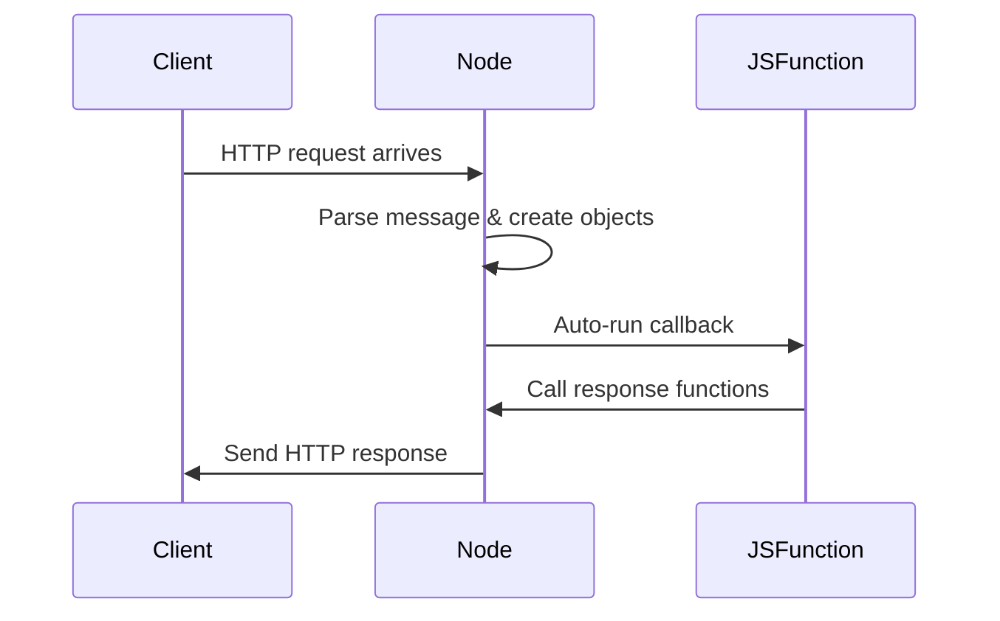

# Auto-Run Function Execution in Node.js

## Event-Driven Execution Model

- Node does **not** continuously run JavaScript code.
    
- Code waits idle until a **background event** (e.g., inbound HTTP request) occurs.
    
- When the event happens, Node **automatically executes** a pre-registered function.

**Key Idea:** Execution is triggered by events, not by developer-written loops or polling.

---

# Auto-Run Function and Execution Context

## Auto-Run Function

- A function previously passed to `createServer`.
    
- Executed automatically when an HTTP request arrives.

## Execution Context

**Definition:**  
An execution context is a temporary environment created when a function runs. It includes:

- Local memory (variables)
    
- Parameters
    
- The scope of execution

**Important Properties**

- Created at the moment Node executes the function.
    
- Exists only while the function is running.

---

# Auto-Inserted Arguments

## Parameters Vs Arguments

|Term|Definition|Role|
|---|---|---|
|Parameter|Placeholder variable in function definition|Receives values|
|Argument|Actual value inserted by Node|Real runtime data|

Node **auto-creates and inserts arguments** into the function’s parameters.

---

# Auto-Inserted Objects

## 1. Incoming Data Object (Request)

- Contains structured data extracted from the raw HTTP message.
    
- Node converts raw text into an object for developer convenience.

**Key Properties**

|Property|Meaning|Example|
|---|---|---|
|`url`|Path requested by client|`/tweets/3`|
|`method`|HTTP method|`GET`|

---

## 2. Outgoing Data Object (Response)

- Contains functions that modify the outbound HTTP message.
    
- Running these functions writes data and finalizes the response.

**Common Functions**

|Function|Purpose|
|---|---|
|`write`|Add data to response body|
|`end`|Signal response is complete and send it|

---

# Timeline of Execution



---

# Example: Selecting a Tweet by URL

## Stored Data

- Tweets are stored in a JavaScript array.
    
- Arrays in JavaScript are **zero-indexed**.

## Step-by-Step Execution

1. **Function Auto-Runs**
    
    - Node executes the handler function.
        
    - Inserts request and response objects as arguments.
        
2. **Read Requested URL**

```js
    incomingData.url  // "/tweets/3"
    ```

3. **Extract Tweet Number**

```js
    tweetNeeded = incomingData.url.slice(8)
    ```

    - Removes `/tweets/`
        
    - Result: `"3"`
        
4. **Convert to Array Index**
    
    - Subtract 1 because arrays start at index 0.
        
    - Tweet 3 → index 2
        
5. **Retrieve Tweet**

```js
    tweets[2] // "Hello"
    ```

6. **Send Response**

```js
    outgoingData.end("Hello")
    ```

    - Attaches data to the response.
        
    - Signals Node to send it back to the client.

---

# Role of Libuv and Node Internals

- **Libuv** transfers data between the network and Node.
    
- Node manages:
    
    - Message parsing
        
    - Object creation
        
    - Function execution
        
    - Response transmission

Developers interact only with JavaScript objects and functions.

---

# Generalized Server Pattern

This pattern repeats for all Node-based servers:

1. Background feature triggers event.
    
2. Node auto-runs a callback.
    
3. Node inserts structured data.
    
4. JavaScript inspects incoming object.
    
5. JavaScript uses response functions to send data.

This same model scales from simple servers to large systems.

---

# Summary of Key Points

- Node uses an event-driven execution model.
    
- Functions run automatically when events occur.
    
- Each execution creates a new execution context.
    
- Node auto-inserts request and response objects.
    
- Developers inspect request data and modify the response.
    
- URLs are parsed to determine requested resources.
    
- Zero-indexing affects data retrieval.
    
- This single pattern underlies all Node server behavior.