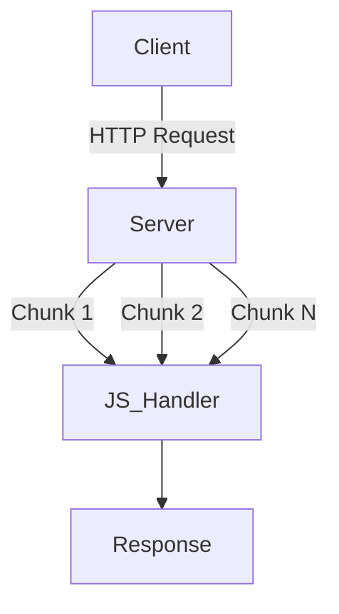
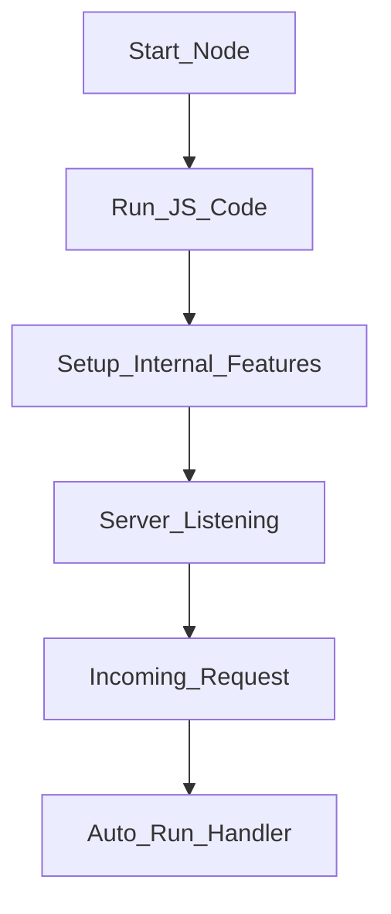

# Node.js Server Execution and Data Handling

## 1. Where Node.js Code Runs

**Definition:**  
Node.js runs JavaScript on a server (a computer connected to the internet), not in the browser.

**Context & Relevance:**

- All server-side logic discussed occurs on the service’s computer (e.g., Twitter’s servers), not the client’s browser.
    
- The browser only sends requests and waits for responses.

**Key Point:**  
Incoming requests are handled entirely on the server machine where Node.js is running.

---

## 2. Incoming HTTP Data: Chunks and Streams

### 2.1 HTTP Data Chunks

**Definition:**  
HTTP data is transmitted in **chunks**, meaning pieces of data arrive incrementally rather than all at once.

**Context:**

- Even though developers often treat requests as a single object, internally the data arrives in parts.
    
- Node.js provides built-in mechanisms to access and handle these chunks.

### 2.2 Streams

**Definition:**  
A **stream** is an abstraction representing data arriving over time in chunks.

**Clarification:**

- Despite the name “stream,” data is not a continuous flow; it arrives as discrete chunks.
    
- Node allows processing data:
    
    - All at once (small payloads)
        
    - In batches/chunks (large payloads)

**Relevance:**  
Essential for handling large files, uploads, or real-time data efficiently.

---

## 3. Auto-Executed Callback Functions in Node.js

**Definition:**  
Node.js uses **callback functions** that automatically execute when a background event occurs (e.g., an HTTP request arrives).

**Context:**

- Node sets up internal C++ features (network sockets, file system).
    
- When activity occurs, Node automatically:
    
    - Invokes a JavaScript function
        
    - Injects relevant data as arguments

**Injected Data Typically Includes:**

- Incoming request object (request data)
    
- Outgoing response object (methods to send data back)

**Relevance:**  
This pattern is the core of Node.js’s event-driven architecture.

---

## 4. Request and Response Objects

### 4.1 Incoming Request Object

**Definition:**  
An object automatically created by Node that represents the incoming HTTP request.

**Key Properties Example:**

- `request.method` → HTTP method (`"GET"`, `"POST"`, etc.)
    
- URL, headers, body (parsed or streamed)

**Example (Step-by-Step):**

1. Client sends a GET request.
    
2. Node receives the request.
    
3. Node injects a request object into the handler.
    
4. Accessing `request.method` returns `"GET"` as a string.
    
5. Logging it displays the method in the console.

### 4.2 Outgoing Response Object

**Definition:**  
An object with methods to send data back to the client.

**Key Method:**

- `response.end(data)` → sends the response and closes the connection.

---

## 5. HTTP Methods and Routing Setup

**Definition:**  
HTTP methods (GET, POST, etc.) define the type of operation requested by the client.

**Key Constraint in Node.js Setup:**

- All routes and handlers must be defined **before** the server starts listening.
    
- Changes to routes or handlers require:
    
    1. Stopping Node
        
    2. Restarting Node
        
    3. Re-running all setup code

**Reason:**

- Node configures internal sockets during startup.
    
- Later JavaScript changes cannot safely modify already-initialized internal features.

**Implication:**  
Server configuration is a one-time setup per run.

---

## 6. Error Handling in Server Communication

**Definition:**  
Error handling ensures the server responds appropriately when requests are invalid or unexpected.

**Context:**

- Invalid URLs (e.g., `/tweets/A` not defined) can cause errors.
    
- If not handled:
    
    - Browser may remain connected indefinitely
        
    - No response is returned

**Relevance:**  
Robust error handling is critical because servers interact with external systems and users.

---

## 7. Running Node.js Code

**Concept:**  
Writing server code is not enough; Node must be explicitly started.

**Process Overview:**

1. Turn on Node.js (starts a JavaScript engine).
    
2. Execute the JavaScript file.
    
3. Node sets up:
    
    - JavaScript execution
        
    - Internal background features (network sockets)
        
4. Server begins listening for incoming requests.

---

## Summary of Key Points

- Node.js runs server-side JavaScript on a remote computer, not in the browser.
    
- HTTP data arrives in chunks, abstracted as streams.
    
- Node automatically executes callback functions when background events occur.
    
- Request and response objects are auto-injected into handlers.
    
- All routes and methods must be defined before starting the server.
    
- Server changes require restarting Node.
    
- Proper error handling is essential for stable client-server communication.