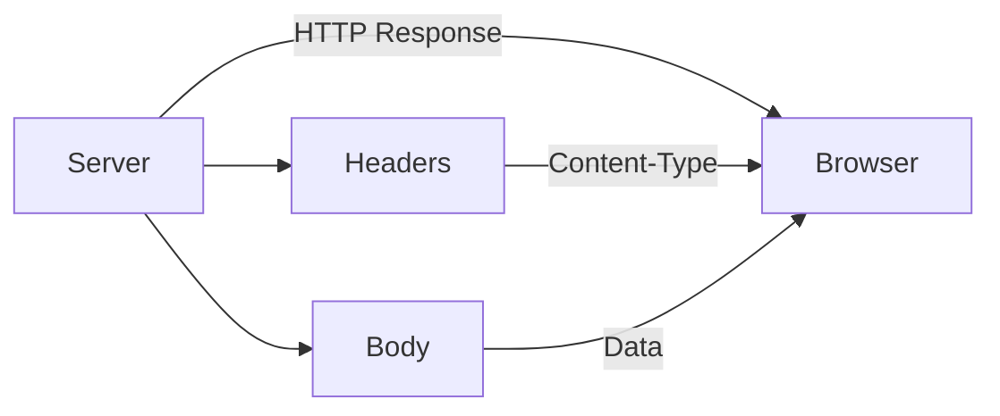

# HTTP Response Messages in Node.js

## 1. Overview of HTTP Message Structure

HTTP uses a standardized message format for both **requests** and **responses**. While requests are sent from a client (e.g., browser) to a server, responses are sent back from the server to the client.

An HTTP response mirrors the structure of a request and contains all the information the client needs to correctly interpret the returned data.

---

## 2. Structure of an HTTP Response

An HTTP response consists of three main parts:

1. **Status Line (Headline)**
    
2. **Headers**
    
3. **Body**

|Component|Purpose|
|---|---|
|Status Line|Indicates the result of the request (e.g., success, error)|
|Headers|Metadata describing the response content|
|Body|The actual data sent back (e.g., text, HTML, JSON)|

---

## 3. Response Body

**Definition:**  
The **body** of the HTTP response contains the actual data returned by the server.

**Context & Relevance:**

- Used to send content such as `"hello"`, HTML pages, or JSON data.
    
- The client reads and renders this data based on instructions in the headers.

---

## 4. Response Headers

**Definition:**  
Headers are metadata fields that describe how the response body should be handled.

**Key Example: `Content-Type`**

- Specifies the format of the data in the response body.
    
- Informs the browser how to interpret the incoming data.

|Content-Type Value|Meaning for the Browser|
|---|---|
|`text/plain`|Treat response as plain text|
|`text/html`|Parse and render response as HTML|
|`application/json`|Parse response as JSON|

**Why Headers Matter:**  
Without correct headers, the browser may misinterpret the data (e.g., displaying raw HTML instead of rendering a webpage).

---

## 5. Client Interpretation of Responses

When a browser (e.g., Chrome, Safari, Firefox) receives a response:

1. It reads the **headers** first.
    
2. Determines how to process the **body**.
    
3. Renders or processes the content accordingly.

This makes headers essential for correct client-side behavior.

---

## 6. HTTP Response Flow (Conceptual)

---

## 7. Practical Implication in Node.js

When sending a response from Node.js:

- The response must include:
    
    - Proper headers (e.g., `Content-Type`)
        
    - A body containing the data
        
- The response message must be complete so the browser can load and interpret the data correctly.

This setup ensures seamless communication between the server and the client.

---

## Summary of Key Points

- HTTP responses have the same core structure as requests: status line, headers, and body.
    
- The response body carries the actual data sent back to the client.
    
- Headers, especially `Content-Type`, tell the browser how to interpret the data.
    
- Correctly structured responses are essential for proper rendering and client behavior.
    
- Node.js allows developers to customize both headers and body to control how clients handle responses.