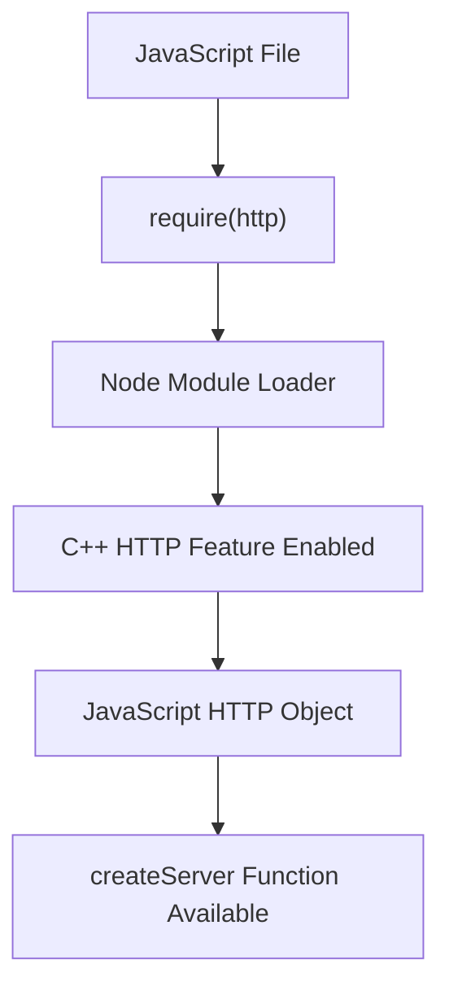

# Accessing Node.js Built-in (C++) Features

## Overview

Node.js exposes system-level functionality (networking, file system, timers) through JavaScript-accessible APIs. These APIs act as **labels** that connect JavaScript code to underlying **C++ features** running in the background.

---

# The `require` Mechanism

## Definition: `require`

`require` is a function used in Node.js to load and enable access to specific built-in or external modules.

- **Purpose**: Explicitly opt in to specific Node C++ features.
    
- **Design goal**: Avoid loading unnecessary system features into memory.
    
- **Context**: Follows the CommonJS module pattern.

## Key Characteristics

- Available in any Node.js file.
    
- Takes a string identifier (e.g., `"http"`).
    
- Returns an object containing functions tied to the requested feature.

---

# HTTP Module as an Example

## Definition: HTTP Module

The HTTP module provides access to Node’s C++ networking capabilities for handling HTTP requests and responses.

- Enabled via: `require("http")`
    
- Returns an object containing methods such as `createServer`.

## Why HTTP Is Not Automatic

- Not all servers use HTTP (e.g., mail servers).
    
- Node requires developers to explicitly enable only the features they need.

---

# How `require("http")` Works Conceptually

1. JavaScript calls `require("http")`.
    
2. Node identifies the requested module.
    
3. Node exposes a JavaScript object that maps to HTTP-related C++ functionality.
    
4. That object includes methods such as `createServer`.

```js
const http = require("http");
```

- `http` now references an object of functions connected to C++ networking logic.
    
- `http.createServer` sets up the background networking behavior.

---

# Relationship to Other Node Features

## Comparison: `http.createServer` Vs `setTimeout`

|Feature|JavaScript Origin|Backed by C++|Requires `require`|
|---|---|---|---|
|`setTimeout`|Global label|Yes|No|
|HTTP module|Not global|Yes|Yes|

## Key Insight

- JavaScript itself has **no timers or networking**.
    
- These capabilities come from Node’s C++ layer.
    
- Some labels (like `setTimeout`) are preloaded.
    
- Others (like `http`) must be explicitly requested.

---

# Conceptual Flow: Enabling a Node Feature



---

# Design Philosophy Behind `require`

## Benefits

- Performance efficiency (load only what is needed).
    
- Clear separation of concerns.
    
- Explicit control over system-level access.
    
- Supports modular application architecture.

## Broader Context

- `require` is part of the CommonJS pattern.
    
- Module loading relies on closures and controlled scope.
    
- Deeper mechanics are explored in advanced Node.js internals.

---

# Key Takeaways

- Node.js system capabilities are implemented in C++.
    
- JavaScript accesses these capabilities through labeled APIs.
    
- `require` is used to opt in to specific Node features like HTTP.
    
- `require("http")` exposes an object containing functions such as `createServer`.
    
- Not all Node features are globally available by design.
    
- This modular approach improves efficiency and flexibility.