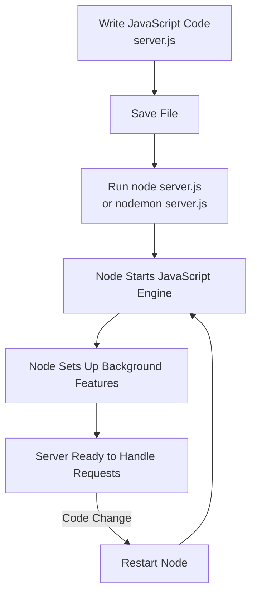

# Running JavaScript with Node.js (Server-Side Execution)

## 1. JavaScript Execution Environments

### 1.1 Browser vs. Node.js

- **Browser JavaScript Execution**
    
    - JavaScript runs automatically when a web page is opened.
        
    - The browser:
        
        - Turns on a JavaScript engine.
            
        - Executes embedded or linked JavaScript immediately.
            
    - Developers do not need to manually start the JavaScript runtime.
        
- **Node.js JavaScript Execution**
    
    - Node.js is an **application** that must be explicitly started.
        
    - It provides:
        
        - A JavaScript engine.
            
        - Access to computer internal features (via Node APIs).
            
    - JavaScript does **not** run automatically; the developer must start Node.

**Key Definition**

- **Node.js**: A runtime environment that allows JavaScript to run outside the browser, with access to system-level features such as networking and file systems.

---

## 2. Writing Server-Side JavaScript Code

### 2.1 JavaScript Files

- JavaScript code is written in plain text files.
    
- Conventionally saved with a `.js` extension (e.g., `server.js`).
    
- The file:
    
    - Is just a text file.
        
    - Contains JavaScript instructions to be executed by Node.

**Key Definition**

- **`.js` file**: A text file containing JavaScript code that can be executed by a JavaScript engine.

---

## 3. Starting Node.js from the Terminal

### 3.1 The Terminal (Command Line Interface)

- Developers interact with Node using the **terminal**, not by double-clicking.
    
- The terminal allows:
    
    - Launching applications.
        
    - Running scripts.
        
    - Interacting directly with the operating system.

**Key Definition**

- **Terminal / Command Line Interface (CLI)**: A text-based interface for executing commands and controlling applications.

### 3.2 Running a JavaScript File with Node

Steps:

1. Open the terminal.
    
2. Navigate to the directory containing the JavaScript file.
    
3. Run:

    ```bash
    node server.js
    ```

4. Node:
    
    - Starts a JavaScript engine.
        
    - Executes the code in `server.js`.
        
    - Sets up any Node features defined in the file.

**Key Definition**

- **node `<filename>`**: A command that starts Node.js and runs the specified JavaScript file.

---

## 4. Node.js Lifecycle and Code Reloading

### 4.1 One-Time Setup Model

- When Node starts:
    
    - It runs through the JavaScript file **once**.
        
    - Sets up all background features (e.g., servers, sockets).
        
- If the code changes:
    
    - Node does **not** automatically re-run the file.
        
    - The server must be stopped and restarted.

**Implication**

- Any change to server setup code requires a full restart of Node.

---

## 5. Restarting Node Automatically with Nodemon

### 5.1 Nodemon

- **Nodemon** is a development tool that wraps Node.js.
    
- It monitors JavaScript files for changes.

**How Nodemon Works**

1. Start the app with:

```bash
    nodemon server.js
    ```

2. When a file changes:
    
    - Nodemon stops Node.
        
    - Restarts Node automatically.
        
    - Re-runs all setup code.

**Key Definition**

- **Nodemon**: A development utility that automatically restarts a Node.js application when source files change.

---

## 6. Execution Flow Overview



---

## 7. Comparison: Node vs. Nodemon

|Feature|Node.js|Nodemon|
|---|---|---|
|Manual restart|Required|Not required|
|Detects file changes|No|Yes|
|Use case|Production & development|Development only|
|Behavior on change|No effect|Auto-restart and re-run code|

---

# Summary of Key Points

- Node.js is an application that must be explicitly started to run JavaScript.
    
- JavaScript code is written in `.js` files and executed via the terminal.
    
- Running `node server.js` starts Node and executes the file once.
    
- Any code change requires restarting Node to apply updates.
    
- Nodemon automates restarts by monitoring file changes, improving development workflow.