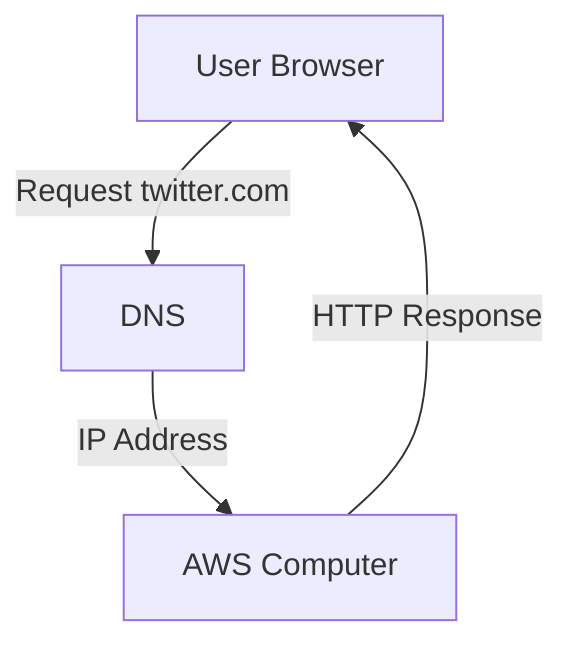

# Running Server Code on Always-On Infrastructure

## The Problem: Always-On Servers

- **Server availability requirement**: A server must be able to receive and respond to requests (e.g., users opening a website) at any time, day or night.
    
- **Old approach**: Developers kept their own computers plugged in and always on to act as servers.
    
- **Limitation**: This is impractical, unreliable, and demanding for individuals or small teams.

---

# Cloud Providers as the Solution

## Cloud Computing

- **Definition**: The practice of renting computing resources (servers, storage, networking) from large providers that maintain always-on infrastructure.
    
- **Purpose**: Removes the need for developers to maintain their own always-on machines.

## Major Cloud Providers

| Provider              | Company   |
| --------------------- | --------- |
| Amazon Web Service    | Amazon    |
| Google Cloud Platform | Google    |
| Azure                 | Microsoft |

- These providers operate **massive data centers** with hundreds of thousands to millions of computers that are always connected to the internet.
    
- Developers rent a portion of this infrastructure to run their applications.

---

# Local Development Vs Remote Deployment

## Local Development

- Code is written on a personal computer using an editor (e.g., VS Code).
    
- Files such as `server.js` contain JavaScript server logic.
    
- The local terminal is used for development tasks.

## Remote Deployment

- The server code does **not** ultimately run on the developer’s machine.
    
- Instead, it runs on a **remote cloud computer** owned by a provider like AWS.

---

# SSH: Accessing Remote Computers Securely

## SSH (Secure Shell)

- **Definition**: A protocol that allows secure remote access to another computer through the terminal.
    
- **Purpose**:
    
    - Control a cloud computer as if it were local.
        
    - Start processes like Node.js on the remote machine.
        
- **Key idea**: The developer’s terminal controls the cloud computer, not the local one.

---

# Running Node.js on the Cloud

- Node.js is installed on the cloud computer.
    
- The developer:
    
    1. Connects to the cloud machine via SSH.
        
    2. Runs Node.js there.
        
    3. Loads and executes the server code (e.g., `server.js`) on the cloud machine.
        
- Result: The server is always on and reachable over the internet.

---

# Domain Names and DNS

## DNS (Domain Name System)

- **Definition**: A global mapping system that links human-readable domain names to numeric IP addresses.
    
- **Purpose**: Allows users to access servers using names like `twitter.com` instead of IP numbers.

## IP Address

- **Definition**: A unique numeric identifier assigned to each computer on a network.
    
- Example (simplified):
    
    - `twitter.com` → `32.2.5.7`

## How DNS Fits In

- Previously, a domain might point to a developer’s personal computer.
    
- After deployment, the domain is updated to point to the cloud provider’s computer instead.

---

# Ports, Processes, and Scalability

## Ports

- **Port 80**: Standard port for HTTP traffic.
    
- Cloud machines handle traffic routing internally, even though many apps may use the same port.

## Multiple Processes and Apps

- A single cloud computer can:
    
    - Run multiple Node.js processes.
        
    - Host multiple web applications simultaneously.
        
- Apps can also be distributed across multiple computers for scalability and reliability.

---

# DevOps

## DevOps

- **Definition**: The discipline focused on deploying, configuring, and maintaining applications on infrastructure.
    
- **Responsibilities include**:
    
    - Ensuring code runs correctly on cloud machines.
        
    - Configuring DNS so domains point to the correct servers.
        
    - Managing scaling, reliability, and deployment pipelines.
        
- **Importance**: Modern development relies heavily on DevOps due to cloud-based infrastructure.

---

# Summary of Key Points

- Servers must be always on to handle user requests at any time.
    
- Cloud providers offer always-on infrastructure that developers can rent.
    
- Code is written locally but runs on remote cloud computers.
    
- SSH enables secure control of cloud machines via the terminal.
    
- DNS maps domain names to cloud server IP addresses.
    
- DevOps ensures correct deployment, routing, and operation of server applications.