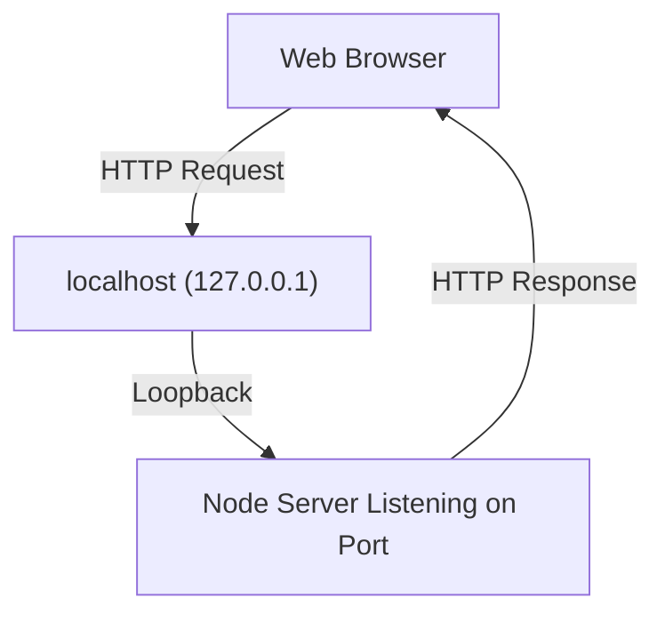

# Local Development Vs Remote Server Testing

## The Testing Problem

- **Issue:** Testing server code by deploying to a remote machine (e.g., AWS) is slow and impractical.
    
- **Why:** Each change would require redeploying, waiting, and asking external users to test requests.
    
- **Goal:** Test both the server (listening and responding) and the client (sending requests) on the same machine.

---

# Development Machine

## Definition

- **Development Machine:** The developer’s local computer used to write, run, and test code before deployment.
    
- **Relevance:** Enables rapid iteration and debugging without relying on external infrastructure.

## What Runs on the Development Machine

- Node.js JavaScript engine
    
- Node’s C++ features (networking, sockets)
    
- Open network channel (socket) to listen for requests

---

# Servers as Open Network Channels

## Server (Conceptual Definition)

- A **server** is not a special type of computer.
    
- It is a computer process with:
    
    - An open network socket
        
    - A defined port
        
    - Logic to receive requests and send responses

## Key Idea

- Any computer can act as a server if it opens a socket and listens for messages.

---

# The Localhost Loopback Mechanism

## Localhost

- **Definition:** A special domain name that refers back to the same computer.
    
- **Domain Name:** `localhost`
    
- **IP Address:** `127.0.0.1`

## Purpose

- Allows a computer to send HTTP requests to itself.
    
- Eliminates the need for another physical or remote machine during development.

## How It Works

- Requests sent to `localhost` do **not** go out to the internet.
    
- The operating system routes them directly back into the same machine.

---

# Ports and Local Development

## Ports Overview

- **Port:** A numbered entry point for network traffic.
    
- Computers support ~65,000 ports.

## Common Ports

|Port|Usage|
|--:|---|
|80|Default HTTP (browser default)|
|3000|Common development port|

## Why Not Use Port 80 Locally?

- Port 80 is typically reserved or already in use.
    
- Developers choose higher-numbered ports (e.g., 3000).

## Explicit Port Declaration

- When not using port 80, the port must be specified in the URL:
    
    - Example: `http://localhost:3000`

---

# Example: Local Server Testing Flow

## Step-by-Step

1. Start Node on the local machine.
    
2. Open a network socket listening on port 3000.
    
3. Open a web browser on the same machine.
    
4. Navigate to `localhost:3000`.
    
5. Browser sends an HTTP request.
    
6. Operating system loops the request back internally.
    
7. Node server receives the request.
    
8. Server processes it and sends a response.
    
9. Browser displays the response.

---

# Operating System Support

## Loopback Feature

- Built into modern operating systems.
    
- Replaces older hardware-based loopback methods.
    
- Ensures fast, isolated, and reliable local testing.

---

# Why Localhost Is Essential for Development

- Enables full server-client testing on one machine.
    
- No internet connection required.
    
- No cloud deployment required during development.
    
- Mirrors real HTTP behavior closely.

---

# Summary of Key Points

- Testing directly on remote servers is inefficient.
    
- Developers use their local machine as both client and server.
    
- `localhost` (`127.0.0.1`) loops requests back to the same computer.
    
- Servers are simply processes listening on ports.
    
- Explicit ports (e.g., 3000) are commonly used for local development.
    
- Localhost enables fast, realistic server testing without deployment.