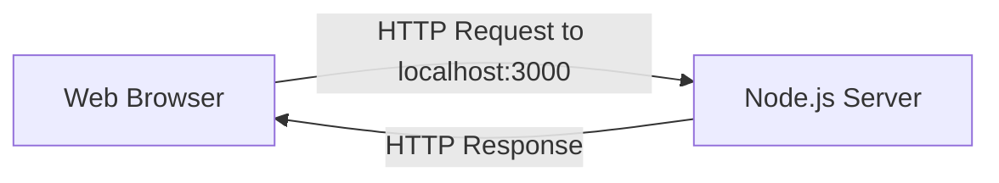

# Local Development Workflow with Node.js

## Role of the Developer Machine

- **Development machine**: The developer’s own computer used to write, run, and test server-side JavaScript code.
    
- Node.js is started locally via the terminal to:
    
    - Turn on the **JavaScript engine**
        
    - Enable **Node C++ features**
        
    - Access the computer’s **networking internals**

## Running Server Code Locally

- JavaScript code is written in a file (e.g., `server.js`).
    
- The file is executed by running `node server.js` in the terminal.
    
- This starts a server that:
    
    - Opens a **network socket**
        
    - Listens for inbound HTTP requests
        
    - Sends responses back to clients

---

# The Problem of Testing Server Code

## Naive (Impractical) Approach

- Deploy code to a remote server (e.g., AWS).
    
- Ask another person to open the website to test changes.
    
- Repeat for every bug fix or change.

**Why this is inefficient**:

- Slow feedback loop
    
- Dependent on external machines and people
    
- Makes rapid iteration impossible

---

# Localhost and the Loopback Mechanism

## Localhost

- **Localhost**: A special pseudo-domain name that refers to the current machine.
    
- Domain name: `localhost`
    
- IP address: `127.0.0.1`

**Purpose**:

- Allows a computer to send network requests to itself.
    
- Enables testing both the server and the client (browser) on the same machine.

## Loopback Feature

- Built into operating systems.
    
- Sends outbound HTTP requests directly back into the same machine.
    
- The request never leaves the computer or reaches the public internet.

### Historical Note

- Before OS-level loopback, developers physically looped a network cable back into the computer.

---

# Ports and Local Testing

## Ports

- **Port**: An entry point for network traffic on a computer.
    
- Browsers default to **port 80** for HTTP.
    
- Developers typically use non-default ports for local development (e.g., `3000`).

## Declaring a Port Explicitly

- When using a non-default port, it must be specified in the URL:
    
    - Example: `http://localhost:3000`

## Why Not Use Port 80?

- Port 80 is commonly reserved and may require special permissions.
    
- Using higher-numbered ports avoids conflicts.

### Port Range

- Available ports: ~64,000
    
- Common convention for Node.js development: `3000`, `4000`, etc.

---

# Local Development Flow

**Explanation**:

1. Node.js opens a socket on a specific port.
    
2. The browser sends a request to `localhost:PORT`.
    
3. The operating system loops the request back internally.
    
4. The Node server processes the request and responds.
    
5. The browser renders the response.

---

# What a Server Really Is

- A **server** is not a special machine.
    
- It is:
    
    - An open network socket
        
    - Listening on a specific port
        
    - Ready to receive and respond to messages

---

# Pair Programming Setup

## Development Context

- Code is provided via a downloadable project.
    
- Developers work locally:
    
    - Install Node.js
        
    - Download the project files
        
    - Follow instructions in the README
        
- The client (browser) and server are both running on the same machine using `localhost`.

---

# Pair Programming Roles

## Navigator

- Reads and interprets the problem.
    
- Designs the **overall strategy**.
    
- Communicates intent clearly to the driver.
    
- Does **not** touch the keyboard.

## Driver

- Types the code.
    
- Implements the navigator’s strategy.
    
- Asks clarifying questions when needed.

---

# Benefits of Pair Programming

## Balanced Learning

Avoids two common traps:

- Over-researching without coding
    
- Copy-pasting solutions without understanding

## Improved Technical Communication

- Forces clear verbal explanations of:
    
    - What to build
        
    - Why it works
        
    - How it should be implemented

## Debugging as a Learning Tool

- Errors are anticipated and explained.
    
- Error messages become informative rather than confusing.
    
- Debugging follows a structured process:
    
    1. Expected behavior
        
    2. Actual behavior
        
    3. Hypothesis
        
    4. Experiment (e.g., `console.log`)
        
    5. Iterate

## Career Relevance

|Level|Capability|
|---|---|
|Junior|Build features with familiar tools|
|Mid-level|Build features with unfamiliar tools|
|Senior|Enable others to build features through explanation|

---

# Pair Programming Best Practices

- Switch roles every 5–10 minutes.
    
- Navigator provides:
    
    - High-level strategy
        
    - Line-by-line intent (not keystrokes)
        
- Encourage verbalization of confusion and assumptions.
    
- Treat debugging as a shared reasoning exercise.

---

# Key Concepts Summary

- Local development avoids deploying code just to test it.
    
- `localhost` (`127.0.0.1`) enables loopback testing on the same machine.
    
- Servers are simply open network sockets listening on ports.
    
- Explicit ports (e.g., `3000`) are used for local Node.js development.
    
- Pair programming improves understanding, communication, and debugging skills.