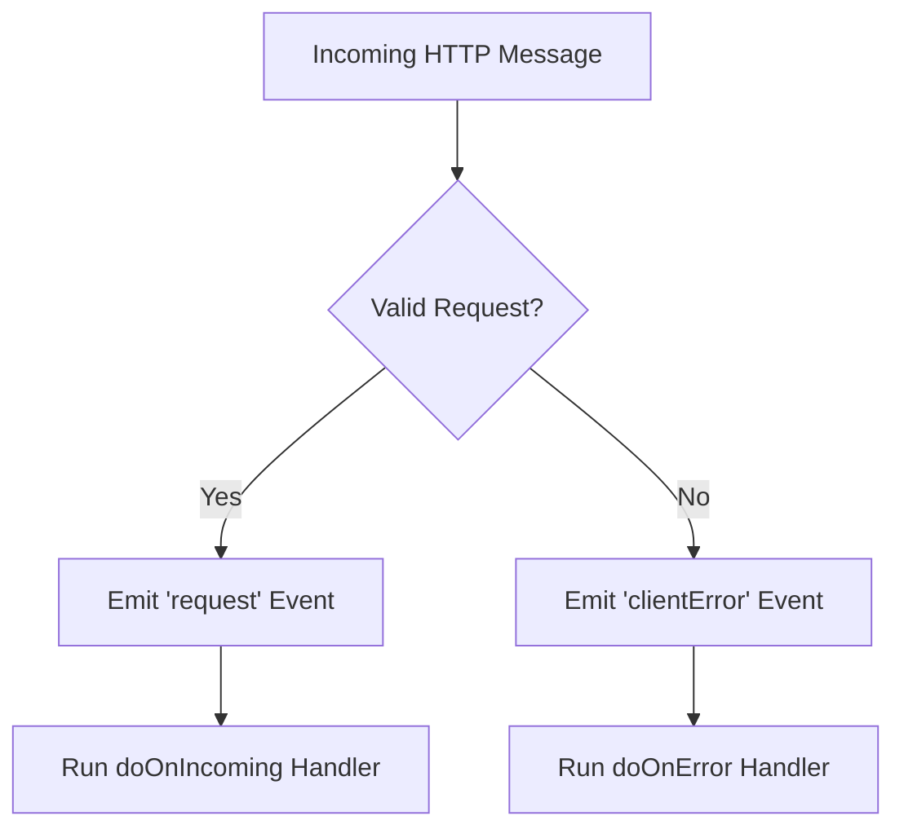

# Server-Side Error Handling in Node.js

## Why Errors Are Common in Server-Side Development

- **Context**: Server-side code interacts with many external systems (clients’ computers, networks, browsers).
    
- **Result**: Many things can go wrong (invalid URLs, corrupted data, malformed requests).
    
- **Goal**: Servers must detect errors, handle them gracefully, and avoid crashing or sending incorrect responses.

---

# Understanding HTTP Errors on the Server

## Client Vs Server Interaction

- **Client**: A user’s browser or application sending an HTTP request.
    
- **Server**: A computer running Node.js, listening for incoming requests and responding.

## Types of Problems

- Corrupted request messages
    
- Invalid URLs
    
- Incorrect request formats
    
- Network-level issues

---

# Events in Node.js

## Definition: Event

- An **event** is a signal emitted by Node.js when something happens (e.g., a request arrives, an error occurs).
    
- Events are broadcast internally and can trigger specific functions.

## Key Concept

- Node.js does **not** automatically call request-handling functions.
    
- Instead, it **emits events**, and registered functions respond to those events.

---

# The `request` Event

## What Happens on a Valid Request

1. An HTTP request arrives at the server.
    
2. Node.js emits the **`request`** event.
    
3. A handler function (e.g., `doOnIncoming`) runs in response.

## Implicit Event Handling

- Passing a function into `createServer(handler)`:
    
    - Automatically registers `handler` to run when the `request` event is emitted.

---

# Handling Errors with Events

## The Problem

- If a request is malformed or invalid:
    
    - Node.js does **not** emit the `request` event.
        
    - The normal request handler should not run.

## The Solution

- Use a **separate event handler** for errors.

## The `clientError` Event

- Emitted when Node.js detects a bad or corrupted client request.
    
- Allows the server to:
    
    - Log the error
        
    - Respond appropriately
        
    - Avoid executing normal request logic

---

# Manual Event Registration

## Why Register Events Manually?

- Allows precise control over:
    
    - Which function runs
        
    - Under what conditions
        
- Enables separate logic for:
    
    - Successful requests
        
    - Client errors

## Pattern

- Create the server without a handler.
    
- Register event listeners explicitly:
    
    - On `"request"` → run request handler
        
    - On `"clientError"` → run error handler

---

# Event-Driven Flow in Node.js

---

# Key Components in the Node.js Architecture

|Layer|Description|Role|
|---|---|---|
|Computer Internals|Networking, file system, sockets|Low-level system access|
|Node C++ Features|HTTP, file system, timers|Bridge between JS and OS|
|JavaScript Runtime|Executes JavaScript code|Runs server logic|

---

# Why This Matters

- Robust servers must handle both **expected** and **unexpected** inputs.
    
- Event-based architecture enables:
    
    - Clear separation of concerns
        
    - Safer execution paths
        
    - Better debugging and logging

---

# Connection to Future Topics

- Event handling leads directly into:
    
    - The **event loop**
        
    - Queues and asynchronous execution
        
- Understanding events is foundational for advanced Node.js behavior.

---

# Summary of Key Points

- Server-side development involves frequent errors due to external inputs.
    
- Node.js uses an **event-driven model**, not automatic function execution.
    
- Valid requests emit the `request` event.
    
- Invalid requests emit the `clientError` event.
    
- Separating request and error handlers improves reliability and clarity.
    
- Manual event handling provides greater control over server behavior.