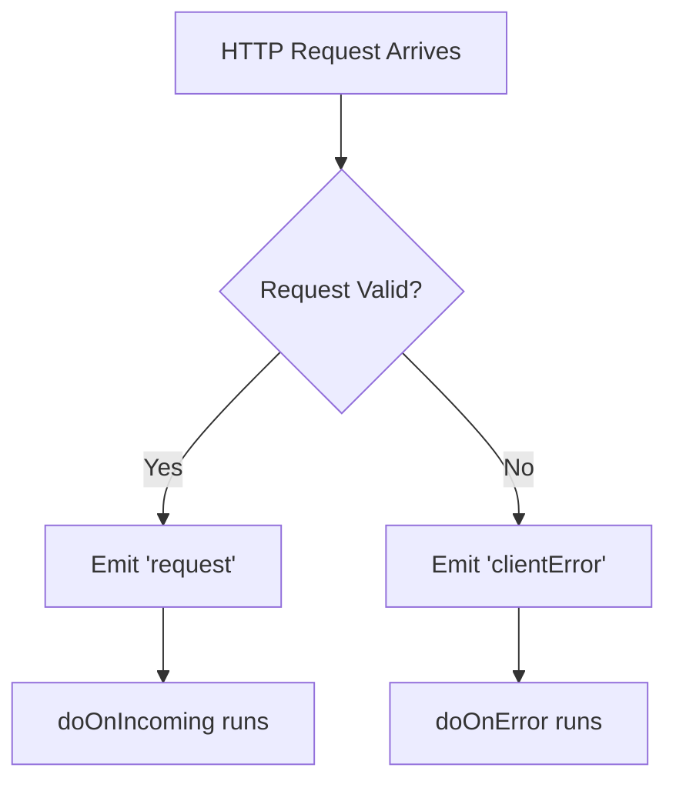
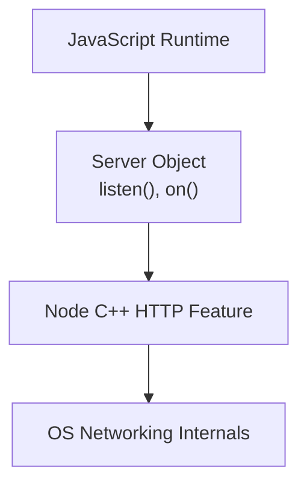

# Server-Side Error Handling in Node.js

## Why Error Handling Is Essential

- **Server-side development** involves communication between multiple computers over the internet.
    
- Many things can go wrong: malformed requests, network issues, incorrect URLs, corrupted data.
    
- Robust servers must **handle valid requests and errors differently** to remain stable and debuggable.

---

# Core Concepts

## Client Vs Server

- **Client**: The computer/browser sending an HTTP request.
    
- **Server**: The computer running Node.js, listening for requests, and responding.

## HTTP Requests

- Requests may be:
    
    - **Valid**: Correctly formatted and expected.
        
    - **Invalid (Client Errors)**: Corrupted data, malformed URLs, or unsupported formats.

---

# Event-Driven Architecture in Node.js

## Events

- **Event**: A message broadcast internally by Node.js when something happens.
    
- Events are:
    
    - _Emitted_
        
    - _Broadcast_
        
    - _Flashed out_
        
- These terms all refer to the same mechanism.

## Key Built-in Events

|Event Name|Triggered When|
|---|---|
|`request`|A valid HTTP request arrives|
|`clientError`|A malformed or invalid request is received|

---

# How Node Handles Incoming Requests

## Default Behavior

- When a valid request arrives:
    
    - Node emits the `request` event.
        
    - A handler function (e.g. `doOnIncoming`) is executed.

## Error Behavior

- When a bad request arrives:
    
    - Node emits `clientError`.
        
    - The normal request handler is **not run**.
        
    - A separate error-handling function should execute.

---

# Separating Request and Error Logic

## Defining Handler Functions

- **`doOnIncoming`**  
    Handles valid requests and sends responses.
    
- **`doOnError`**  
    Handles invalid requests, logs errors, prevents crashes.

---

# Setting Up the Server Manually

## `http.createServer()`

- **In Node (C++)**
    
    - Opens a network socket (two-way communication channel).
        
- **In JavaScript**
    
    - Returns a **server object**.

## Server Object

An object that exposes methods allowing JavaScript to **edit the underlying Node HTTP server instance**.

|Method|Purpose|
|---|---|
|`listen()`|Selects the port to listen on|
|`on()`|Attaches functions to specific events|

---

# Manual Event Registration Pattern

Instead of passing a handler directly into `createServer`, you can:

1. Create the server
    
2. Register event handlers explicitly

## Why This Matters

- Gives **fine-grained control** over behavior.
    
- Allows different functions to run for different events.
    
- Enables robust error handling.

---

# Event Registration Flow (Conceptual)

---

# Editing the Server After Creation

## Why This Is Possible

- `http.createServer()`:
    
    - Sets up the socket in Node
        
    - Returns an object with methods in JavaScript
        
- These methods are **live connections** to the underlying server instance.

## Key Insight

- JavaScript does **not** directly manipulate networking.
    
- It uses **methods** that communicate with Node’s C++ internals.

---

# Conceptual Layer Model

---

# Pattern: Event-Based Server Control

- Node emits events when something happens.
    
- Developers decide:
    
    - **Which events matter**
        
    - **Which functions run for each**
        
- This is the foundation of Node’s flexibility and scalability.

---

# Key Takeaways

- Node.js servers are **event-driven**, not function-triggered directly.
    
- Valid requests emit `request`; invalid ones emit `clientError`.
    
- `http.createServer()`:
    
    - Opens a socket in Node
        
    - Returns a controllable server object in JavaScript
        
- Server behavior is customized using methods like `listen()` and `on()`.
    
- Separating request handling from error handling is a critical server-side pattern.