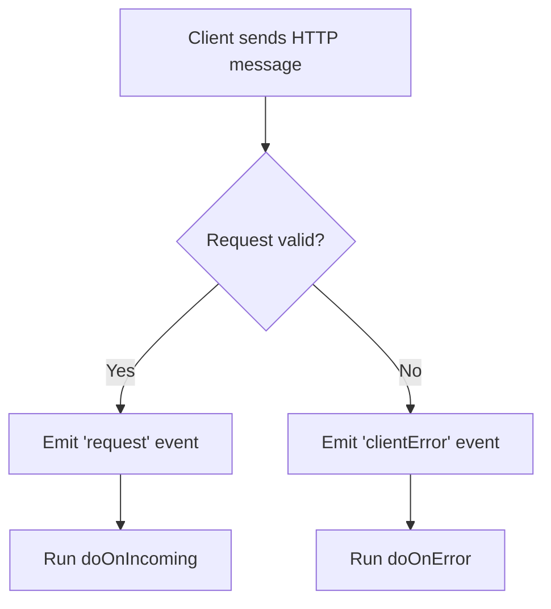
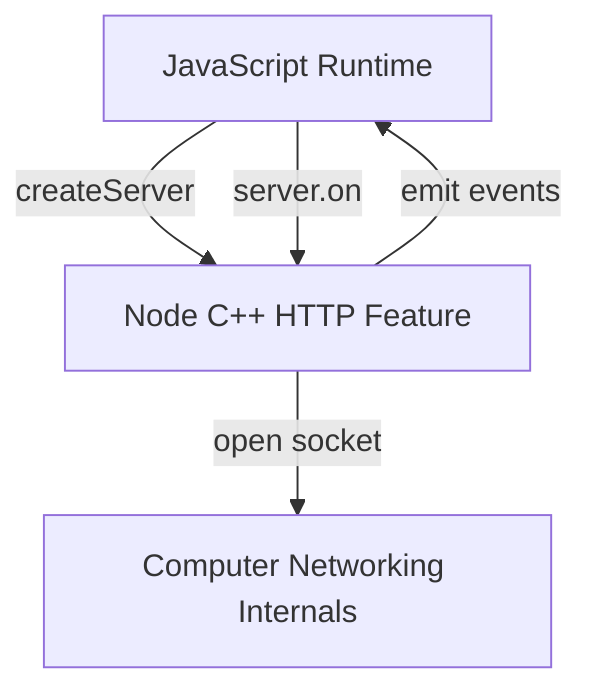

# Handling Errors in Node.js Server Development

## Why Error Handling Is Essential

- Server-side development involves communication between multiple computers over a network.
    
- Many things can go wrong: corrupted requests, malformed URLs, network issues, or client-side mistakes.
    
- Robust servers must **detect**, **separate**, and **handle** normal requests differently from error cases.

---

# Core Concepts

## Server-Side Vs Client-Side Errors

- **Client**: The computer sending requests (e.g., a browser).
    
- **Server**: The computer receiving requests and responding.
    
- Errors often originate from the client (bad request format, invalid data), but must be handled on the server.

## HTTP Server in Node.js

- Node.js exposes HTTP functionality via C++ internals.
    
- JavaScript interacts with these internals through labeled access points (APIs).

---

# Events in Node.js

## Event System (High-Level Idea)

- Node does **not** automatically run functions when something happens.
    
- Instead, Node:
    
    1. **Emits an event** (a named signal).
        
    2. Executes any function that has been registered to respond to that event.

## Key Terms

- **Event**: A named signal emitted by Node when something happens internally.
    
- **Emit**: Node broadcasting an event.
    
- **Listener**: A function registered to run when a specific event is emitted.

---

# Important Built-in HTTP Events

|Event Name|When It Fires|Typical Use|
|---|---|---|
|`request`|A valid HTTP request arrives|Handle normal requests|
|`clientError`|A malformed or corrupted request is received|Log or handle errors safely|

---

# Creating an HTTP Server

## `http.createServer()`

### What It Does in Node (C++ Side)

- Opens an **HTTP socket**:
    
    - A two-way communication channel to the network.
        
    - Allows receiving and sending data.

### What It Does in JavaScript

- Returns a **server object** containing methods that control the server.

---

# The Server Object

## Methods Returned by `createServer()`

|Method|Purpose|
|---|---|
|`listen`|Sets the port and starts listening for connections|
|`on`|Registers event listeners (auto-run functions)|

These methods allow **ongoing modification** of the same server instance.

---

# Setting the Port with `listen`

## Why Ports Matter

- A computer has ~65,000 possible ports.
    
- Port **80** is the default for HTTP traffic from browsers.
    
- The server must explicitly listen on a port to receive messages.

## Example

- `server.listen(80)`
    
    - Opens port 80 on the machine’s network interface.
        
    - Allows browsers to send requests to the server.

---

# Registering Event Handlers with `on`

## Manual Event Registration

Instead of passing a handler directly into `createServer`, we can register handlers manually for more control.

## Common Pattern

- Use `server.on(eventName, handlerFunction)`

---

# Handling Normal Requests

## Request Event

- When a valid request arrives, Node emits the `request` event.

## Example Flow

1. Request reaches the open socket.
    
2. Node emits the `request` event.
    
3. The registered handler runs automatically.

## Example

- Event: `request`
    
- Handler: `doOnIncoming`

---

# Handling Client Errors

## Client Error Event

- If a request is corrupted or malformed:
    
    - Node does **not** emit `request`.
        
    - Node emits `clientError`.

## Purpose

- Prevent normal request logic from running.
    
- Log errors, inspect them, or safely terminate the connection.

## Example

- Event: `clientError`
    
- Handler: `doOnError`

---

# Event-Based Server Setup Flow

---

# Why Use the Event System Explicitly?

## Benefits

- Fine-grained control over server behavior.
    
- Different logic for different scenarios.
    
- Clear separation between:
    
    - Happy path (valid requests)
        
    - Error handling (invalid requests)

## Comparison

|Approach|Behavior|
|---|---|
|Passing handler into `createServer`|Implicit setup for `request` only|
|Using `server.on(…)`|Explicit control over multiple events|

---

# Mental Model of Node.js HTTP Servers

---

# Key Takeaways (Summary)

- Node.js uses an **event-driven architecture** for server behavior.
    
- Incoming requests cause Node to **emit events**, not directly run functions.
    
- `http.createServer()`:
    
    - Opens a network socket (Node side).
        
    - Returns a server object with control methods (JavaScript side).
        
- `server.listen()` configures which port the server listens on.
    
- `server.on()` connects events (`request`, `clientError`) to handler functions.
    
- Separating request handling from error handling is essential for robust servers.