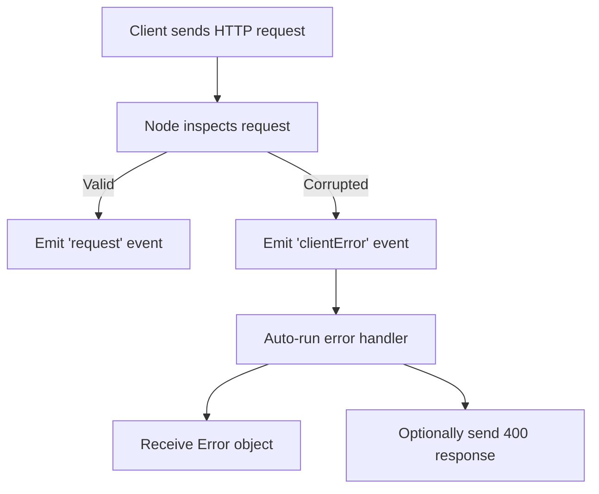

# Handling Corrupted HTTP Requests in Node.js

## 1. Context: Client–Server Interaction

- A **client** (e.g., a browser opening a website) sends an **HTTP request** to a server.
    
- Under normal conditions, the request is well-formed and processed by the server.
    
- Sometimes, the request arrives **corrupted** and cannot be safely processed.

---

# 2. Corrupted HTTP Requests

## Definition

A **corrupted HTTP request** is a request that does not conform to expected HTTP formatting or data standards.

## Common Causes

- Misspelled or malformed URLs
    
- Unexpected tokens in the URL
    
- DNS resolution issues
    
- Misformatted JSON data in a POST request

## Why They Matter

- Passing corrupted data into JavaScript can:
    
    - Cause runtime errors
        
    - Break the server
        
    - Lead to incorrect parsing or interpretation

Node.js detects these issues early and prevents unsafe data from reaching application logic.

---

# 3. Node.js Event System for Errors

## Built-in Events

Node.js automatically emits events when certain conditions occur.

|Event Name|When It Fires|
|---|---|
|`request`|A valid HTTP request arrives|
|`clientError`|A corrupted client request is detected|

## Key Idea

Node.js **announces events** internally. Developers attach handlers to respond when those events occur.

---

# 4. `clientError` Event

## Purpose

- Emitted when Node detects a malformed or corrupted HTTP request.
    
- Prevents unsafe request data from entering JavaScript logic.

## Behavior

- Node inspects the incoming request.
    
- If corruption is detected:
    
    - The request is blocked
        
    - The `clientError` event is emitted

---

# 5. Registering an Error Handler

## Pattern

```js
server.on('clientError', doOnError)
```

## Meaning

- If Node emits the `clientError` event,
    
- Automatically run the function `doOnError`.

---

# 6. Auto-Inserted Arguments in Event Handlers

## Definition: Argument

An **argument** is data automatically passed into a function when it is invoked.

## In `clientError` Handlers

Node automatically inserts arguments when `doOnError` runs.

|Argument Position|Description|
|---|---|
|1st argument|An **Error object**|
|2nd argument|A **raw socket** (low-level network connection)|

---

# 7. Error Object

## Definition

An **Error object** is a special JavaScript object containing information about what went wrong.

## Characteristics

- Includes:
    
    - Error message
        
    - Stack trace
        
    - Context about where the error occurred
        
- Useful for debugging and logging

## Example

```js
function doOnError(error) {
  console.error(error)
}
```

## Why `console.error`

- Designed to work with Error objects
    
- Outputs a readable stack trace

---

# 8. Parameters vs. Arguments

|Term|Meaning|
|---|---|
|Parameter|A placeholder variable in a function definition|
|Argument|Actual data inserted into the function when it runs|

**Example**

```js
function doOnError(error) {
  // 'error' is a parameter
}
```

- The Error object emitted by Node is the **argument** that fills the parameter.

---

# 9. Sending a Response for Client Errors

## HTTP Status Codes

- **Status codes** communicate server outcomes to the client.
    
- Codes starting with **4xx** indicate client-side errors.

## Common Code for Corrupted Requests

|Status Code|Meaning|
|---|---|
|400|Bad Request|

## Important Detail

- For `clientError`, Node does **not** provide a parsed HTTP request.
    
- Instead, it provides:
    
    - A raw **socket**
        
    - Developers must manually write an HTTP-formatted response.

---

# 10. Raw Socket Response (Advanced)

## What the Socket Is

- A low-level network connection
    
- Not automatically formatted as HTTP

## Responsibility of the Developer

- Manually construct an HTTP response
    
- Include status code (e.g., 400)
    
- Send it through the socket

---

# 11. Flow of a Corrupted Request



---

# 12. Key Takeaways

- Node.js protects servers by blocking corrupted HTTP requests.
    
- Corrupted requests emit the `clientError` event.
    
- Event handlers receive auto-inserted arguments, including an Error object.
    
- Error objects provide valuable debugging information.
    
- Proper handling includes logging the error and returning a `400 Bad Request`.
	
- Auto inserted data is know as en argument
    
- The event-driven system gives fine-grained control over server behavior.