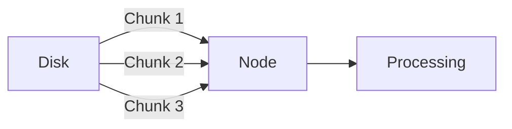

# 1. Core Model of Node.js Servers

## 1.1 HTTP Request–Response Cycle

**Definition (HTTP Request):**  
An HTTP request is a structured message sent by a client (e.g., a browser) to a server, asking for data or an action. It begins with **HTTP** and follows a standardized format.

**Relevance:**  
This request–response cycle is the **core abstraction of Node.js** and of server-side programming in general.

**Key Idea:**  
Node.js applications fundamentally:

1. Receive an inbound HTTP request.
    
2. Inspect the request.
    
3. Prepare a response.
    
4. Send the response back to the client.

Everything else in Node.js builds on top of this model.

---

# 2. Requests as the Heart of Node.js

## 2.1 Why Requests Matter

- Requests represent **user intent** (“the client wants something”).
    
- Node inspects requests to determine:
    
    - What data is requested
        
    - What processing is required
        
- Responses are constructed by:
    
    - Adding data
        
    - Adding metadata (headers, status codes)
        
    - Sending results back to the client

**Key Insight:**  
Handling inbound requests and sending responses is not just part of Node—it _is_ Node’s core purpose.

---

# 3. Persistent Data Vs JavaScript Memory

## 3.1 JavaScript Memory (RAM)

- Fast access
    
- Temporary
    
- Data is lost when the Node process stops

## 3.2 Persistent Storage (Hard Drive)

- Slower access
    
- Long-term, permanent storage
    
- Ideal for large datasets (e.g., tweet archives)

**Example Context:**  
A Twitter-like app stores **1.5 GB of tweets** on disk rather than in JavaScript memory to avoid reloading data every time the server restarts.

|Storage Type|Speed|Persistence|Typical Use|
|---|---|---|---|
|RAM (JS memory)|Very fast|Temporary|Active computation|
|Hard Drive|Slower|Permanent|Large datasets, archives|

---

# 4. Node.js File System (`fs`) Module

## 4.1 Definition

**File System (`fs`):**  
A built-in Node.js module that provides access to the computer’s file storage (hard drive).

**Relevance:**  
It allows Node.js to:

- Read large files
    
- Write persistent data
    
- Interact directly with the operating system’s storage

**Key Point:**  
Node.js can access the file system because it runs on top of lower-level systems (C++ bindings) that interact with the OS.

---

# 5. Scale of Data: Bytes and File Size

## 5.1 Bytes Explained

- **1 byte** = 8 bits (zeros and ones)
    
- 8 bits → 256 possible combinations
    
- Standard characters (e.g., letters) usually fit in 1 byte
    
- Some characters (e.g., emojis) require **multiple bytes**

## 5.2 Implications for Large Files

- 64,000 bytes ≈ 64,000 characters (roughly)
    
- 1.5 GB ≈ ~1.5 billion characters (rough estimate)

**Insight:**  
Large files are expensive to load all at once into JavaScript memory.

---

# 6. Performance Cost of Disk Access

## 6.1 Disk Read Timing

- Reading **1 MB from disk ≈ 1 millisecond**
    
- Reading **1.5 GB** takes:
    
    - Multiple milliseconds
        
    - Potentially several seconds overall

**Problem Identified:**  
Waiting for the _entire file_ to load before processing is inefficient.

---

# 7. Motivation for Incremental Processing

## 7.1 The Inefficiency

- Loading the entire file first
    
- Only then starting to process (e.g., cleaning tweets)

## 7.2 Key Question Raised

> Can we start processing the data _while it is still being read_?

**Preview of Solution (Conceptual):**

- Data may arrive in chunks (e.g., every ~64 KB)
    
- Each chunk could trigger an event
    
- Processing can begin incrementally instead of waiting

---

# 8. Conceptual Takeaway

- Node.js is built around **event-driven handling of incoming data**
    
- This model applies not only to HTTP requests but also to:
    
    - File system operations
        
    - Large data streams

---

# Summary of Key Points

- Node.js revolves around handling HTTP requests and sending responses.
    
- Requests are the core abstraction of servers and Node applications.
    
- Large datasets should be stored on disk, not in JavaScript memory.
    
- The `fs` module enables Node to interact with persistent storage.
    
- Disk access is slow compared to memory, especially for large files.
    
- Efficient systems avoid waiting for full data loads and instead process data incrementally.
    
- This motivates event-driven and streaming approaches in Node.js.