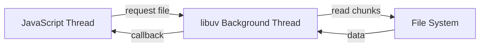
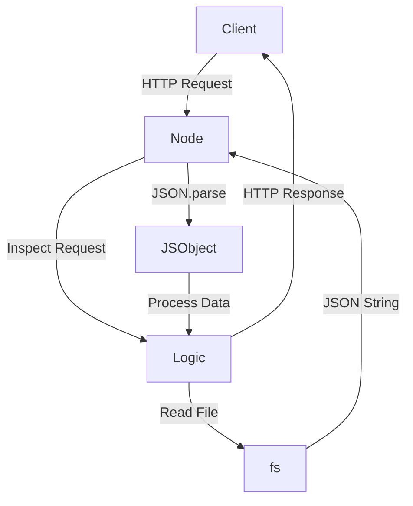

# 1. Core Model of Node.js: HTTP Requests and Responses

## 1.1 HTTP Requests as the Foundation

- **HTTP (HyperText Transfer Protocol):**  
    The standardized format for messages sent from a client (e.g., browser) to a server.
    
- **Inbound Request:**  
    Every Node.js server fundamentally exists to:
    
    1. Receive an HTTP request
        
    2. Inspect it
        
    3. Prepare a response
        
    4. Send it back to the client

**Key Idea:**  
Node.js servers are built around _message in → message out_. Everything else is secondary.

---

# 2. Persistent Data Vs JavaScript Memory

## 2.1 JavaScript Memory Limitations

- JavaScript memory is **temporary**:
    
    - Cleared every time Node restarts
        
    - Not suitable for long-term storage
        
- Large datasets (e.g., 1.5 GB of tweets) should **not** live permanently in memory

## 2.2 Persistent Storage

- **Hard Drive (File System):**
    
    - Long-term, persistent storage
        
    - Retains data across restarts
        
- Node.js accesses the hard drive via **C++ bindings**

---

# 3. The File System (`fs`) Module

## 3.1 Definition

- **`fs` (File System):**  
    A Node.js core module that provides access to the computer’s file storage system.

## 3.2 Purpose

- Read files from disk
    
- Write files to disk
    
- Enable Node.js to work with large datasets stored outside memory

## 3.3 Example Use Case

- Load a large tweet archive from disk
    
- Process and clean tweets using JavaScript functions
    
- Avoid reloading or recomputing data every server start

---

# 4. Performance Considerations with Large Files

## 4.1 File Size and Time

- **1 byte:** 8 bits (0s and 1s)
    
- **Text encoding:**
    
    - ASCII characters ≈ 1 byte
        
    - Emojis ≈ 2 bytes or more
        
- **1.5 GB ≈ 1.5 billion characters**

## 4.2 Disk Access Cost

- Reading from disk is slow compared to memory:
    
    - ~1 millisecond per megabyte
        
- Large files take **multiple milliseconds or seconds** to load

**Implication:**  
Waiting for the entire file to load before processing is inefficient.

---

# 5. File Paths and the “Current Directory”

## 5.1 Current Working Directory

- The **current folder** is:
    
    - The directory from which Node.js is started in the terminal
        
    - Not necessarily where the JavaScript file is saved

## 5.2 Path Syntax

- `.` → current directory
    
- `/` → navigate into subfolders
    
- Example:

    ```text
    ./tweets.json
    ```

---

# 6. JSON as a Data Storage Format

## 6.1 What is JSON?

- **JSON (JavaScript Object Notation):**
    
    - A text-based format for storing structured data
        
    - Represents objects as plain strings

## 6.2 Why JSON is Necessary

- JavaScript objects:
    
    - Exist only in memory
        
    - Cannot be stored directly on disk
        
- JSON allows:
    
    - Serialization (object → string)
        
    - Persistence (save to disk)
        
    - Portability (send between computers)

---

# 7. Converting Between JSON and JavaScript Objects

## 7.1 Serialization

- **Purpose:** Store data outside JavaScript
    
- Convert object → string
    
- Stored as `.json` file

## 7.2 Parsing

- **`JSON.parse()`**
    
    - Converts JSON string → JavaScript object
        
    - Enables data manipulation in code

## 7.3 Example Flow

1. Tweets stored as `tweets.json`
    
2. `fs.readFile` loads file as a string
    
3. `JSON.parse` converts string into a usable object
    
4. Data is cleaned or processed

---

# 8. Background Processing and Libuv

## 8.1 The Problem

- File system access is slow
    
- Blocking the main thread would freeze the server

## 8.2 Libuv

- **libuv:**  
    A C++ library used by Node.js to:
    
    - Handle file system operations
        
    - Run work in background threads
        
    - Prevent blocking the main JavaScript thread

## 8.3 Result

- Node can:
    
    - Start reading a file
        
    - Continue handling requests
        
    - Process data as it becomes available



---

# 9. High-Level Architecture Overview



---

# 10. Key Concepts Summary Table

|Concept|Definition|Purpose|
|---|---|---|
|HTTP|Request/response protocol|Client-server communication|
|fs|File system module|Access hard drive|
|JSON|Text-based data format|Persist objects|
|JSON.parse|Converts JSON to object|Enable data use|
|libuv|Background threading library|Non-blocking I/O|
|Current Directory|Terminal execution location|File path resolution|

---

# Summary of Key Points

- Node.js is fundamentally about handling HTTP requests and responses.
    
- Large datasets must be stored on disk, not in JavaScript memory.
    
- The `fs` module enables access to persistent storage.
    
- JSON allows JavaScript objects to be stored and retrieved as text.
    
- Disk access is slow, so Node relies on libuv for non-blocking background work.
    
- Understanding file paths and execution context is critical for correct file access.