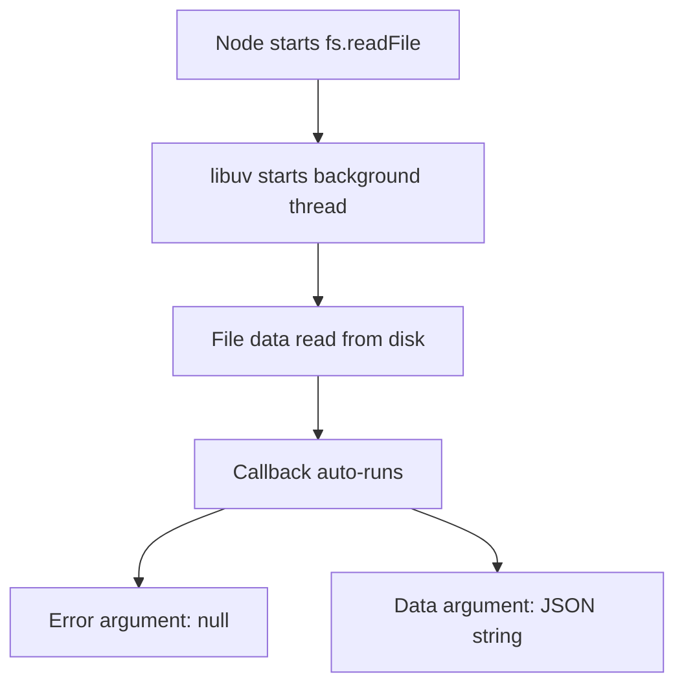

# Node.js File System Integration and Asynchronous Data Loading

## 1. Accessing the File System in Node.js

### 1.1 `fs` Module

- **Definition**: `fs` (File System) is a built-in Node.js module that provides access to the computer’s file storage via underlying C++ bindings.
    
- **Relevance**: Enables JavaScript to read from and write to files on disk, which is not allowed in browser JavaScript for security reasons.
    
- **Usage Requirement**: Must be imported using `require('fs')`.

---

## 2. Reading Files with `fs.readFile`

### 2.1 `fs.readFile` Overview

- **Purpose**: Asynchronously reads the contents of a file from disk.
    
- **Key Inputs**:
    
    1. **Path**: Location of the file in the file system.
        
    2. **Callback Function**: Automatically executed when file reading completes.

|Argument Position|Meaning|
|---|---|
|1st|File path (string)|
|2nd|Callback function to auto-run|

### 2.2 File Path Resolution

- `.` (dot) represents the **current working directory**—the folder from which Node was launched in the terminal.
    
- Example: `./tweets.json`
    
    - Means: Look in the current folder for `tweets.json`.

---

## 3. Callback Execution and Asynchronous Flow

### 3.1 Auto-Run Callback Logic

- `fs.readFile` immediately starts file reading in the background.
    
- The callback function is **not run immediately**.
    
- It is auto-executed **only after** the file data has been fully loaded into Node.

### 3.2 Time Considerations

- Reading large files (e.g., ~1.5 GB) can take several seconds.
    
- This is significantly slower than in-memory JavaScript operations (nanoseconds vs seconds).
    
- Node’s asynchronous design allows other work to continue during this time.

---

## 4. Libuv and Background Threads

### 4.1 Libuv Role

- **Definition**: A C/C++ library used by Node.js to manage asynchronous I/O operations.
    
- **Responsibility**:
    
    - Manages background threads for certain I/O tasks.
        
    - Abstracts differences across operating systems.

### 4.2 I/O Responsibility Comparison

| I/O Type           | Who Manages the Thread      |
| ------------------ | --------------------------- |
| File System (`fs`) | libuv (Node-managed thread) |
| Network / Sockets  | Operating System            |

- **Reason**: File system access varies widely across OS implementations, so Node standardizes it via libuv.

> [!note] **I/O** = input / output
---

## 5. Callback Arguments: Error-First Pattern

### 5.1 Error-First Callback Convention

- Most Node.js callbacks receive **two auto-inserted arguments**:

|Argument|Meaning|
|---|---|
|1st|Error object (or `null` if no error)|
|2nd|Actual data from the operation|

- This pattern is known as the **error-first pattern**.

### 5.2 Example Callback Signature

```js
function useImportedTweets(error, data) {
  // error: null if successful
  // data: JSON string from tweets.json
}
```

- If the operation succeeds:
    
    - `error` → `null`
        
    - `data` → stringified JSON content
        
- If the operation fails:
    
    - `error` → Error object
        
    - `data` → `undefined`

---

## 6. JSON Data Handling

### 6.1 JSON as a Storage Format

- **Definition**: JSON (JavaScript Object Notation) is a string-based format for storing structured data.
    
- **Why JSON**:
    
    - JavaScript objects cannot be stored directly on disk.
        
    - JSON converts objects into strings that can be saved and transferred.

### 6.2 Parsing JSON

- **Function**: `JSON.parse`
    
- **Purpose**: Converts a JSON-formatted string back into a usable JavaScript object.
    
- **Constraint**:
    
    - JSON must be perfectly formatted (correct quotes, commas, structure).
        
    - Parsing does not attempt error recovery.

---

## 7. Execution Flow Summary (Step-by-Step Example)

1. Import `fs` module.
    
2. Call `fs.readFile('./tweets.json', useImportedTweets)`.
    
3. Node delegates file reading to libuv (background thread).
    
4. Main JavaScript execution continues.
    
5. After file loading completes:
    
    - `useImportedTweets` auto-runs.
        
    - Receives `(null, jsonString)` as arguments.
        
6. Inside callback:
    
    - Parse JSON string.
        
    - Process tweet data (e.g., cleaning bad words).

---

## 8. Asynchronous File Read Flow Diagram



---

# Key Takeaways

- `fs.readFile` enables asynchronous file access in Node.js via C++ and libuv.
    
- File paths are resolved relative to the directory where Node is launched.
    
- Callbacks follow the error-first pattern: `(error, data)`.
    
- Large file reads are slow compared to in-memory operations, reinforcing the importance of asynchronous design.
    
- JSON serves as a bridge between persistent storage and JavaScript objects.