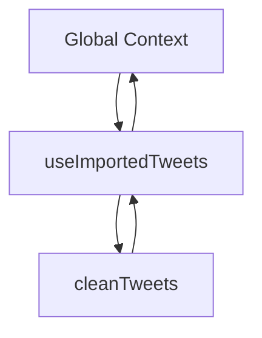

# JavaScript Execution Model: The Call Stack

## Definition

**Call Stack**:  
A core JavaScript runtime structure that tracks which function is currently executing. It operates as a **stack (LIFO)** where:

- The **top** of the stack is the function currently running.
    
- When a function is called, it is **pushed** onto the stack.
    
- When it finishes, it is **popped** off, returning control to the previous context.

**Relevance**:  
The Call Stack ensures JavaScript always knows _where execution is_ and _where to return next_, enabling predictable, single-threaded execution.

---

# Global Execution Context

## Key Idea

- All JavaScript code runs inside an implicit **global function**.
    
- The global context is always present at the bottom of the Call Stack.
    
- Auto-run functions (e.g., callbacks triggered by Node) are executed from the global context unless called by another function.

---

# Stack Behavior During Function Execution

## Rules

1. Global context starts on the stack.
    
2. Calling a function pushes it onto the stack.
    
3. Nested function calls push additional frames.
    
4. Returning from a function pops it off the stack.
    
5. Execution resumes in the previous frame.

## Data Structure Characteristics

|Property|Description|
|---|---|
|Type|Stack (LIFO)|
|Access|Only the top frame matters|
|Purpose|Track active execution context|

---

# Example Context: `useImportedTweets` Execution

## Scenario Overview

- A large JSON file (tweets) is read from disk.
    
- Node auto-runs a callback function when file reading completes.
    
- That callback processes and cleans the data.

---

# Auto-Run Callback and Parameters

## Error-First Callback Pattern (Node.js)

Most Node auto-run functions receive two parameters:

|Parameter Position|Meaning|
|---|---|
|First|Error data (or `null` if no error)|
|Second|Actual data returned|

**In this case**:

- `errorData` → `null`
    
- `data` → JSON string of imported tweets

---

# Call Stack Walkthrough (Step-by-Step)

## Step 1: Initial State

- `global` execution context is on the stack.

## Step 2: File Read Completes

- Node auto-runs `useImportedTweets`
    
- Function is pushed onto the Call Stack.

## Step 3: Inside `useImportedTweets`

Parameters are placed into local memory:

- `errorData = null`
    
- `data = <JSON string of tweets>`

---

## Step 4: Calling `cleanTweets(data)`

- `cleanTweets` is invoked manually.
    
- It is pushed onto the Call Stack.
    
- It processes the tweet data and removes undesirable words.
    
- Returns cleaned JSON-formatted string.
    
- `cleanTweets` is popped off the stack.

---

## Step 5: Parsing JSON into an Object

- `JSON.parse(cleanTweetsJson)` converts the cleaned string into a JavaScript object.
    
- Result stored in `tweetsObj`.

---

## Step 6: Using the Result

- Access specific properties (e.g., `tweetsObj.tweet2`)
    
- Log or further process the cleaned data.

---

# Visualizing the Call Stack Flow

---

# Performance Implications

## Observations

- File reading took ~15 seconds.
    
- Cleaning the data took ~10 seconds.
    
- Total processing time ~25 seconds.

## Insight

- This highlights the cost of large synchronous computations.
    
- Motivates future optimization (e.g., streaming, parallel processing).

---

# Key Concepts Summary Table

|Concept|Description|
|---|---|
|Call Stack|Tracks active function execution|
|Global Context|Base execution environment|
|Stack Frame|Execution context of a function|
|Error-first callback|Standard Node pattern (`error, data`)|
|JSON.parse|Converts JSON strings into JS objects|

---

# Key Takeaways

- The Call Stack is JavaScript’s mechanism for tracking execution order.
    
- Only one function runs at a time; the top of the stack defines control.
    
- Node auto-run callbacks integrate seamlessly into the Call Stack.
    
- Understanding stack behavior is critical for debugging and performance reasoning.
    
- Large I/O and CPU-bound tasks reveal why asynchronous and streaming models matter.