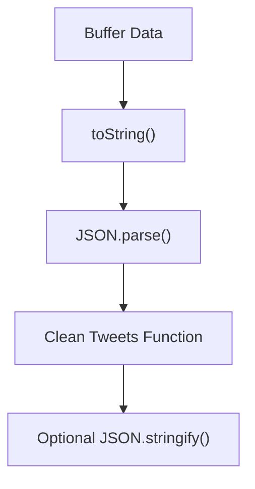

# Node.js Background Features, Buffers, and the Error-First Callback Pattern

---

## 1. JavaScript Execution and the Call Stack

### 1.1 Call Stack Representation

**Definition:**  
The call stack is a data structure that tracks which functions are currently executing in JavaScript.

**Key Idea:**  
Only functions that **we explicitly write and control** are typically represented when teaching or reasoning about the call stack.

**Clarification:**

- Built-in or background operations (e.g., `JSON.parse`, `fs.readFile`) **do execute JavaScript internally**.
    
- However, they are often omitted from conceptual call stack diagrams because:
    
    - We cannot inject or control execution inside them.
        
    - They add noise rather than insight for learning execution flow.

**Relevance:**  
This abstraction helps developers focus on controllable execution paths rather than internal engine mechanics.

---

## 2. Data Input in Node.js: Buffers

### 2.1 Buffer Data Format

**Definition:**  
A **Buffer** is Node.js’s way of handling raw binary data—a sequence of zeros and ones.

**Key Properties:**

- Can represent **any data type** (text, JSON, images, video).
    
- Mutable: data can be added, removed, or sliced.
    
- Not inherently a string or JSON object.

**Why Buffers Exist:**  
Node.js needs a flexible, low-level format to handle incoming data from files, networks, or streams.

---

### 2.2 Buffers Vs Strings Vs JSON

| Format      | Description                 | When Used                        |
| ----------- | --------------------------- | -------------------------------- |
| Buffer      | Raw binary data (0s and 1s) | Default incoming data in Node.js |
| String      | Human-readable **text**     | After calling `.toString()`      |
| JSON Object | Structured JavaScript data  | After `JSON.parse()`             |

**Important Insight:**  
Data does **not** arrive as stringified JSON by default. Conversion is required.

---

## 3. JSON Parsing Workflow

### 3.1 JSON.parse

**Definition:**  
`JSON.parse()` converts a JSON-formatted string into a JavaScript object.

**Contextual Detail:**

- Incoming data often arrives as a **Buffer**.
    
- Typical workflow:
    
    1. Convert Buffer → String
        
    2. Parse String → JavaScript Object

**Convenience:**  
Some workflows combine string conversion and parsing logically, but conceptually these are distinct steps.

---

### 3.2 Example: Parsing Tweet Data

**Step-by-step Flow:**

1. Data arrives from disk/network as a Buffer.
    
2. Buffer is converted to a string.
    
3. String is parsed into a JavaScript object.
    
4. Data is cleaned (e.g., removing unwanted words).
    
5. Cleaned data may be stringified again for storage or transfer.



---

## 4. Accessing Node.js Background Features

### 4.1 Importing Modules

**Definition:**  
Node.js background features (like the file system) must be explicitly imported.

**Example:**

```js
const fs = require('fs');
```

**Key Point:**

- This is mandatory to access features such as file reading.
    
- Often omitted in teaching examples to reduce distraction.

---

## 5. Callback Functions and Parameters

### 5.1 Parameters as Placeholders

**Definition:**  
Parameters are placeholders that receive values when a function is invoked.

**Critical Insight:**

- Node.js does **not** assign inherent names to callback arguments.
    
- Names like `err` or `data` are chosen by the developer.
    
- Only the **order** matters.

---

### 5.2 Arbitrary Naming (and Its Risks)

You could technically write:

```js
fs.readFile('file.txt', (data, error) => {
  // Confusing and dangerous
});
```

**Why This Works (But Shouldn’t):**

- JavaScript only matches arguments by position.
    
- Semantics are entirely developer-defined.

---

## 6. The Error-First Callback Pattern

### 6.1 Definition

**Error-First Pattern:**  
A Node.js convention where the first callback parameter represents an error.

```js
(error, data) => { ... }
```

---

### 6.2 Why Error Comes First

**Design Rationale:**

- Errors are impossible to ignore.
    
- Developers must consciously handle failures.
    
- Reflects real-world unreliability of I/O operations.

---

### 6.3 Truthy and Falsy Error Handling

**Key Rule:**

- If no error occurs, the error parameter is `null` (falsy).
    
- If an error occurs, it becomes truthy.

**Example:**

```js
fs.readFile('tweets.json', (error, data) => {
  if (error) {
    console.log(error);
    return;
  }
  // Safe to use data
});
```

---

## 7. Conditional Execution and Error Control

### 7.1 Developer Responsibility

**Important Principle:**  
Node.js does not automatically stop execution when an error occurs.

**Your Job:**

- Explicitly check for errors.
    
- Decide whether to:
    
    - Stop execution
        
    - Call another function
        
    - Log and recover

---

### 7.2 Documentation-Driven Decisions

Different errors may:

- Prevent data access entirely (e.g., file not found).
    
- Allow partial execution.

Understanding these cases requires consulting official documentation.

---

## 8. Summary of Key Points

- Built-in functions execute internally but are often excluded from call stack diagrams for clarity.
    
- Node.js receives incoming data as Buffers, not strings or JSON.
    
- Buffers must be converted before parsing or manipulation.
    
- `JSON.parse()` transforms stringified JSON into usable JavaScript objects.
    
- Background features like `fs` must be explicitly imported.
    
- Callback parameter names are arbitrary; order is what matters.
    
- Node.js uses the error-first callback pattern to enforce error handling.
    
- Error handling logic is always the developer’s responsibility.