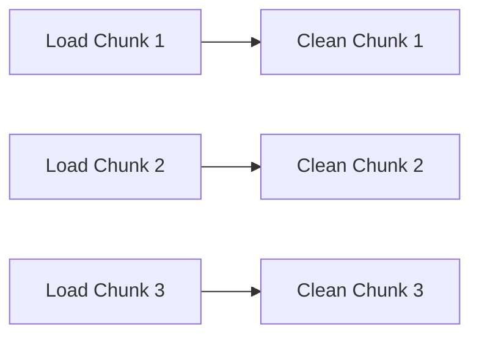
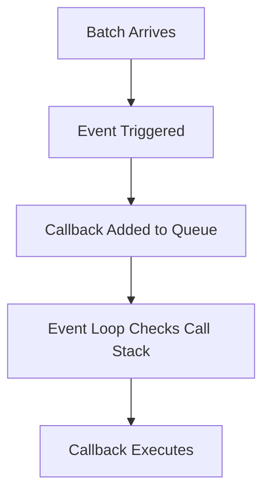

# Introducing Node Streams

---

## 1. The Event Paradigm in Node.js

### Definition: Event-Driven Architecture

Node.js is built around an **event-driven architecture**, meaning:

- The system reacts to events (e.g., data received, file read, request completed).
    
- Functions are triggered automatically in response to those events.
    
- Execution is non-blocking and asynchronous.

### Core Idea

Instead of:

- Waiting for all data to load
    
- Then processing it

We can:

- Process data **as it arrives**
    
- In smaller chunks
    
- Triggered by events

---

## 2. The Batch Processing Idea

### Scenario

We are loading a large JSON dataset (e.g., tweets).

Instead of:

1. Loading all data (e.g., 20 seconds)
    
2. Then cleaning it (e.g., 10 seconds)

Total time: 30 seconds

We can:

- Load data in chunks
    
- Process each chunk immediately
    
- Overlap loading and processing

### Conceptual Flow

### Key Optimization

While Node is:

- Pulling the next batch in the background

JavaScript can:

- Clean the previous batch in the foreground

This creates overlapping work.

---

## 3. Streams in Node.js

### Definition: Stream

A **stream** is a way to handle data piece-by-piece instead of loading it all at once.

Streams allow:

- Incremental data handling
    
- Reduced memory usage
    
- Better performance
    
- Overlapping I/O and processing

### Why Streams Matter

Without streams:

- Entire dataset must be loaded into memory.
    
- Processing begins only after full load.

With streams:

- Data is processed as it arrives.
    
- Memory footprint stays smaller.
    
- Total time decreases.

---

## 4. Parallelism Vs Concurrency in Node

### Important Clarification

Node.js is **single-threaded** in JavaScript execution.

So:

- Multiple cleaning functions cannot run simultaneously on the call stack.
    
- There are strict rules about when a function can execute.

### What Actually Happens

- Data arrives → Event triggered.
    
- Event handler runs.
    
- If handler is still running:
    
    - New events wait in a queue.

---

## 5. The Queueing Problem

### The Core Question

If:

- A batch arrives.
    
- Cleaning starts.
    
- Another batch arrives before cleaning finishes.

Can the new cleaning function run immediately?

Answer: No.

Because:

- JavaScript runs one function at a time on the call stack.

### This Introduces Queuing

---

## 6. The Event Loop’s Role

### Definition: Event Loop

The **event loop** is the mechanism that:

- Monitors the call stack
    
- Checks the callback queue
    
- Pushes queued callbacks to the stack when it’s empty

### Execution Rules

1. If call stack is busy → wait.
    
2. When call stack is empty → next queued callback runs.
    
3. Only one callback runs at a time.

This prevents true parallel execution of JavaScript code.

---

## 7. Overlapping I/O and Computation

Even though JavaScript is single-threaded:

- I/O operations (like reading data from disk/network) happen in the background (Node’s C++ layer / OS).
    
- JavaScript runs callbacks when data is ready.

So we get:

- I/O in background
    
- Processing in foreground
    
- Coordinated by events

---

## 8. Timing Example Analysis

### Initial Estimate

- Loading all data: 20 seconds
    
- Cleaning data: 10 seconds
    
- Total: 30 seconds

### With Streaming

If:

- Cleaning each batch takes time
    
- Loading happens continuously

Then:

- Cleaning overlaps with loading
    
- Total time approaches the slower operation

If cleaning takes longer than loading:

- Cleaning becomes bottleneck.

If loading takes longer:

- Loading becomes bottleneck.

### Conceptual Timeline

```mermaid
gantt
    title Overlapping Load and Process
    dateFormat  X
    axisFormat %s
    section Load
    Chunk 1 :0,4
    Chunk 2 :4,8
    Chunk 3 :8,12
    section Process
    Clean 1 :4,9
    Clean 2 :8,13
    Clean 3 :12,17
```

This demonstrates overlapping but non-parallel execution of JavaScript.

---

## 9. Strict Execution Rules

There must be strict rules governing:

- When a callback can run.
    
- How multiple incoming events are scheduled.
    
- How backpressure is handled (implied concept).

### Backpressure (Additional Insight)

Backpressure occurs when:

- Data arrives faster than it can be processed.
    
- The system must slow down intake to avoid overload.

Streams in Node handle backpressure automatically.

---

## 10. Key Concepts Summary Table

|Concept|Definition|Why It Matters|
|---|---|---|
|Event-Driven Architecture|Code runs in response to events|Enables non-blocking behavior|
|Stream|Piece-by-piece data processing|Improves performance and memory use|
|Event Loop|Scheduler for JavaScript execution|Enforces single-threaded execution|
|Callback Queue|Holds ready-to-run callbacks|Prevents simultaneous execution|
|Concurrency|Overlapping tasks|Achieved in Node via async I/O|
|Parallelism|Simultaneous execution|Not available in JS call stack|

---

# Key Points Summary

- Node.js uses an event-driven architecture.
    
- Streams allow data to be processed in chunks rather than all at once.
    
- Processing can overlap with data loading.
    
- JavaScript execution is single-threaded.
    
- The event loop enforces strict execution order.
    
- Callbacks are queued if the stack is busy.
    
- Streams improve performance by overlapping I/O and computation.
    
- Queueing and scheduling are essential to managing multiple incoming chunks.
    
- Backpressure ensures the system does not get overwhelmed.

---

## MicroTest