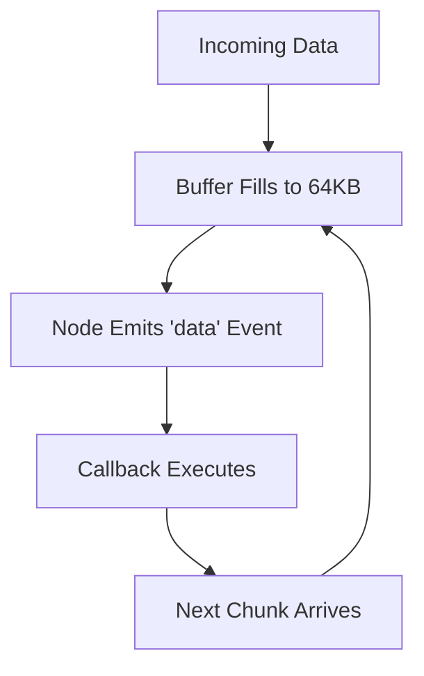
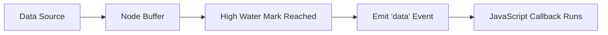

# Node Streams and Batch Processing in Node.js

---

## 1. From “Flow” to Batches: What a Stream Really Is

### 1.1 Intuitive Misconception

A “stream” intuitively sounds like:

- A continuous, uncontrolled flow of data.
    
- Data racing toward the application in real time.

However, in Node.js and computer science:

> A stream is not an infinite continuous flow—it is handled as discrete chunks of data.

---

## 2. Streams as Chunks (Batches) of Data

### 2.1 Definition: Stream (in Node.js)

A **stream** in Node.js is a mechanism for processing data in **chunks**, rather than loading it all into memory at once.

Each chunk:

- Has a default size.
    
- Triggers an event when available.
    
- Is processed independently.

---

### 2.2 Default Batch Size: High Water Mark

|Concept|Definition|
|---|---|
|High Water Mark|The default maximum size of a data chunk in a stream buffer|
|Default Value|64 KB (kilobytes)|

This means:

- Data is internally buffered in 64 KB pieces.
    
- Each 64 KB chunk is delivered separately.

These are not infinite flows—they are “buckets” of data.

---

## 3. Event-Driven Batch Processing

### 3.1 What Happens When a Chunk Arrives?

When a chunk (e.g., 64 KB) arrives:

1. Node emits an event.
    
2. The event name is `"data"`.
    
3. Any attached callback runs automatically.

### Example Conceptual Pattern

```javascript
stream.on("data", (chunk) => {
  processChunk(chunk);
});
```

### Step-by-Step Explanation

1. Data is read internally by Node.
    
2. Once 64 KB is buffered:
    
    - Node emits `"data"`.
        
3. The registered function runs.
    
4. The next chunk arrives.
    
5. The process repeats.

---

## 4. Event Emission Model



This loop continues until all data is processed.

---

## 5. Why This Design Is Powerful

### 5.1 Efficiency in a Single-Threaded Environment

Node.js is single-threaded for JavaScript execution.

Streams allow:

- Processing data incrementally.
    
- Avoiding memory overload.
    
- Preventing blocking of other code.
    
- Handling large-scale data efficiently.

Instead of:

- Waiting for full file load.
    
- Then processing.

We:

- Process while loading continues.

---

## 6. Who Handles the Batching?

### Question

Is the data pre-batched before reaching Node?

### Answer

Node handles batching internally.

It:

- Buffers incoming data.
    
- Tracks chunk size.
    
- Emits events when chunk thresholds are reached.

Node acts as the controller of chunk boundaries.

---

## 7. Why Streams Are Node’s “Pride and Joy”

### Core Strengths

|Advantage|Explanation|
|---|---|
|Memory Efficiency|No need to load entire datasets|
|Performance|Overlapping I/O and processing|
|Non-Blocking|Keeps event loop responsive|
|Scalability|Handles large-scale data smoothly|

This design makes Node highly suitable for:

- File processing
    
- Network streaming
    
- Large dataset handling
    
- Real-time data systems

---

## 8. Streams Vs True Continuous Flow

Conceptually:

- A real-world stream = continuous flow.
    
- Node stream = chunked event-driven processing.

Better analogy:

> Buckets of water arriving one at a time.

Each bucket:

- Contains 64 KB.
    
- Triggers processing.
    
- Does not overwhelm the system.

---

## 9. Application to Large-Scale Systems (e.g., Video)

### Important Clarification

Video streaming:

- Can use chunk-based streaming.
    
- But often uses specialized infrastructure.

### TCP Vs UDP

|Protocol|Characteristics|Use Case|
|---|---|---|
|TCP|Reliable, ordered, connection-based|HTTP, web communication|
|UDP|Faster, no guaranteed delivery|Video calls, real-time streaming|

Node commonly uses TCP (under HTTP).

Video chat systems often use UDP because:

- Lower latency is prioritized.
    
- Occasional packet loss is acceptable.

---

## 10. Relationship Between Streams and the Event System



Streams rely on:

- Node’s event-driven architecture.
    
- The event loop.
    
- Callback execution.

---

## 11. Concept Summary Table

|Concept|Meaning|Why It Matters|
|---|---|---|
|Stream|Chunk-based data processing|Enables scalable data handling|
|High Water Mark|Max buffer size per chunk (64 KB default)|Controls memory usage|
|"data" Event|Event emitted when chunk is ready|Triggers processing|
|Event-Driven Execution|Code runs in response to events|Enables non-blocking design|
|TCP|Reliable communication protocol|Used in HTTP|
|UDP|Faster, less reliable protocol|Used in real-time media|

---

# Key Points Summary

- Streams in Node.js process data in chunks, not as a continuous flow.
    
- The default chunk size is 64 KB (high water mark).
    
- Each chunk triggers a `"data"` event.
    
- Node internally manages buffering and batching.
    
- Streams enable efficient, non-blocking large-scale data handling.
    
- JavaScript remains single-threaded, but I/O is handled asynchronously.
    
- TCP is used for standard web communication; UDP is preferred for real-time video.
    
- Streams are a core performance feature of Node.js.

---